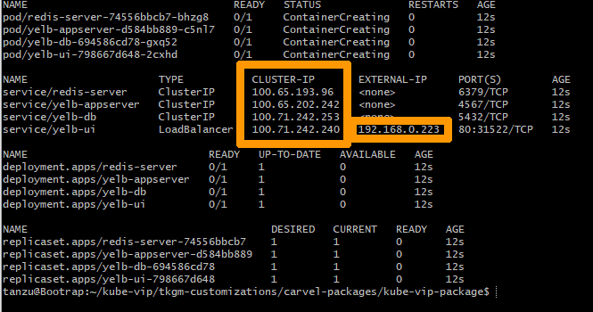
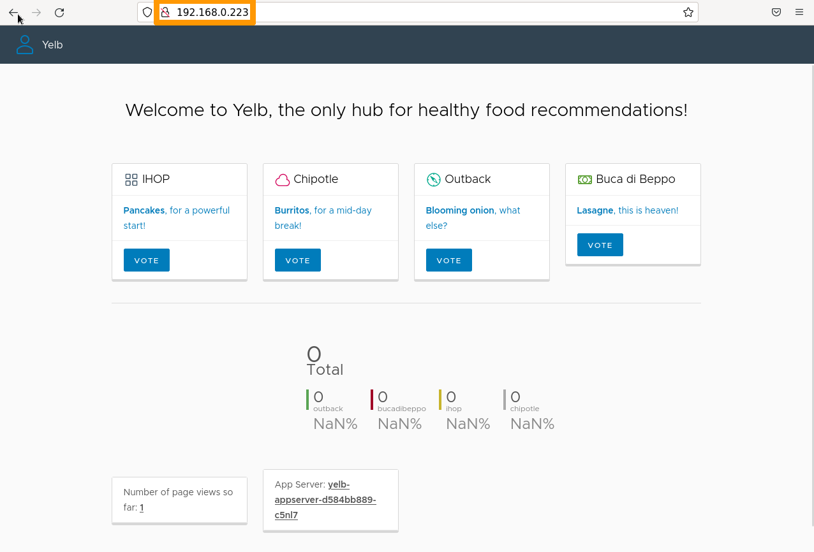

**Dernière mise à jour le 06/09/2022**

## Objectif

**Ce guide vous permet d'installer Tanzu Kubernetes Grid sur votre cluster Hosted Private Cloud Powered by VMware**

> [!warning]
> OVHcloud vous met à disposition des services dont la configuration, la gestion et la responsabilité vous incombent. Il vous appartient donc de ce fait d’en assurer le bon fonctionnement.
>
> Ce guide a pour but de vous accompagner au mieux sur des tâches courantes. Néanmoins, nous vous recommandons de faire appel à un [prestataire spécialisé](https://partner.ovhcloud.com/fr/) si vous éprouvez des difficultés ou des doutes concernant l’administration, l’utilisation ou la mise en place d’un service sur un serveur.
>

## Présentation

VMware Tanzu Kubernetes Grid est est une plate-forme Kubernetes fournie par **VMware** et maintenue dans le cadre du support **Hosted Private Cloud Powered by VMware**.

Vous pouvez déployer ce produit sur votre infrastructure OVHcloud pour profiter de ses fonctionnalités et de son évolutivité.

## Prérequis

- Être contact administrateur de l'infrastructure [Hosted Private Cloud](https://www.ovhcloud.com/fr/enterprise/products/hosted-private-cloud/), afin de recevoir les identifiants de connexion.
- Avoir un identifiant actif dans l'[espace client OVHcloud](https://www.ovh.com/auth/?action=gotomanager&from=https://www.ovh.com/fr/&ovhSubsidiary=fr)
- Avoir un identifiant actif dans vSphere.
- Avoir déployé le cluster d'administration **TKG**. Vous pouvez vous aider de guide [Installer Tanzu Kubernetes Grid](https://docs.ovh.com/fr/private-cloud/tanzu-tkgm-installation)
- Avoir un VLAN qui possède un accès à internet et un serveur DHCP.
- Disposer de ces ressources :
    - 16 Go de mémoire, 4 vCPU, 40 Go de stockage par nœud Kubernetes (Il faut 6 nœuds par cluster de **Workload** dans le même mode).
    

## En pratique

Nous allons déployer un cluster de workload sur un cluster d'administration **Tanzu Kubernetes Grid**. et ajouter une application.


### Déploiement d'un cluster de *Workload*

A partir de la machine virtuelle **Bootstrap** nous allons crééer un cluster de *Workload* dans lequel il sera possible de déployer des applications.

Copiez le fichier qui a servi pour la création du cluster d'administration dans un fichier nommé **tkg-workload-cluster.yaml**.

```bash
cp ~/.config/tanzu/tkg/clusterconfigs/tkgmfile.yaml ~/tkg-workload-cluster.yaml
```

Modifiez le contenu du fichier **~/tkg-workload-cluster.yaml** en changeant ces valeurs :

```yaml
CLUSTER_NAME: tkg-workload-cluster
VSPHERE_CONTROL_PLANE_ENDPOINT: 192.168.0.11
```

Lancez cette commande pour créer le cluster :

```bash
tanzu cluster create --file tkg-workload-cluster.yaml
```

Connectez-vous au cluster avec ces commandes :

```bash
# Autorisation de la connexion au cluster
tanzu cluster kubeconfig get tkg-workload-cluster --admin
# Positionnement sur le cluster tkg-workload-cluster
# Les comptes d'administration ont toujours cette formee nomcluster-admin@nomcluster
kubectl config use-context tkg-workload-cluster-admin@tkg-workload-cluster
```
### Installation du **Load-Balancer**

Le **Load-Balancer** fait le lien entre le cluster et le réseau local, pour cela nous allons utiliser le package **kube-vip** qui servira de *load-balancer* entre le réseau interne au cluster et le réseau du VLAN10. Vous trouverez plus d'informations sur ce lien [Documentation kube-vip](https://kube-vip.io/).

Exécutez ces commandes :

```bash
# Création d'un dossier pour accueillir l'application kube-vip depuis git
mkdir ~/kube-vip
# Déplacement dans ce dossier
cd ~/kube-vip
# Récupération des données depuis github
git clone https://github.com/vrabbi/tkgm-customizations.git
# Déplacement dans le sous dossier de l'application
cd tkgm-customizations/carvel-packages/kube-vip-package/
# Application de la pré-configuration
kubectl apply -n tanzu-package-repo-global -f metadata.yml
kubectl apply -n tanzu-package-repo-global -f package.yaml
```

Créez le fichier **~/kube-vip/tkgm-customizations/carvel-packages/kube-vip-package/values.yaml** avec ce contenu qui correspond aux adresses IP utilisable sur le VLAN10 pour déployer une application

```yaml
vip_range: 192.168.0.210-192.168.0.250
```

Installez le package à l'aide de cette commande.

```bash
# Installation
tanzu package install kubevip -p kubevip.terasky.com -v 0.3.9 -f values.yaml
# Vérification de la présence du package kubevip
 kubectl get packages -A
```

### Installation d'une application

Lancez ces commandes pour installer une nouvelle application dans le cluster de **Workload**.


```bash
# Création d'un espace de nom pour cette application
kubectl create ns yelb
# Déploiement de l'application depuis une source sur Internet
kubectl\
 -n yelb apply -f\
 https://raw.githubusercontent.com/lamw/yelb/master/deployments/platformdeployment/Kubernetes/yaml/yelb-k8s-loadbalancer.yaml
# Vérification de la bonne installation de l'application
kubectl get all -n yelb
```
Les adresses IP internes au cluster KUBERNETES apparaissent dans la colonne **CLUSTER-IP**, les applications qui sont visibles depuis l'extérieur du cluster ont une adresse IP dans la colonne **EXTERNAL-IP**.

Dans cet exemple le site WEB est accessible avec l'adresse **192.168.0.223** sur le port **80**.

{.thumbnail}

Au travers de la console **Bootstrap** utilisez le navigateur **WEB** pour vous connecter sur l'URL `http://192.168.0.223`.

{.thumbnail}

En plus des 6 machines virtuelles pour le cluster d'administration 6 autres machines virtuelles sont visible pour le cluster de **Workload**.

{.thumbnail}


## Aller plus loin

[Installer Tanzu Kubernetes Grid](https://docs.ovh.com/fr/private-cloud/tanzu-tkgm-installation)

[Présentation de VMware Tanzu Kubernetes Grid](https://tanzu.vmware.com/kubernetes-grid)

[Documentation de VMware Tanzu Kubenetes Grid](https://https://docs.vmware.com/en/VMware-Tanzu-Kubernetes-Grid/index.html)

[Installation manuelle de l'outil CLI pour le déploiement de Tanzu Kubernetes GRID](https://docs.vmware.com/en/VMware-Tanzu-Kubernetes-Grid/1.5/vmware-tanzu-kubernetes-grid-15/GUID-install-cli.html)

Échangez avec notre communauté d'utilisateurs sur <https://community.ovh.com>.

