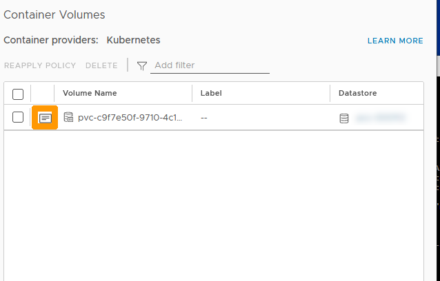
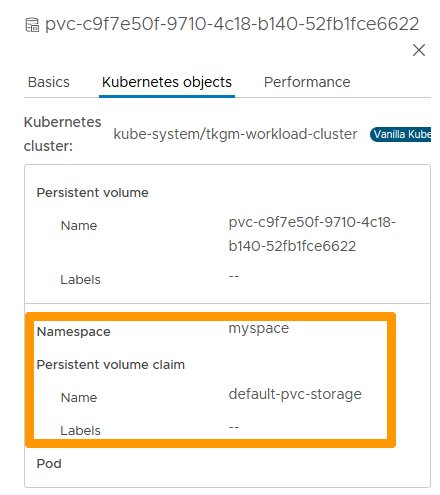
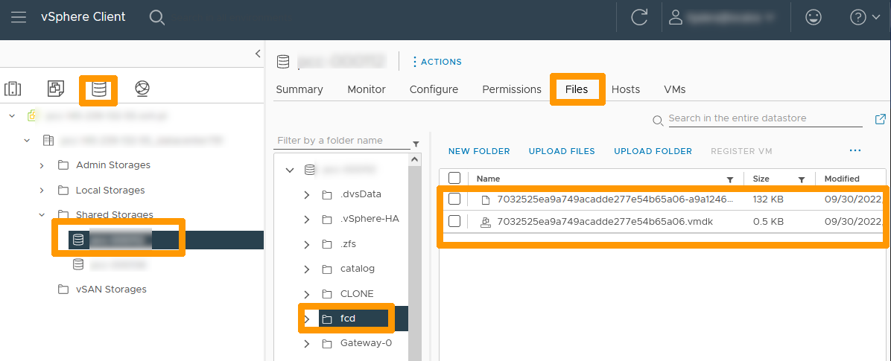
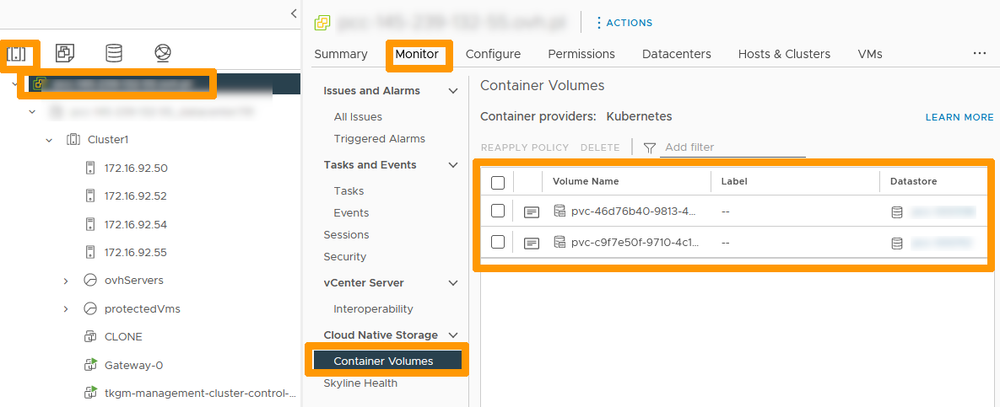

**Dernière mise à jour le 30/09/2022**

## Objectif

**Ce guide vous permet de gérer les volumes persistants sur un cluster Tanzu Kubernetes Grid**

> [!warning]
> OVHcloud vous met à disposition des services dont la configuration, la gestion et la responsabilité vous incombent. Il vous appartient donc de ce fait d’en assurer le bon fonctionnement.
>
> Ce guide a pour but de vous accompagner au mieux sur des tâches courantes. Néanmoins, nous vous recommandons de faire appel à un [prestataire spécialisé](https://partner.ovhcloud.com/fr/) si vous éprouvez des difficultés ou des doutes concernant l’administration, l’utilisation ou la mise en place d’un service sur un serveur.
>

- Être contact administrateur de l'infrastructure [Hosted Private Cloud](https://www.ovhcloud.com/fr/enterprise/products/hosted-private-cloud/), afin de recevoir les identifiants de connexion.
- Avoir un identifiant actif dans l'[espace client OVHcloud](https://www.ovh.com/auth/?action=gotomanager&from=https://www.ovh.com/fr/&ovhSubsidiary=fr).
- Avoir un identifiant actif dans vSphere.
- Avoir déployé le cluster de **Workload** **TKG** à l'aide de ce guide [Administrer Tanzu Management Cluster Grid](https://docs.ovh.com/fr/private-cloud/tanzu-tkgm-management).
- Avoir un VLAN qui possède un accès à internet et un serveur DHCP.
    

### Présentation

Les volumes persistents servent à conserver des données de manière permanente sur un cluster Kubernetes, ces volumes sont stockés dans des fichier VMDK qui se trouvent dans le dossier FCD à la racine du VMFS ou a été déployé le cluster de *WorkLoad*.

A partir de votre cluster VMware rendez-vous dans l'inventaire sélectionnez à gauche `l'icône`{.action} concernant le stockage, positionnez-vous sur le `datastore`{.action} où a été déployé votre cluster de *WorkLoad* allez dans l'onglet `Files`{.action} et cliquez sur le dossier `FCD`{.action}.

{.thumbnail}


Il est possible de créer des **Storage class** qui utilisent une autre dossier que le dossier par défaut.

## En pratique

Nous allons nous connecter à un cluster de *WorkLoad* de **Tanzu Kubernetes Grid** à partir de la console de la machine virtuelle **Bootstrap**. Vous pouvez vous aider de ce guide [Administrer Tanzu Management Cluster Grid](https://docs.ovh.com/fr/private-cloud/tanzu-tkgm-management) pour créer un cluster de workload et l'administrer.

A partir de la console de la machine virtuelle de BootStrap utiliser ces commandes :

```bash
# Affichage de tous les contextes de votre cluster TANZU KUBERNETES GRID
kubectl config get-contexts
```

Sous la colonne **NAME** vous verrez les contextes que vous pourrez utiliser , Si vous n'avez qu'un cluster de *WorkLoad* vous ne verrez que deux contextes un pour le cluster d'administration et l'autre pour le cluster de *WorkLoad*.

Saisissez cette commande pour utiliser le cluster de *WorkLoad* :

```bash
# Connexion au cluster de WorkLoad
kubectl config use-context tkgm-workload-cluster-admin@tkgm-workload-cluster
```

Nous allons à partir de maintenant travailler sur le cluster de *WorkLoad**

### Affichage des **Storage Class** existants

Pour obtenir des information sur les **Storage Class** d'un cluster de WorkLoad saisissez ces commandes :

```bash
# Affichage des Storage Class
kubectl get storageclass
# Description d'un Storage Class
kubectl describe storageclass nomclasse
```

### Création d'un storage class sur un autre VMFS

Il est possible de rajouter un **Storage Class** sur un cluster de *WorkLoad* soit à l'extérieur du cluster VMWARE soit à l'intérieur de votre cluster VMware dans votre stockage NFS ou vSAN. 

Sur notre cluster VMware nous avons deux datastore sur des serveur NFS distants , les machines virtuelles du cluster de *WorkLoad* sont stockées sur un des datastores et les **Storage Class** se trouvent aussi sur ce datastore , nous allons donc créer un nouveau **storage class** sur le deuxième **Datastore**.

Revenez sur votre cluster VMware dana la gestion du stockage , sélectionnez le `second datastore`{.action}, cliquez sur `Summary`{.action} dans les onglet à gauche.

Copiez l'`URL`{.action} en dessous de Type NFS 3.

Editez un nouveau fichier nommé `secondstorageclass.yaml` avec ce contenu :

```yaml
kind: StorageClass
apiVersion: storage.k8s.io/v1
metadata:
  name: secondstorageclass
  annotations:
    storageclass.kubernetes.io/is-default-class: "true"
provisioner: csi.vsphere.vmware.com
parameters:
  datastoreurl: "ds:///vmfs/volumes/xxxxxxxxxxxxxxxxx/"
```

Remplacez `ds:///vmfs/volumes/xxxxxxxxxxxxxxxxx/` par l'URL que vous venez de copier.

Ensuite exécutez cette commande :

```bash
# Création du storageclass à partir du fichier yaml
kubectl apply -f secondstorageclass.yaml
# Affichage des storageclass
kubectl get storageclass
```

Nous voyons donc apparaitre deux **Storage Class**
```bash
NAME                           PROVISIONER              RECLAIMPOLICY   VOLUMEBINDINGMODE   ALLOWVOLUMEEXPANSION   AGE
default (default)              csi.vsphere.vmware.com   Delete          Immediate           true                   3d18h
secondstorageclass (default)   csi.vsphere.vmware.com   Delete          Immediate           false                  12s
tanzu@bootstrap:~$
```

### Création d'un volume persistant dans le **Storage class** par défaut

Créer un fichier nommé default-pvc-storage.yaml avec ce contenu :

```yaml
kind: PersistentVolumeClaim
apiVersion: v1
metadata:
  name: default-pvc-storage
spec:
  accessModes:
    - ReadWriteOnce
  storageClassName: "default"
  resources:
    requests:
      storage: 2Gi
```

la valeur **name** contient le nom du volume permanent dans votre cluster de *WorkLoad**  à coté de storageClassName est indiqué le nom de la **Storage Class** qui sera utilisé pour pour stocker ce volume persistent.

Exécuter cette commande pour créer le volume persistent :

```bash
# Create un  espace de nom qui sera utilisé pour mon volume persistant.
kubectl create namespace myspace
# Application du fichier de configuration dans l'espace de nom créé.
kubectl apply -f default-pvc-storage.yaml -n myspace
# Affichage des volumes persistant de l'espace de nom créé
kubectl get pv,pvc -n myspace
```

Revenez sur votre interface vCenter dans l'inventaire cliquez à gauche sur l'îcone `dataCenter`{.action} ensuite allez dans l'onglet `Monitor`{.action} à droite et cliquez sur `Container Volumes`{.action} pour voir les volumes persistants.

le volume persistant créé précedemment apparait avec à sa droite le nom du **Datastore** sur lequel il est stocké.

{.thumbnail}

Cliquez sur le l'icone en forme de `Bloc note`{.action} à coté du volume pour afficher les détails

{.thumbnail}

Les informations concernant ce stockage persistant sont affichées et correspondent à ce qui a été créé à partir des commandes Kubernetes

{.thumbnail}

Rendez-vous sur le `Datastore`{.action} qui est utilisé par défaut , ensuite cliquez à droite dans l'onglet sur `FIles`{.action} et faites défiler les dossiers du Datastore jusqu'au dossier `fcd`.

Vous constatez que le dossier contient deux fichiers c'est un fichier vmdk qui contient les données du volumes persistant et un ficher temporaire associé.

{.thumbnail}

### Création d'un volume persistant sur le deuxième **Storage Class**

Revenez sur la machine virtuelle **Bootstrap** en ligne de commande.

Créez un fichier nommé second-storage-pvc.yaml

```yaml
kind: PersistentVolumeClaim
apiVersion: v1
metadata:
  name: second-storage-pvc
spec:
  accessModes:
    - ReadWriteOnce
  storageClassName: "secondstorageclass"
  resources:
    requests:
      storage: 2Gi
```

Dans ce fichier à droite de storageClassName est noté secondstorageclass qui correspond au nom du **Storage Class** créé.

Exécutez cette commande pour créer le volume persistant dans l'espace de nom **myspace** :

```bash
# Application du fichier de configuration dans l'espace de nom créé.
kubectl apply -f second-storage-pvc.yaml -n myspace
# Affichage des volumes persistant de l'espace de nom créé
kubectl get pv,pvc -n myspace
```

Le volume persitant est créé sur le deuxième Datastore.

Revenez sur vCenter dans le stockage au même endroit que précemment dans le dossier **fcd** vous constarez qu'aucun nouveau fichier apparait.

{.thumbnail}

cliquez à droite sur le second `Datastore`{.action} allez dans le dossier `fcd`{.action} de ce datastore. Vous constaterez que vous avait deux nouveaux fichiers comme sur le premier **Datastore**

{.thumbnail}

Revenez dans le `Datacenter`{.action} à la racine de datacenter, cliquez sur l'onglet `Monitor`{.action} choisissez `Container Volumes`{.action} pour voir apparaitres les deux volumes persistants avec leurs emplacements dans les *Datastore* 

{.thumbnail}

## Aller plus loin <a name="gofurther"></a>

[Présentation de Tanzu Kubernetes Grid au sein d'OVHcloud](https://docs.ovh.com/fr/private-cloud/tanzu-tkgm-installation)

[Installer Tanzu Kubernetes Grid](https://docs.ovh.com/fr/private-cloud/tanzu-tkgm-installation)

[Administrer Tanzu Management Cluster Grid](https://docs.ovh.com/fr/private-cloud/tanzu-tkgm-management)

[Présentation de VMware Tanzu Kubernetes Grid](https://tanzu.vmware.com/kubernetes-grid)

[Documentation de VMware Tanzu Kubenetes Grid](https://https://docs.vmware.com/en/VMware-Tanzu-Kubernetes-Grid/index.html)

[Installation manuelle de l'outil CLI pour le déploiement de Tanzu Kubernetes GRID](https://docs.vmware.com/en/VMware-Tanzu-Kubernetes-Grid/1.5/vmware-tanzu-kubernetes-grid-15/GUID-install-cli.html)

Échangez avec notre communauté d'utilisateurs sur <https://community.ovh.com>.

