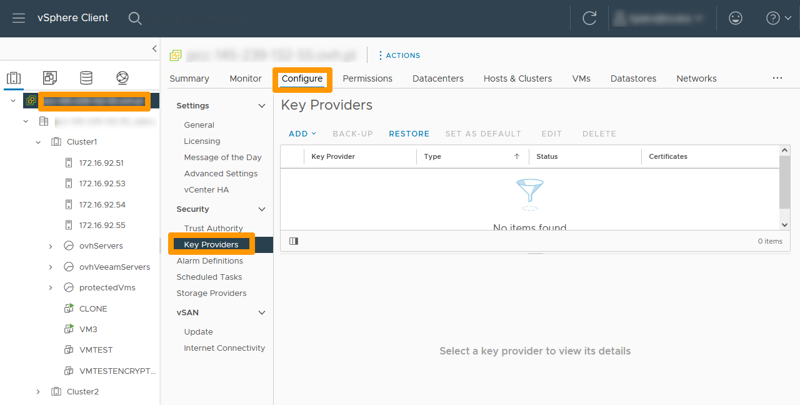
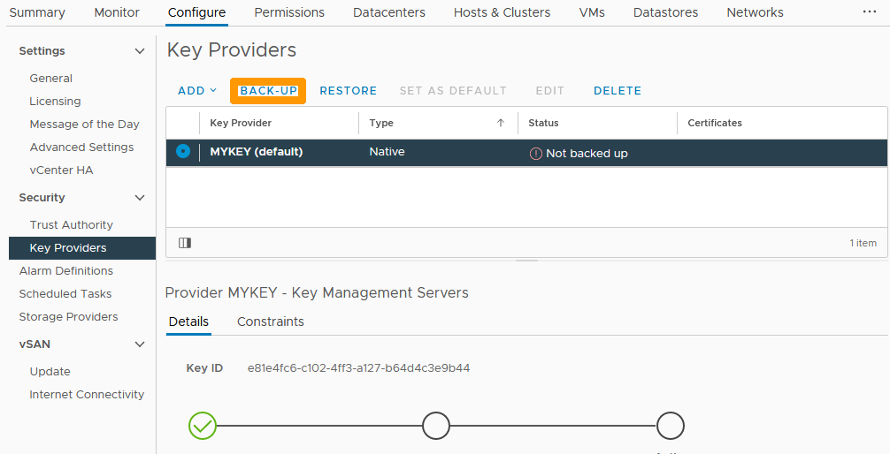
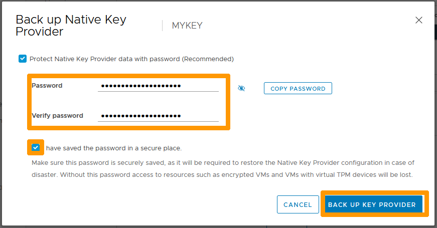
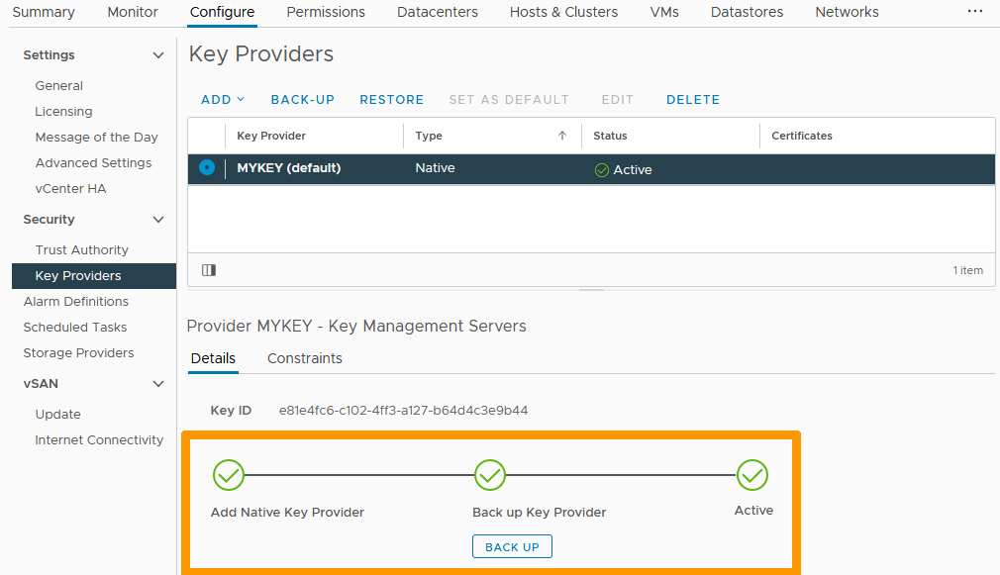
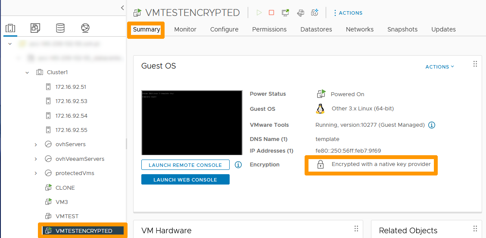

**Dernière mise à jour le 10/08/2022**

## Objectif

Ce guide a pour objectif d'expliquer les détails de la mise en œuvre du chiffrement de machine virtuelles dans l'offre **Private Cloud** **OVHcloud** au travers de vSphere Native Key Provider le fournisseur de clés interne disponible depuis la version 7.0 update 2.

**Découvrez comment mettre en œuvre le chiffrement de vos machines virtuelles à l'aide de vSphere Native Key Provider.**

> [!warning]
> OVHcloud vous met à disposition des services dont la configuration, la gestion et la responsabilité vous incombent. Il vous appartient donc de ce fait d’en assurer le bon fonctionnement.
>
> Ce guide a pour but de vous accompagner au mieux sur des tâches courantes. Néanmoins, nous vous recommandons de faire appel à un prestataire spécialisé si vous éprouvez des difficultés ou des doutes concernant l’administration, l’utilisation ou la mise en place d’un service sur un serveur.
>

## Prérequis

- Avoir souscrit une offre [Hosted Private Cloud](https://www.ovh.com/fr/private-cloud/).
- Avoir un **PCC** en version 7.
- Être connecté à votre [espace client OVHcloud](https://www.ovh.com/auth/?action=gotomanager&from=https://www.ovh.com/fr/&ovhSubsidiary=fr).
- Avoir accès à l’interface de gestion vSphere.

## Présentation

**vSphere Native Key provider** permet de chiffrer les machines virtuelles sans avoir besoin d'un serveur **KMS** (*Key Management Server*) externe.

Il est possible d'exporter la clé **vSphere Native Key provider** vers un autre cluster dans le cas d'un plan de reprise d'activité.

Lorsque l'on chiffre une machine virtuelle l'hôte ESXi génére une clé **DEK** stocké en mémoire, cette clé servira à effectuer le chiffrement de la machine virtuelle et de sa données. Ensuite la clé **DEK** sera à son tour chiffrée à l'aide de **vSphere Native Key provider** et stockée avec la machine virtuelle. Vous trouverez plus de détails sur le chiffrement **WMware** en consultant les documentations officielles dans la section « [Aller plus loin](#gofurther) » de ce guide.

## En pratique

### Autorisation d'un utilisateur à administrer le chiffrement sur un cluster PCC

Avant de pouvoir utiliser les fonctionnalités de chiffrement il est necessaire d'autoriser un utilisateur du **PCC** à gérer le chiffrement cette autorisation se fait à partir de l'espace client OVHcloud.

<!--- Partie à écrire dès que la fonctionnalité sera présente

-->

### Création d'une clé **vSphere Native Key Provider**

Nous allons créer la clé de chiffrement **vSphere Native Key Provider** . Cette clé pourra être utilisé pour chiffrer les clés **DEK** lors du chiffrement d'une machine virtuelle ou pour permettre l'ajout sur une machine virtuelle d'un périphérique virtuel **TPM 2.0**.

Connectez-vous à l'interface **vSphere** à l'aide de ce guide [Se connecter à l'interface vSphere](https://docs.ovh.com/fr/private-cloud/connexion-interface-vsphere/).

Cliquez en haut à gauche sur la racine du `cluster`{.action}, ensuite cliquez sur l'onglet `Configurer`{.action} et choisissez `Fournisseurs de clés`{.action}.

{.thumbnail}

Cliquez sur le bouton `Ajouter`{.action} et choisissez dans le menu `Ajouter un fournisseur de clés natif`{.action}.

{.thumbnail}

Saisissez un nom dans `Nom` et cliquez sur `AJOUTER UN FOURNISSEUR DE CLÉS`{.action}.

{.thumbnail}

Cliquez sur le bouton `SAUVEGARDE`{.action} à gauche pour sauvegarder la clé en dehors du cluster.

{.thumbnail}

Cliquez sur `La case à cocher`{.action} à gauche pour protéger la sauvegarde par un mot de passe.

{.thumbnail}

Saisissez `le mot de passe` et `confirmez-le`, ensuite cochez la case `J'ai enregistré le mot de passe dans un lieu sûr`{.action} et cliquez sur `SAUVEGARDER LE FOURNISSEUR DE CLÉS`{.action}.

{.thumbnail}

Il est possible maintenant d'utiliser la clé pour chiffrer des machines virtuelles ou ajouter un périphérique **TPM 2.0** à une machine virtuelle.

{.thumbnail}

### Chiffrement d'une machine virtuelle

Nous allons chiffrer une machine virtuelle ainsi que sa donnée. 

> [!warning]
> L'opération de chiffrement d'une machine virtuelle ne peut se faire qu'avec la machine virtuelle éteinte
>

Faites un clic droit sur la `machine virtuelle`{.action} ensuite au travers du menu `Stratégies de VM`{.action} choisissez `Modifier les stratégies de stockage VM`{.action}.

{.thumbnail}

Choisissez dans Stratégies de stockage de VM `VM Encryption Policy`{.action} et cliquez sur `OK`{.action}.

{.thumbnail}

Dans les propriétés de la machine virtuelle cliquez sur l'onglet `Résumé`{.action} et vous verrez apparaitre un `cadenas` suivi du texte `Chiffré avec un fournisseur de clés natif` qui indique que la machine virtuelle est chiffrée. 

{.thumbnail} 

### Migration de la solution KMS Thalès vers **vSphere Native Key provider**

Certains clients OVHcloud utilisent une solution de chiffrement avec des clés KMS externes Thalès, Il est possible de migrer le chiffrement vers **vSphere Native Key Provider**

Suivez les instructions ci-dessous pour migrer une machine virtuelle chiffrée avec une clés KMS Thalès nommée **cluster** vers une clé vSphere Native Key Provider portant le nom **MY-NKP**.

A partir de la console **vSphere** de votre cluster cliquez en haut à gauche sur la `racine du cluster`{.action}, allez en haut dans l'onglet `Configurer`{.action} cliquez `Fournisseurs de clés`{.action} dans la barre verticale, positionnez-vous sur la `clé vSphere Native Key provider`{.action} et cliquez sur `DÉFINIR COMME VALEUR PAR DÉFAUT`{.action}.

{.thumbnail}

Cliquez sur `DÉFINIR COMME VALEUR PAR DÉFAUT`{.action}.

{.thumbnail}

La clé **vSphere Native Key Provider** est définie par défaut.

{.thumbnail}

Cliquez sur `la machine virtuelle`{.action} allez dans l'onglet `Résumé`{.action}. Cette machine virtuelle utilise le `fournisseur de clés standard`. Nous allons changer le chiffrement de cette machine virtuelle.

{.thumbnail}

Au travers du client **vSphere** faites un clic droit sur `la machine virtuelle`{.action} qui doit être rechiffrée, ensuite au travers du menu dans `VM Policies`{.action} choisissez `Chiffrer à nouveau`{.action}.

> [!primary]
> L'opération de rechiffrement peut se faire avec la machine virtuelle allumée, car uniquement la clé **DEK** est chiffrée à nouveau.
>

{.thumbnail}

Le rechiffrement s'effectue en quelques millisecondes car ce n'est que la clé **DEK** qui est rechiffrée à l'aide la nouvelle clé **vSphere Native Key Provider**.

{.thumbnail}

Cliquez sur la `machine virtuelle`{.action} ou le chiffrement a été modifié allez dans l'onglet `Résumé`{.action} vous pouvez constater que le chiffrement utilise un fournisseur de clés natif à coté du  `cadenas`.

{.thumbnail}

## Aller plus loin 

[Présentation WMware de vSphere Native Key Provider](https://core.WMware.com/native-key-provider)

[Documentation VMware du processus de chiffrement sur vSphere](https://docs.vmware.com/en/VMware-vSphere/7.0/com.vmware.vsphere.security.doc/GUID-4A8FA061-0F20-4338-914A-2B7A57051495.html)

[Documentation WMware concernant vSphere Native Key Provider](https://docs.WMware.com/en/WMware-vSphere/7.0/com.WMware.vsphere.security.doc/GUID-54B9FBA2-FDB1-400B-A6AE-81BF3AC9DF97.html)

Échangez avec notre communauté d’utilisateurs sur <https://community.ovh.com/>.

