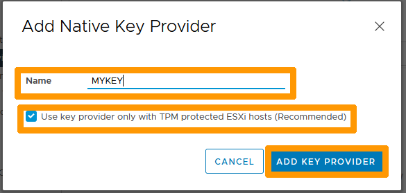
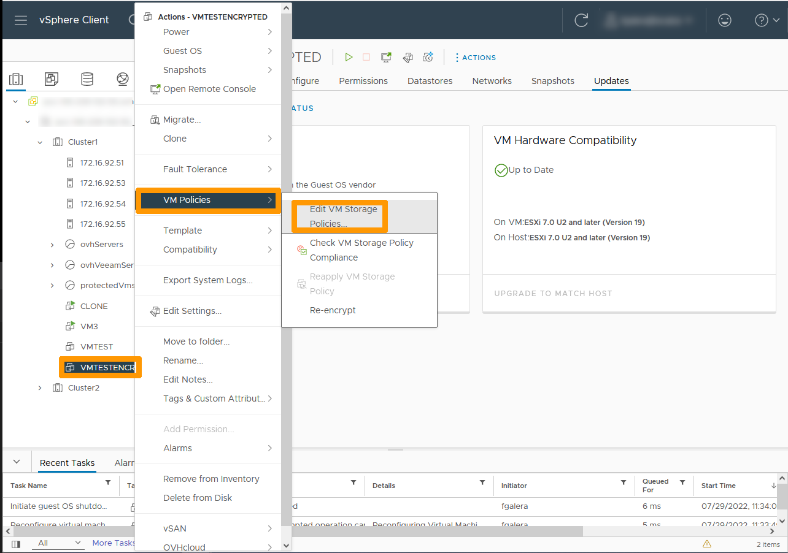
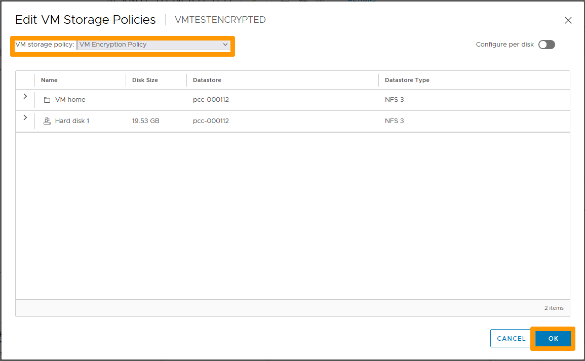
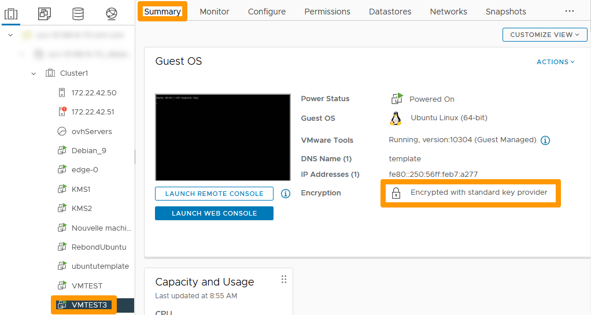

**Dernière mise à jour le 02/08/2022**

## Objectif

Ce guide a pour objectif d'expliquer les détails de la mise en oeuvre du chiffrement de machine virtuelles sur l'offre Private Cloud de OVHcloud, en employant vSphere Native Key Provider le serveur de clé interne disponible depuis la version 7.0 update 2.

**Découvrez comment mettre en œuvre le chiffrement de vos machines virtuelles avec vSphere Native Key Provider.**

> [!warning]
> OVHcloud vous met à disposition des services dont la configuration, la gestion et la responsabilité vous incombent. Il vous appartient donc de ce fait d’en assurer le bon fonctionnement.
>
> Ce guide a pour but de vous accompagner au mieux sur des tâches courantes. Néanmoins, nous vous recommandons de faire appel à un prestataire spécialisé si vous éprouvez des difficultés ou des doutes concernant l’administration, l’utilisation ou la mise en place d’un service sur un serveur.
>

## Prérequis

- Avoir souscrit une offre [Private Cloud](https://www.ovh.com/fr/private-cloud/){.external}.
- Utiliser un cluster vSphere en version 7.0 Update 2 au minimum. 
- Avoir accès à l’interface de gestion vSphere.

## Présentation

**vSphere Native Key provider** permet de chiffrer les machines virtuelles sans avoir besoin d'un serveur KMS (Key management Server) externe.

La version minimale est vSphere 7.0 Update 2 avec une licence **enterprise plus**.

L'option doit être activée sur l'espace client OVHcloud.

La clé est créée sur vSphere et est copiée sur chacun des serveurs Esxi membres du cluster, si une clé est supprimée les machines virtuelles qui sont chiffrés continuerons à fonctionner jusqu'à qu'elles soient retirées de l'inventaire.

IL est possible d'importer la clé sur un autre cluster dans le cas d'un plan de reprise d'activité.

Le chiffrement sur des cluster **vSphere** se fait en deux étapes, les données des machines virtuelles sont chiffrées à l'aide d'une clé **DEK** qui se trouve sur les serveurs **Esxi**, ensuite cette clé est re-chifrée à l'aide de la clé **vSphere Native Key provider** qui est en fait une clé **KEK** (*Key Encryption Key*). Vous trouverez plus de détails sur le chiffrement **VMWARE** en consultant  les documentations officielles que vous trouverez dans la section « [Aller plus loin](#gofurther) » de ce guide.

## En pratique

### Autorisation de la fonctionnalité au travers de l'espace client OVHcloud

Non encore disponible

<!--- Partie à écrire dès que la fonctionnalité sera présente

-->

### Création d'une clé **vSphere Native Key Provider**

Nous allons créer la clé de chiffrement. Cette clé est une clé **KEK** (*Key Encryption Key*) qui sert pour faire du chiffrement symétrique (*wrap*) de la clé **DEK** qui se trouve sur les hôtes **ESXi**. 

Connectez-vous à l'interface vSphere à l'aide de ce guide [Se connecter à l'interace vSphere](https://docs.ovh.com/fr/private-cloud/connexion-interface-vsphere/).

Cliquez en haut à gauche sur la racine du `cluster`{.action}, ensuite cliquez sur l'onglet `Configurer`{.action} et choisissez `Fournisseurs de clés`{.action}.

{.thumbnail}

Cliquez sur le bouton `Ajouter`{.action} et choisissez dans le menu `Ajouter un fournisseur de clés natif`{.action}.

{.thumbnail}

Saisissez un nom dans `Nom` et cliquez sur `AJOUTER UN FOURNISSEUR DE CLÉS`{.action}.

{.thumbnail}

Cliquez sur le bouton `SAUVEGARDE`{.action} à gauche pour sauvegarder la clés en dehors du cluster.

{.thumbnail}

Cliquez sur `La case à cocher`{.action} à gauche pour protéger la sauvegarde par un mot de passe.

{.thumbnail}

Saisissez `le mot de passe` et `confirmez le`, ensuite cochez la case `J'ai enregistré le mot de passe dans un lieu sûr`{.action} et cliquez sur `SAUVEGARDER LE FOURNISSEUR DE CLÉS`{.action}.

{.thumbnail}

Il est possible maintenant d'utiliser la clé pour chiffrer des machines virtuelles.

{.thumbnail}

### Chiffrement d'une machine virtuelle

Nous allons chiffrer le fichier de configuration de la machine virtuelle ainsi que les disques de stockage. L'opération de chiffrement se fait en deux étapes, les données sont chiffrées à l'aide d'une clé **DEK** (Data encryption Key) qui se trouve sur les serveurs Esxi et ensuite la clé **DEK** est rechiffrée (**wrapped**) à l'aide de la clé **KEK** générée précédemment.

> [!warning]
> L'opération de chiffrement d'une machine virtuelle ne peut se faire qu'avec la machine virtuelle éteinte
>

Faites un clic droit sur la `machine virtuelle`{.action} que vous voulez chiffrer, à partir du menu `Stratégies de VM`{.action} et choisissez `Modifier les stratégies de stockage VM`{.action}.

{.thumbnail}

Choisissez dans Stratégies de stockage de VM `VM Encryption Policy`{.action} et cliquez sur `OK`{.action}.

{.thumbnail}

Dans les propriétés de la machine virtuelle cliquez sur l'onglet `Résumé`{.action} et vous verrez apparaitre un `cadenas` qui indique que la machine virtuelle est chiffrée. 

{.thumbnail} 

### Migration de la solution KMS Thalès vers **vSphere Native Key provider**

Certains clients OVHcloud utilisent une solution de chiffrement avec des clés KMS externes, Il est possible de migrer le cryptage vers vSphere Native Key Provider

Nous allons migrer une machine virtuelle chiffrée avec une clés KMS de Thalès nommée **cluster** vers une clé vSphere Native Key Provider portant le nom **MY-NKP**.

A partir de la console **vCenter** de votre cluster cliquez en haut à gauche sur la `racine du cluster`{.action}. allez en haut dans l'onglet `Configurer`{.action} cliquez `Fournisseurs de clés`{.action} dans la barre verticale, positionnez-vous sur la `clé vSphere Native Key provider`{.action} et cliquez sur `DÉFINIR COMME VALEUR PAR DÉFAUT`{.action}.

{.thumbnail}

Cliquez sur `DÉFINIR COMME VALEUR PAR DÉFAUT`{.action}.

{.thumbnail}

La clé **vSphere Native Key Provider** est définie par défaut.

{.thumbnail}

Au travers de **vCenter** faites un clic droit sur `la machine virtuelle`{.action} qui doit être rechiffrée ensuite au travers du menu dans `VM Policies`{.action} choisissez `Chiffrer à nouveau`{.action}.

> [!primary]
> L'opération de rechiffrement peut se faire avec la machine virtuelle allumée, car uniquement la clé **DEK** est re-chiffrée.
>

{.thumbnail}

Le rechiffrement s'éffectue en quelques millisecondes car ce n'est que la **DEK** qui est rechiffrée à l'aide la nouvelle clé **vSphere Native Key Provider**.

{.thumbnail}

## Aller plus loin 

[Présentation VMWARE de vSphere Native Key Provider](https://core.vmware.com/native-key-provider)

[Documentation VMARE du processus de chiffrement sur vSphere](https://docs.vmware.com/en/VMware-vSphere/7.0/com.vmware.vsphere.security.doc/GUID-4A8FA061-0F20-4338-914A-2B7A57051495.html)

[Documentation VMWARE concernant vSphere Native Key Provider](https://docs.vmware.com/en/VMware-vSphere/7.0/com.vmware.vsphere.security.doc/GUID-54B9FBA2-FDB1-400B-A6AE-81BF3AC9DF97.html)

Échangez avec notre communauté d’utilisateurs sur <https://community.ovh.com/>.

