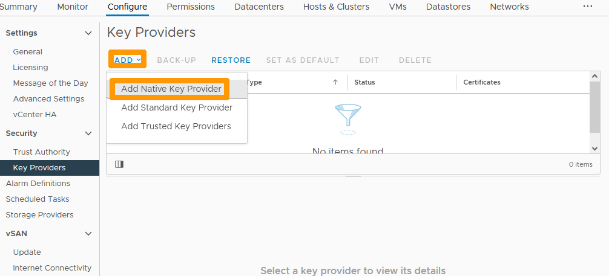

**Dernière mise à jour le 01/07/2020**

## Objectif

Ce guide a pour objectif d'expliquer les détails de la mise en oeuvre de VM Encryption sur l'offre Private Cloud de OVHcloud, en employant vSphere Native Key Provider le serveur de clé interne à vSphere disponible depuis la version 7.0 update 2.

**Découvrez comment mettre en oeuvre le chiffrement de vos machines virtuelles avec VM Encryption.**

## Prérequis

- Avoir souscrit une offre [Private Cloud](https://www.ovh.com/fr/private-cloud/){.external}.
- Utiliser un cluster vSphere en version 7.0 Update 2 au minimum. 
- Avoir accès à l’interface de gestion vSphere.

## Présentation

La solution **vSphere Native Key provider** permet de chiffrer les machines virtuelles sans avoir besoin d'un serveur KMS (Key management Server) externe.

Pour pouvoir l'utiliser il faut un cluster vSphere 7.0 Update 2 avec une licence enterprise plus.

L'option doit être activée sur l'espace client OVHcloud.

La clé est crée sur vCenter et est copié sur chacun des serveurs Esxi membres du cluster, si une clé est supprimée les machines virtuelles qui sont cryptées continuerons à fonctionner jusqu'a quelles soient sorties de l'inventaire.

IL est possible d'importer la clé sur un autre cluster dans le cas d'un plan de reprise d'activité.

## En pratique

<!--- Partie à écrire dès que la fonctionnalité sera présente

### Autorisation de la fonctionnalité au travers de l'espace client OVHcloud

-->

### Création d'une clé pour 

Nous allons créer la clé de chiffrement.

Connectez-vous à l'interface vSPHERE à l'aide de ce guide [Se connecter à l'interace vSphere](https://docs.ovh.com/fr/private-cloud/connexion-interface-vsphere/).

Cliquez en haut à gauche sur le la racine du `cluster`{.action}, ensuite cliquez sur l'onglet `Configurer`{.action} et choisissez `Fournisseurs de clés`{.action}.

Cliquez sur le bouton `Ajouter`{.action} et choississez dans le menu `Ajouter un fournisseur de clés natif`{.action}.

Saisissez un nom dans `Nom` et cliquez sur `AJOUTER UN FOURNISSEUR DE CLÉS`{.action}.

Cliquez sur le bouton `SAUVEGARDE`{.action} à gauche pour sauvegarder la clés en dehors du cluster.

Cliquez sur `La case à cocher`{.action} à gauche pour protéger la sauvegarde par un mot de passe.

Saisissez `le mot de passe` et `confirmez le`, ensuite cochez la case `J'ai enregistré le mot de passe dans un lieu sûr`{.action} et cliquez sur `SAUVEGARDER LE FOURNISSEUR DE CLÉS`{.action}.

Il est possible maintenant d'utiliser la clé pour chiffrer des machines virtuelles.

[01 Create KEY 07](images/01-create-key07.png)

### Chiffrement d'une machine virtuelle

Avant de lancer le chiffrement d'un machine virtuelle il faut absolument quelle soit éteinte.

Faites un clic droit sur la `machine virtuelle`{.action} que vous voulez chiffrer, à partir du menu `Stratégies de VM`{.action} et choisissez `Modifier les stratégies de stockage VM`{.action}.

[02 encrypt VM 01](images/02-encrypt-vm01.png)

Choisissez dans Stratégies de stockage de VM `VM Encryption Policy`{.action} et cliquez sur `OK`{.action}.

[02 encrypt VM 02](images/02-encrypt-vm02.png)

Dans les propriétés de la machine virtuelle cliquez sur l'onglet `Résumé`{.action} et vous verrez apparaitre un `cadenas` qui indique que la machine virtuelle est chiffrée. 

[02 encrypt VM 03](images/02-encrypt-vm03.png) 

### Migration de la solution **KMS** vers **VNKP**

des clients OVHcloud utilisent une solution de chiffrement avec des clés KMS externes, il est possible de migrer les machines virtuelles utilisant ce système vers VNKP.

## Aller plus loin

[Présentation de Vsphere Native Key Provider](https://core.vmware.com/native-key-provider)

[Documentation Vsphere Native Key Profider](https://docs.vmware.com/en/VMware-vSphere/7.0/com.vmware.vsphere.security.doc/GUID-54B9FBA2-FDB1-400B-A6AE-81BF3AC9DF97.html)

Échangez avec notre communauté d’utilisateurs sur <https://community.ovh.com/>.
