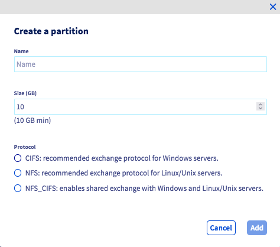
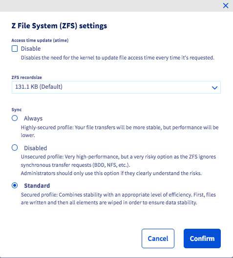

> [!primary]
> Questa traduzione è stata generata automaticamente dal nostro partner SYSTRAN. I contenuti potrebbero presentare imprecisioni, ad esempio la nomenclatura dei pulsanti o alcuni dettagli tecnici. In caso di dubbi consigliamo di fare riferimento alla versione inglese o francese della guida. Per aiutarci a migliorare questa traduzione, utilizza il pulsante "Modifica" di questa pagina.
>

**Ultimo aggiornamento: 16/09/2021**

## Obiettivo

Il NAS (Network Attached Storage) è un server di file collegato ad una rete la cui funzione principale è lo storage di dati in un volume centralizzato per clienti di rete eterogenei.

## Prerequisiti

- Disporre di un indirizzo IP associato a un servizio OVHcloud (Hosted Private Cloud, Server Dedicato, VPS, Istanza Public Cloud, ecc...)
- Disporre di un [NAS-HA](https://www.ovh.it/nas/)
- Avere accesso allo [Spazio Cliente OVHcloud](https://www.ovh.com/auth/?action=gotomanager&from=https://www.ovh.it/&ovhSubsidiary=it){.external}

## Procedura

Il NAS-HA è gestito dallo [Spazio Cliente OVHcloud](https://www.ovh.com/auth/?action=gotomanager&from=https://www.ovh.it/&ovhSubsidiary=it){.external}.

Una volta connesso, clicca su `Bare Metal Cloud`{.action} e poi su `NAS e CDN`{.action} nel menu a sinistra. Clicca sul tuo servizio per accedere al menu di amministrazione.

{.thumbnail}

### Creare una partizione 

Per aggiungere una nuova partizione, clicca su `Crea una partizione`{.action}.

{.thumbnail}

Inserisci il **nome della tua partizione**, la **dimensione** della stessa e il **protocollo autorizzato** (NFS o CIFS).

{.thumbnail}

### Modifica la dimensione di una partizione

Per modificare la dimensione di una partizione, clicca sul pulsante `(...)`{.action} situato a destra della partizione interessata e poi su `Modifica la dimensione`{.action}.

{.thumbnail}

Indica la nuova dimensione e conferma l'operazione.

### Modifica la frequenza degli Snapshot

Di default, uno snapshot del contenuto del tuo NAS si effettua ogni ora e si registra sul tuo NAS.

È possibile creare fino a 3 Snapshot supplementari a frequenze differenti se lo desideri, che saranno ugualmente registrati sul tuo NAS.

Clicca sul pulsante `(...)`{.action} situato a destra della partizione interessata e poi su `Frequenza degli Snapshot`{.action}.

{.thumbnail}

Seleziona la nuova frequenza e conferma.

### Crea uno Snapshot istantaneo

Al di fuori degli Snapshot realizzati automaticamente, potete in qualsiasi momento creare uno Snapshot istantaneo di una partizione, cliccando sul pulsante `(...)`{.action} situato a destra della partizione e poi su `Snapshot istantaneo`{.action}.

{.thumbnail}

Assegna un nome allo Snapshot e clicca su `Aggiungi`{.action}

### Aggiungere un accesso 

Per accedere alla partizione che hai creato precedentemente, devi configurare un accesso.

> [!primary]
>
> Possono accedere al NAS solo gli indirizzi IP di servizi OVHcloud (ad esempio: un server dedicato, un VPS, un'istanza Public Cloud, ecc...)
>

Per autorizzare un IP ad accedere al NAS, clicca sul pulsante `(...)`{.action} situato a destra della partizione esistente e poi su `Gestisci gli accessi`{.action}.

{.thumbnail}

Clicca su `Aggiungi un accesso`{.action} e poi seleziona l'indirizzo IP del tuo prodotto OVHcloud.
 Devi anche definire se l'accesso autorizzato per questo indirizzo IP è in sola lettura (*Read-only*) o in lettura/scrittura (*Read/Write*)

{.thumbnail}

#### Eliminare un accesso

Per eliminare l'accesso a una partizione, clicca sul pulsante `(...)`{.action} situato a destra dell'indirizzo IP in questione e poi su `Elimina`{.action}.

{.thumbnail}

### Parametri Z File System (ZFS)

> [!warning]
>
> Tutti i parametri ZFS di default sono ottimizzati. Anche se non consigliamo di modificare questi parametri, questo menu permette di adattare il ZFS utilizzato dal NAS-HA.
>

Per modificare le impostazioni ZFS di una partizione, clicca sul pulsante `(...)`{.action} a destra della partizione interessata e poi su `Impostazioni Z File System (ZFS)`{.action}.

{.thumbnail}

- **Disattiva l'aggiornamento dei tempi di accesso (*atime*)**: La disattivazione del *gesto* significa che il kernel non aggiornerà più l'orario del file ad ogni accesso al file. Ciò può essere utile per accelerare le operazioni di lettura frequenti, ad esempio su pagine Web statiche. Questa disattivazione non è consigliabile per applicazioni critiche in termini di coerenza, come i database.
- **ZFS recordsize**: Questa proprietà modifica la dimensione massima del blocco sul file system ZFS. Si noti che ZFS utilizzerà sempre una dimensione del blocco inferiore se il file è inferiore alla dimensione massima. Ad esempio, un file da 16 KB utilizzerà un blocco da 16 KB (più i metadati) per non sprecare spazio di storage. In generale, ti consigliamo di non modificare il ZFS *recordsize*.
- **Sync**: Questo parametro modifica il comportamento delle transazioni del file system ZFS per quanto riguarda la memorizzazione in buffer dei dati RAM e la scrittura dei dati sul disco. Ti consigliamo di non modificare questa proprietà, tranne nel caso in cui ci sia un motivo specifico.

### Elimina una partizione

> [!alert]
>
> L'eliminazione di una partizione comporta la cancellazione totale e definitiva di tutti i dati in essa contenuti.
>

Per eliminare una partizione, clicca sul pulsante `(...)`{.action} situato a destra della partizione esistente e seleziona `Elimina`{.action}.

{.thumbnail}

## Per saperne di più

Contatta la nostra Community di utenti all’indirizzo <https://community.ovh.com/en/>.
