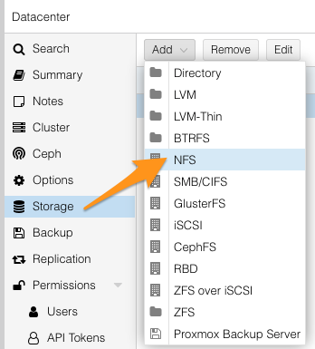
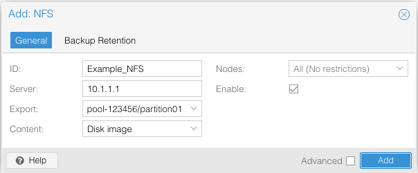

**Last updated 6th December 2022**

## Objective

The OVHcloud HA-NAS service allows you to manage file storage that can be accessed over a network.

**This guide explains how to access your HA-NAS via NFS on the most common operating systems.**

> [!warning]
>OVHcloud is providing you with services for which you are responsible, with regard to their configuration and management. It is therefore your responsibility to ensure  that they function correctly.
>
>This guide is designed to assist you in common tasks as much as possible. Nevertheless, we recommend that you contact a [specialist service provider](https://partner.ovhcloud.com/en-ca/directory/) or reach out to [our community](https://community.ovh.com/en/) if you face difficulties or doubts concerning the administration, usage or implementation of services on a server.
>

## Requirements

- An [OVHcloud HA-NAS solution](https://www.ovhcloud.com/en-ca/storage-solutions/nas-ha/)
- An OVHcloud service with a public IP address attached to it (Hosted Private Cloud, dedicated server, VPS, Public Cloud instance, etc.)
- An operating system compatible with NFS installed on your server
- [A partition created on the service with the NFS protcol enabled](https://docs.ovh.com/ca/en/storage/file-storage/nas/get-started/#partition)
- [An ACL entry for the server's IP address](https://docs.ovh.com/ca/en/storage/file-storage/nas/get-started/#addaccess)
- Administrative access (root) to your server via SSH or GUI

## Instructions

The following sections contain configuration examples for the most commonly used distributions / operating systems. The first step is always to log in to your server via SSH or connecting to the GUI of your installed OS. The examples below presume you are logged in as a user with elevated permissions.

You will also need the **internal name** and the **IP address** of your HA-NAS service which you can find in the email received after the installation or in your [OVHcloud Control Panel](https://ca.ovh.com/auth/?action=gotomanager&from=https://www.ovh.com/ca/en/&ovhSubsidiary=ca).

The following notations are used as arguments in the command line sections below. Replace them with the appropriate values when entering the commands.

|Argument|Description|
|---|---|
|IP_HA-NAS|The IP address of the HA-NAS (Example: `10.1.1.1`)|
|NFS_PATH|The path to the HA-NAS partition to mount, consisting of the service name and your partitions' name (Example: `zpool-123456/partition01`)|
|MOUNTING_FOLDER|The local folder for your mounted partition|


> [!warning]
>
> The NFS user is `root`; rights changes with this user can generate conflicts with existing CIFS / SMB rights.
>


### Debian based distributions

Install the package `nfs-common`:

```bash
ubuntu@server:~$ sudo apt install nfs-common
```

Then use the following mount command:

```bash
ubuntu@server:~$ sudo mount -t nfs IP_HA-NAS:/NFS_PATH /MOUNTING_FOLDER
```

**Example:**

```bash
ubuntu@server:~$ sudo mount -t nfs 10.1.1.1:/zpool-123456/partition01 /mount/ha_nas
```

You can now access your mounted partition at the specified folder.


> [!primary]
>
> In order to automate the mounting process for each time the server boots, add the following line to the file `/etc/fstab`:
>
> `IP_HA-NAS:/NFS_PATH /MOUNTING_FOLDER nfs rw 0 0`
>


### CentOS 7 / AlmaLinux / Rocky Linux

Verify that the latest versions of the packages `nfs-utils` and `rpcbind` are installed:


```bash
centos@server:~$ sudo yum install nfs-utils rpcbind
```

If necessary, restart the `rpcbind` service with the following command:


```bash
centos@server:~$ sudo systemctl restart rpcbind
```

To mount your partition, use the following command:

```bash
centos@server:~$ sudo mount -t nfs IP_HA-NAS:/NFS_PATH /MOUNTING_FOLDER
```

**Example:**

```bash
centos@server:~$ sudo mount -t nfs 10.1.1.1:/zpool-123456/partition01 /mount/ha_nas
```

You can now access your mounted partition at the specified folder.

> [!primary]
>
> In order to automate the mounting process for each time the server boots, add the following line to the file `/etc/fstab`:
>
> `IP_HA-NAS:/NFS_PATH /MOUNTING_FOLDER nfs rw 0 0`
>

### Fedora

Install the package `nfs-utils`:

```bash
fedora@server:~$ sudo dnf -y install nfs-utils
```

Then use the following mount command:

```bash
fedora@server:~$ sudo mount -t nfs IP_HA-NAS:/NFS_PATH /MOUNTING_FOLDER
```

**Example:**

```bash
fedora@server:~$ sudo mount -t nfs 10.1.1.1:/zpool-123456/partition01 /mount/ha_nas
```

You can now access your mounted partition at the specified folder.


### Proxmox

In the Proxmox administration interface, click on `Storage`{.action} in the vertical menu.

{.thumbnail}

Click on the button `Add`{.action} and select `NFS`{.action}.

In the popup window, enter the following details.

|Detail|Description|
|---|---|
|ID|An identifier for the share|
|Server|The IP address of the HA-NAS (Example: `10.1.1.1`)|
|Export|The path to the HA-NAS partition (It should be detected by the automatic scan; select it from the list.)|
|Content|Content types for this NFS share (Disk image, ISO image, Container template, VZDump backup file, Container, Snippets)|

{.thumbnail}

Click on `Add`{.action} to mount your partition.

### VMware ESXI

In the VMware ESXI administration interface, click on `Storage`{.action} in the menu on the left.

Then click on the button `New datastore`{.action} to open the assistant.

{.thumbnail}

In the new window, select `Mount NFS datastore`{.action} and click on `Next`{.action}.

{.thumbnail}

Complete the form with the following details.

|Detail|Description|
|---|---|
|Name|An identifier for the share|
|NFS server|The IP address of the HA-NAS (Example: `10.1.1.1`)|
|NFS share|The path to the HA-NAS partition to mount (Example: `zpool-123456/partition01`)|

{.thumbnail}

Once done, click on `Next`{.action}. Click on `Finish`{.action} in the last step.

Your HA-NAS partition is now mounted as a datastore.

{.thumbnail}

## Go further

Join our community of users on <https://community.ovh.com/en/>.
