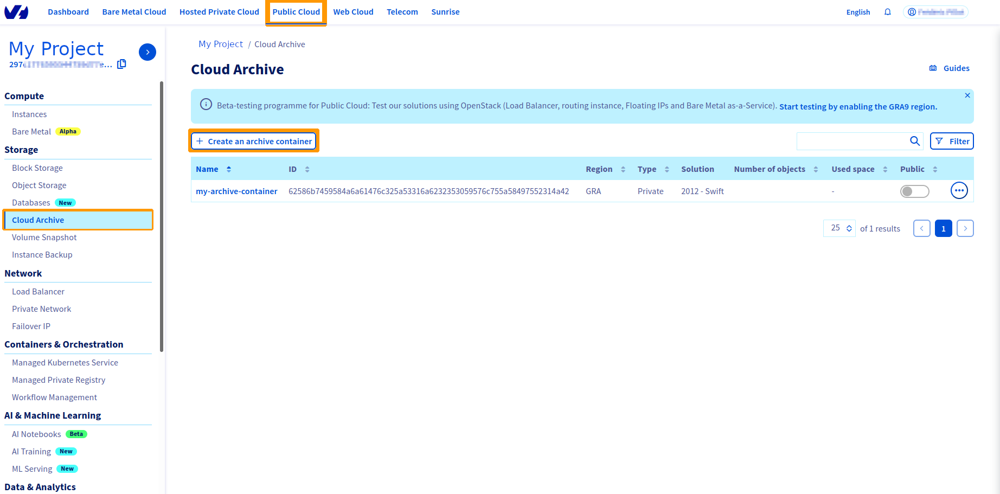

> [!primary]
> Questa traduzione è stata generata automaticamente dal nostro partner SYSTRAN. I contenuti potrebbero presentare imprecisioni, ad esempio la nomenclatura dei pulsanti o alcuni dettagli tecnici. In caso di dubbi consigliamo di fare riferimento alla versione inglese o francese della guida. Per aiutarci a migliorare questa traduzione, utilizza il pulsante "Modifica" di questa pagina.
>

**Ultimo aggiornamento: 27/10/2021**

## Obiettivo

L'offerta Public Cloud Archive è una soluzione di storage illimitata con fatturazione semplice e adattata alle tue necessità. Esistono numerosi tipi di container di oggetti:

- per l'hosting statico (sito web statico);
- per l'hosting privato (esempio: memorizzazione di dati personali);
- per l'hosting pubblico (per archiviare tutto ciò che è accessibile al pubblico);
- per l'archiviazione a freddo (archiviazione).

Il primo step è la creazione di un container che raggrupperà i tuoi file. 

**Questa guida ti mostra come creare un container dallo Spazio Cliente OVHcloud.**

## Prerequisiti

- Avere accesso allo [Spazio Cliente OVHcloud](https://www.ovh.com/auth/?action=gotomanager&from=https://www.ovh.it/&ovhSubsidiary=it){.external}

## Procedura

### Crea un container Public Cloud Archive dallo Spazio Cliente OVHcloud

Accedi al tuo [Spazio Cliente](https://www.ovh.com/auth/?action=gotomanager&from=https://www.ovh.it/&ovhSubsidiary=it){.external}, accedi alla sezione `Public Cloud`{.action} e seleziona il tuo progetto Public Cloud. Clicca su `Cloud Archive`{.action} nella barra di navigazione di sinistra su `Storage`.

Per il tuo primo container:

Se hai già creato container:

Seleziona la Region del container e clicca su `Seguente`{.action}:

Assegna un nome al tuo container e clicca su `Aggiungi container`{.action}:

> [!warning]
>
> Per collegare il container a un dominio, il nome del container di dati non deve contenere questi caratteri:
>
> - [ . ]
> - [ _ ]
> - e non utilizzare maiuscole.
>
> Per maggiori informazioni, consulta la guida [Associare un container a un dominio](https://docs.ovh.com/it/storage/configura_un_dominio_su_un_container_del_tuo_object_storage/).
>

Il tuo container è stato creato:

## Per saperne di più

Contatta la nostra Community di utenti all’indirizzo <https://community.ovh.com/en/>.
