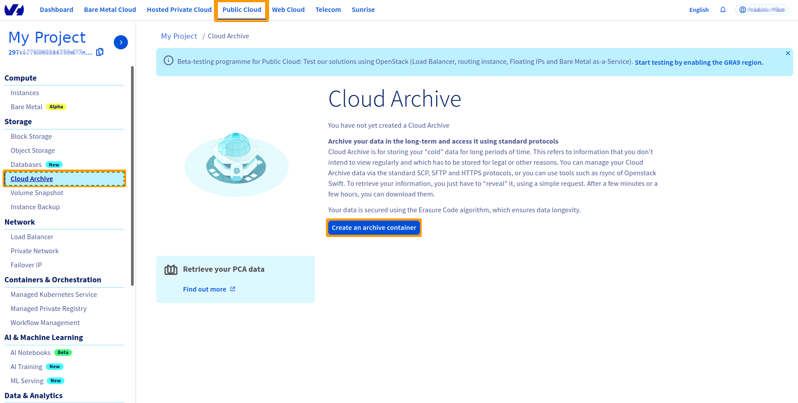
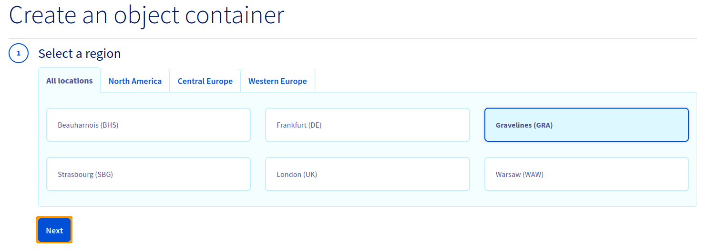

> [!primary]
> Tłumaczenie zostało wygenerowane automatycznie przez system naszego partnera SYSTRAN. W niektórych przypadkach mogą wystąpić nieprecyzyjne sformułowania, na przykład w tłumaczeniu nazw przycisków lub szczegółów technicznych. W przypadku jakichkolwiek wątpliwości zalecamy zapoznanie się z angielską/francuską wersją przewodnika. Jeśli chcesz przyczynić się do ulepszenia tłumaczenia, kliknij przycisk “Zaproponuj zmianę” na tej stronie.
>

**Ostatnia aktualizacja z dnia 27-10-2021**

## Wprowadzenie

Oferta Public Cloud Archive to rozwiązanie do przechowywania danych bez ograniczeń. Fakturowanie jest proste i dostosowane do Twoich potrzeb. Istnieje wiele rodzajów kontenerów obiektów:

- w przypadku hostingu statycznego (statyczna strona internetowa);
- dla hostingu prywatnego (Przykład: przechowywanie danych osobowych);
- do hostingu publicznego (do przechowywania wszystkiego, co jest dostępne publicznie);
- do archiwizacji danych.

Pierwszy etap polega na utworzeniu kontenera, który gromadzi Twoje pliki. 

**Niniejszy przewodnik wyjaśnia, jak utworzyć kontener w Panelu klienta OVHcloud.**

## Wymagania początkowe

- Zalogowanie do [Panelu klienta OVHcloud](https://www.ovh.com/auth/?action=gotomanager&from=https://www.ovh.pl/&ovhSubsidiary=pl){.external}

## W praktyce

### Utworzenie kontenera Public Cloud Archive w Panelu klienta OVHcloud

Zaloguj się do swojego [panelu klienta](https://www.ovh.com/auth/?action=gotomanager&from=https://www.ovh.pl/&ovhSubsidiary=pl){.external}, przejdź do sekcji `Public Cloud`{.action} i wybierz odpowiedni projekt Public Cloud. Następnie kliknij `Cloud Archive`{.action} na pasku nawigacji po lewej stronie `Storage`.

W przypadku pierwszego kontenera:

Jeśli już utworzyłeś jeden/kilka kontenerów:

Wybierz region kontenera i kliknij `Dalej`{.action}:

Nazwij kontener i kliknij na `Dodaj kontener`{.action}:

> [!warning]
>
> Jeśli chcesz przypisać kontener do domeny, nazwa kontenera nie może zawierać następujących znaków:
> 
> - [ . ]
> - [ _ ]
> - nie wolno używać wielkich liter.
>
> Aby uzyskać więcej informacji, zapoznaj się z naszym przewodnikiem "[Powiązanie kontenera z nazwą domeny](https://docs.ovh.com/pl/storage/umieszczenie_kontenera_object_storage_za_domena/)".
>

Kontener został utworzony:

## Sprawdź również

Dołącz do społeczności naszych użytkowników na stronie <https://community.ovh.com/en/>.
