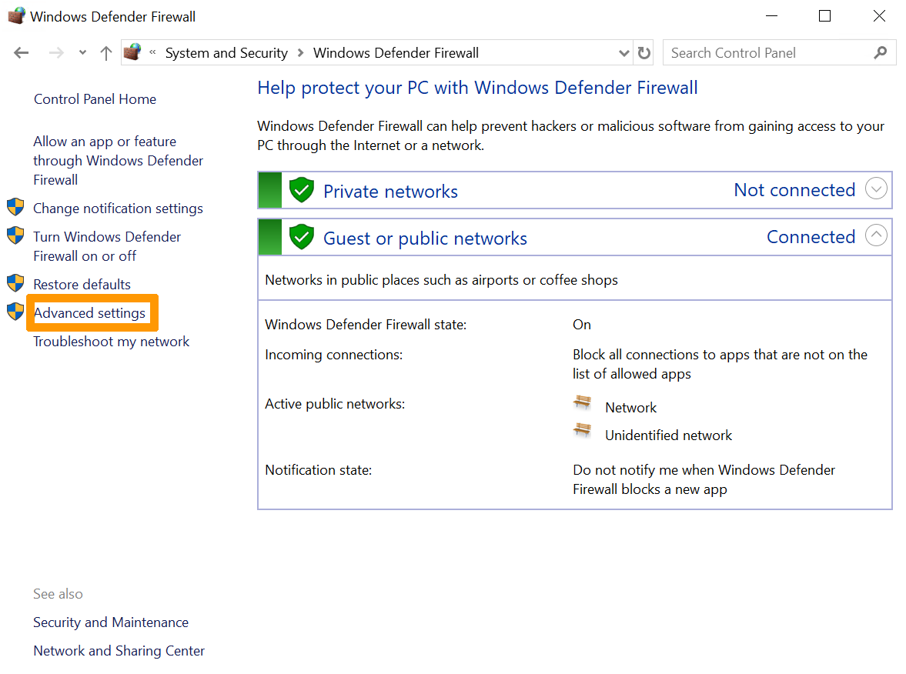

**Dernière mise à jour le 17/02/2023**

## Objectif

Pour protéger de manière optimale votre système, votre serveur sous Windows Server dispose de son propre pare-feu intégré. Son paramétrage vous permet  d’augmenter les niveaux de sécurité et de garantir ainsi la disponibilité et l’intégrité de tous les éléments hébergés sur le serveur, tels que les rôles, les services, les dossiers partagés.

**Ce guide vous explique comment appliquer les règles du pare-feu sous Windows.**

> [!warning]
>
> OVHcloud met à votre disposition des services dont la responsabilité vous revient. En effet, n’ayant aucun accès à ces machines, nous n’en sommes pas les administrateurs et ne pourrons vous fournir d'assistance. Il vous appartient de ce fait d’en assurer la gestion logicielle et la sécurisation au quotidien.
>
> Nous mettons à votre disposition ce guide afin de vous accompagner au mieux sur des tâches courantes. Néanmoins, nous vous recommandons de faire appel à un [prestataire spécialisé](https://partner.ovhcloud.com/fr-ca/) si vous éprouvez des difficultés ou avez des doutes concernant l’administration, l’utilisation ou la sécurisation d’un serveur. Plus d’informations dans la section « Aller plus loin » de ce guide.
>

## Prérequis

- Disposer d’un [serveur dédié](https://www.ovhcloud.com/fr-ca/bare-metal/) sous Windows dans votre compte OVHcloud
- Disposer d'un accès administrateur à votre serveur via un bureau distant sous Windows. 

## En pratique

### Etape 1 : accéder au pare-feu Windows

Afin d’accéder au pare-feu Windows, vous pouvez suivre cet ordre :

- cliquez sur `Démarrer`{.action};
- cliquez sur `Rechercher`{.action};
- recherchez « Pare-feu Windows » via la barre de recherche;
- cliquez sur `Pare-feu Windows`{.action}.

Cliquez ensuite sur la ligne `Configuration avancée`{.action}.

{.thumbnail}

### Etape 2 : activer une règle de trafic entrant

Dans la fenêtre affichée, vous trouverez des paramètres tels que:

- Règles d’entrée et de sortie
- Règles de sécurité de la connexion
- Options de surveillance du pare-feu du serveur

En sélectionnant les `Règles de trafic entrant `{.action}, toutes les règles préconfigurées de Windows Server associées aux connexions réseau et aux paquets entrants s’affichent. Certaines de ces règles ne sont pas activées par défaut. Si vous souhaitez les activer, faites un clic-droit sur la règle et sélectionnez l’option `Activer la règle `{.action}.

{.thumbnail}

### Etape 3 : créer une nouvelle règle 

Pour créer une nouvelle règle, allez dans le menu `Action`{.action} et sélectionnez `Nouvelle règle`{.action}.
Cliquez sur l’option `Nouvelle règle`{.action} située dans le panneau de droite.

{.thumbnail}

### Etape 4 : définir le type de règle à activer

L’assistant s’affiche pour définir le type de règle à créer. Sélectionnez la case `Port`{.action}.

{.thumbnail}

### Etape 5 : définir le type de port à activer

A l'étape suivante, définissez le type de port à activer :

{.thumbnail}

> [!primary]
>
>- TCP (protocole de contrôle de transmission)
>C’est un protocole orienté connexion, c’est-à-dire qu’avec TCP, il sera possible de créer des connexions entre elles afin d’envoyer des flux de données. Ce protocole garantit que les données sont livrées au destinataire sans erreur et dans le même ordre dans lequel elles ont été envoyées.
>
>- UDP (User Datagram Protocol – Protocole de datagramme utilisateur)
>C’est un protocole non orienté vers la connexion. Son développement repose sur l’échange de datagrammes et facilite l’envoi de datagrammes à travers le réseau. Il est nécessaire d’avoir préalablement établi une connexion avec la destination.
>
>Vous pouvez également sélectionner la case `Tous les ports locaux`{.action} pour activer tous les ports TCP ou UDP sur un serveur non-sécurisé. Vous pouvez aussi cocher la case `Ports locaux spécifiques`{.action} pour déterminer quel port doit être autorisé. 
>

### Etape 6 : autoriser ou bloquer la connexion

Pour définir l’action que cette règle va déclencher, les options suivantes sont disponibles. Sélectionnez celle qui vous convient.

- **Autoriser la connexion**. Cette option permet une communication complète via ce port.
- **Autoriser la connexion si elle est sécurisée**. Cette option permet aux données d’être transmises uniquement si la connexion est authentifiée via IPsec.
- **Bloquer la connexion**. Cette option empêche les données d’être acheminées via ce port.

Sélectionnez l’option `Autoriser la connexion`{.action} et cliquez sur `Suivant `{.action}. 

{.thumbnail}

### Etape 7 : définir le profil et le nom du pare-feu à appliquer

Vous devez enfin choisir sur quels profils la règle doit s'appliquer, parmi les profils public, de domaine ou privé.
Vous pouvez tous les activer si vous le souhaitez.

{.thumbnail}

Attribuez un nom et une description à la nouvelle règle (optionnel) afin de faciliter son utilisation :

{.thumbnail}

Cliquez sur le bouton `Terminer`{.action} pour terminer le processus et créer la nouvelle règle.

{.thumbnail}

Par la suite, vous pouvez apporter des modifications au niveau de la sécurité de la nouvelle règle créée.

## Aller plus loin

Échangez avec notre communauté d'utilisateurs sur <https://community.ovh.com>.
