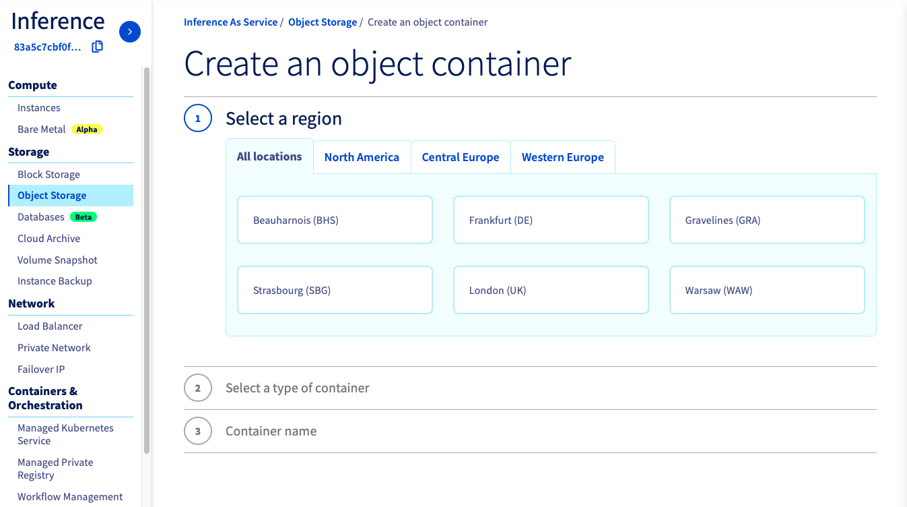
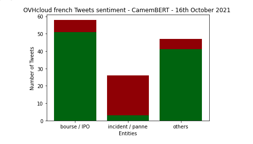
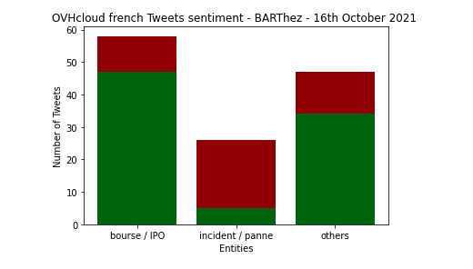
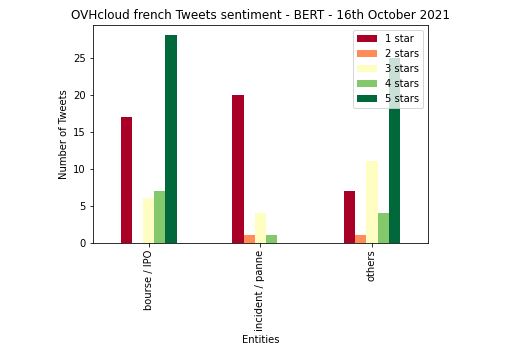
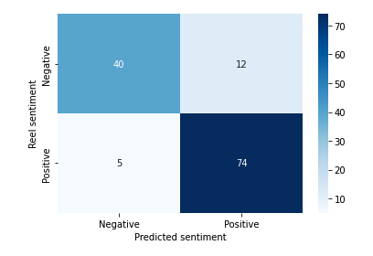
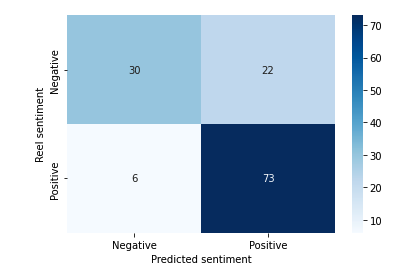

**Last updated 1st September, 2022.**

## Objective

The purpose of this tutorial is to show how it is possible to use [Hugging Face](https://huggingface.co/) pre-trained models to **analyse sentiments on Tweets**. Hugging Face is a company known for making open-source software such as Transformers and Datasets, used for building **NLP** systems. This software can be used for classification, question answering, translation and many other **NLP** tasks.

> [!primary]
>
> **Why using existing models?**
>
> - Someone may already have encountered the same problem as you. So a model may already exist for the task you are trying to address
> - Not enough data: you may not have enough data to train a model from scratch
> - Not enough computing power
> - Lack of knowledge in the field
> - Time saving!
>

**How to define NLP?**

The *Natural language processing* is a branch of Machine Learning that aims to give to computer programs the ability to understand natural human language.

**USE CASE**: all **OVHcloud** French Tweets posted on *October 16, 2021*, i.e. 1 day after the company's IPO and 3 days after an incident.

Hugging Face allows us to show the Tweets sentiments according to their topic.

In order to do this, we will compare 3 models on the sentiment analysis of Tweets: 2 *Sentiment analysis* models working on French and another one on multilingual.

- Model based on [CamemBERT](https://huggingface.co/transformers/model_doc/camembert.html): [pt-tblard-tf-allocine](https://huggingface.co/philschmid/pt-tblard-tf-allocine)
- Model based on [BARThez](https://huggingface.co/transformers/model_doc/barthez.html): [barthez-sentiment-classification](https://huggingface.co/moussaKam/barthez)
- Model based on [BERT](https://huggingface.co/transformers/model_doc/bert.html): [bert-base-multilingual-uncased-sentiment](https://huggingface.co/nlptown/bert-base-multilingual-uncased-sentiment)

We will also use a model to classify the Tweets according to their topic: a *Zero-Shot classification* model working on French.

- Model based on [CamemBERT](https://huggingface.co/transformers/model_doc/camembert.html): [camembert-base-xnli](https://huggingface.co/BaptisteDoyen/camembert-base-xnli)

{.thumbnail}

## Requirements

- Access to the [OVHcloud Control Panel](https://www.ovh.com/auth/?action=gotomanager&from=https://www.ovh.com/fr/&ovhSubsidiary=fr);
- A [Public Cloud project](https://www.ovhcloud.com/fr/public-cloud/) in your OVHcloud account;
- A Public Cloud user with the ability to start AI Notebooks;
- A Hugging Face account (if you want!).

## Instructions

> [!primary]
>
> In this tutorial, we get our Tweets and form our database as a **.csv** file.
>

Beforehand, if you want to store your data (Tweets) in an **object container**, please follow this next step.

### Uploading your dataset on Public Cloud Storage

If you want to upload it from the [OVHcloud Control Panel](https://www.ovh.com/auth/?action=gotomanager&from=https://www.ovh.com/fr/&ovhSubsidiary=fr), go to the Object Storage section and create a new object container by clicking `Object Storage`{.action} > `Create an object container`{.action}.

{.thumbnail}

If you want to run it with the CLI, just follow [this guide](https://docs.ovh.com/fr/publiccloud/ai/cli/access-object-storage-data/). You have to choose the region, the name of your container and the path where your data is located and use the following command:

```bash
ovhai data upload <region> <container> <paths>
```

### Launch and access a Jupyter notebook

The first step will consist in creating a Jupyter Notebook with OVHcloud AI Notebooks.

First, you have to install the OVHAI CLI then choose the name of the notebook (`<notebook-name>`), the Hugging Face image (`huggingface-transformers`) and the number of GPUs (`<nb-gpus>`) to use on your notebook. You can also attach your data, previously stored in the object storage (`<container@region/prefix:mount_path:permission>`) and use the following command:

```bash
ovhai notebook run huggingface-transformers jupyterlab \
	--name <notebook-name> \
	--gpu <nb-gpus>
	--volume <container@region/prefix:mount_path:permission>
```
### Experiment sentiment analysis on Tweets with OVHcloud examples notebooks

Once the repository has been cloned, find the notebook(s) of your choice.

- Notebook for sentiment analysis with CamemBERT (pt-tblard-tf-allocine):

`ai-training-examples` > `notebooks` > `natural-language-processing` > `text-classification` > `hugging-face` > `sentiment-analysis-twitter` > `CamemBERT` > `hugging_face_camembert_sentiment_analysis_tweets.ipynb`

- Notebook for sentiment analysis with BARThez (barthez-sentiment-classification):

`ai-training-examples` > `notebooks` > `natural-language-processing` > `text-classification` > `hugging-face` > `sentiment-analysis-twitter` > `BARThez` > `hugging_face_barthez_sentiment_analysis_tweets.ipynb`

- Notebook for sentiment analysis with BERT (bert-base-multilingual-uncased-sentiment):

`ai-training-examples` > `notebooks` > `natural-language-processing` > `text-classification` > `hugging-face` > `sentiment-analysis-twitter` > `BERT` > `hugging_face_bert_sentiment_analysis_tweets.ipynb`

Instructions are directly shown inside the notebooks. You can run them with the standard "Play" button inside the notebook interface.

### Testing the different models

Testing 3 models...

#### Sentiment Analysis with pt-tblard-tf-allocine

*Théophile Blard, **French sentiment analysis with BERT**, (2020), [GitHub repository](https://github.com/TheophileBlard/french-sentiment-analysis-with-bert)*

Tweets are divided into 2 classes according to their sentiment: **positive** or **negative**.

{.thumbnail}

#### Sentiment Analysis with barthez-sentiment-classification

*Eddine, Moussa Kamal and Tixier, Antoine J-P and Vazirgiannis, Michalis, **BARThez: a Skilled Pretrained French Sequence-to-Sequence Model**, (2020), [GitHub repository](https://github.com/moussaKam/BARThez)*

Tweets are divided into 2 classes according to their sentiment: **positive** or **negative**.

{.thumbnail}

#### Sentiment Analysis with bert-base-multilingual-uncased-sentiment

*Refer to [NLP Town](https://www.nlp.town/)*

Tweets are divided into 5 classes, from 1 to 5 stars, according to their sentiment: 1 star corresponds to a **very negative** tweet while 5 stars correspond to a **very positive** tweet.

{.thumbnail}

### Comparing the models performance

Previously, we have tested 3 Hugging Face models based on BARThez, BERT and camemBERT. Two of them can be compared on our dataset: **BARThez** and **CamemBERT**.

It is possible to **process our data manually** and **compare our results** with the predictions of the models. Then, we will be able to display the success rate of the models to see which one was the best on our dataset.

The confusion matrix will also give us information about false positives or false negatives.

#### Confusion matrix - BARThez x reel sentiments

{.thumbnail}

Success rate: **87.02 %**

#### Confusion matrix - CamemBERT x reel sentiments

{.thumbnail}

Success rate: **78.63 %**

#### Conclusion

To sum up, we find that the results of these pre-trained models are satisfying. We note that the performance of the BARThez-based model is better on our dataset than the CamemBERT-based model.

However, it depends on the dataset you use.

Do not hesitate to test several models!

### Experimenting the notebooks

A preview of the three notebooks can be found on GitHub [here](https://github.com/ovh/ai-training-examples/tree/main/notebooks/natural-language-processing/text-classification/hugging-face/sentiment-analysis-twitter).

## Go further

- You can also deploy a **Flask** app to classify text sentiments with **Hugging Face** models. Check this [documentation](https://docs.ovh.com/fr/publiccloud/ai/deploy/tuto-flask-hugging-face-sentiment-analysis/).
- If you are interested in **NLP** (Natural Language Processing), familiarise yourself with speech to text by following this [tutorial](https://docs.ovh.com/fr/publiccloud/ai/notebooks/tuto-speech-to-text-recognition/).

## Feedback

Please send us your questions, feedback and suggestions to improve the service:

- On the OVHcloud [Discord server](https://discord.com/invite/vXVurFfwe9)
