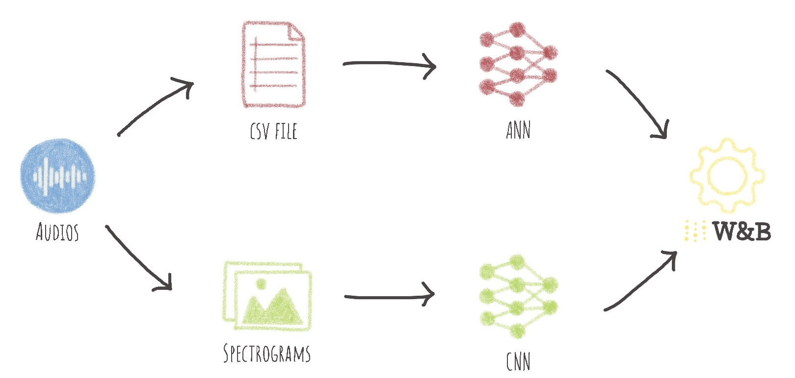
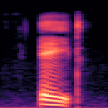
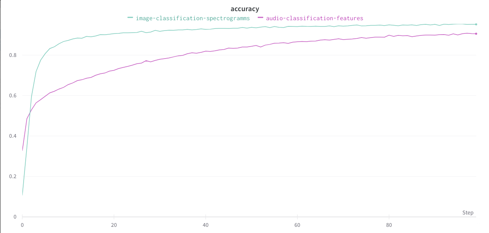
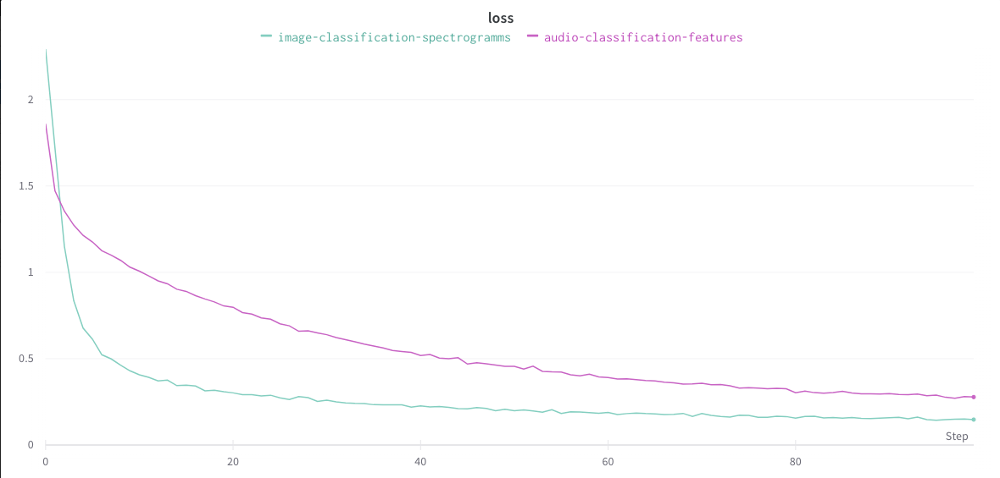
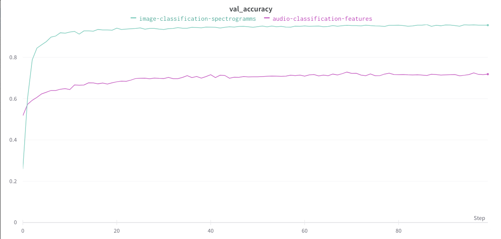
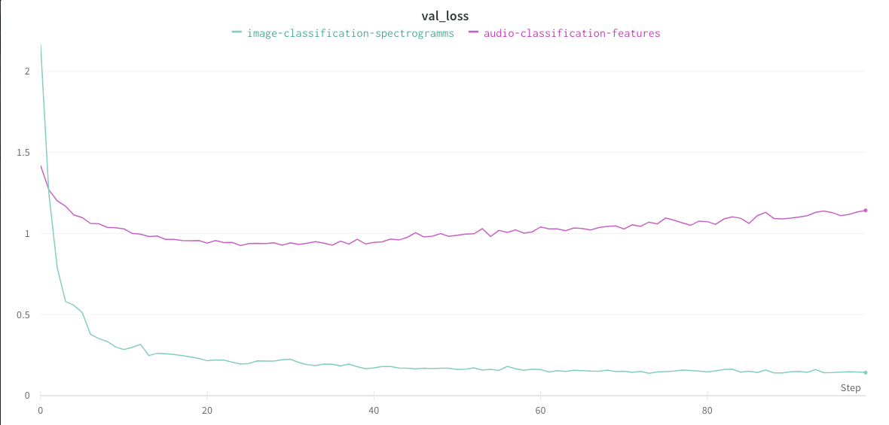
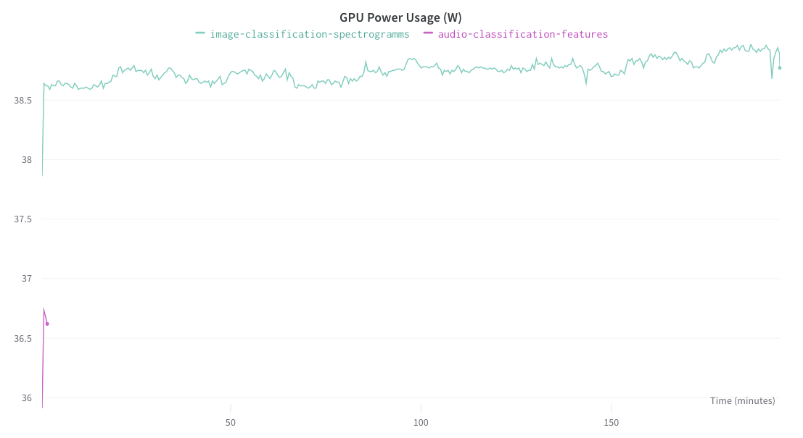

**Last updated 1st September, 2022.**

## Objective

The purpose of this tutorial is to compare two methods by running two jobs in parallel in order to classify audios. To see which model is better in terms of accuracy, resource consumption and training time, we will use the [Weights & Biases](https://wandb.ai/site) tool.

{.thumbnail}

### Use case

The use case is **Spoken Digit Database**. It is available on [Kaggle](https://www.kaggle.com/datasets/subhajournal/free-spoken-digit-database).

The database contains spoken digit files from zero to nine that have been recorded by different persons. All contain **1700 speech digits** files.

*Database License: [Attribution 4.0 International (CC BY 4.0)](https://creativecommons.org/licenses/by/4.0/)*

### AI Models

To build these sound classifiers, we will use two methods.

#### Audio classification based on audios feature

The first method is to create an Artificial Intelligence (AI) model to classify audio files using the different **features of sounds**.

In order to do this, some data processing is required upstream. Each sound will constitute a line of a `csv` file thanks to its transformation into **26 parameters** calculated by [Librosa](https://librosa.org/).

An Artificial Neural Network (**ANN**) is then built and trained on **100 epochs**. It takes the **26 parameters** calculated by Librosa as input and returns a probability for each class as output.

#### Image classification based on spectrograms

The second method is to create an image classification model using the **spectrograms of each sound**.

The data must be processed beforehand. From each sound a **spectrogram** (an image) is generated using the Python module [Librosa](https://librosa.org/). A Convolutional Neural Network (**CNN**) is then built and trained on **100 epochs**.

It takes as input the spectrograms whose size is defined and returns as output a probability for each class.

### Comparaison tool

Two Artificial Intelligence models of different natures are trained to perform the same task: to **classify audio recordings of people speaking numbers** from zero to nine.

To compare them, the [Weights and Biases](https://wandb.ai/home) tool is used. It makes it easy to track and record the performance of deep learning models.

With Weights & Biases, it is possible to build better models faster through experiment tracking, dataset versioning and model management.

In our case, we will be able to track the evolution of different models based on the values of accuracies and losses. The tool also offers us the possibility to visualise the training times and the consumption of resources (`GPU`).

To know more about **Weights & Biases**, please refer to the [documentation](https://docs.wandb.ai/?_gl=1*pk7t4x*_ga*MTgyOTU1NDM2My4xNjU4OTk2NzQy*_ga_JH1SJHJQXJ*MTY1OTM2MDMxNi45LjEuMTY1OTM2MTI3Ny41OQ..).

The basic principles for using Weights & Biases can be found [here](https://github.com/ovh/ai-training-examples/blob/main/notebooks/computer-vision/image-classification/tensorflow/weights-and-biases/notebook_Weights_and_Biases_MNIST.ipynb) with AI Notebooks.

## Requirements

- Access to the [OVHcloud Control Panel](https://www.ovh.com/auth/?action=gotomanager&from=https://www.ovh.de/&ovhSubsidiary=de);
- An AI Training project created inside a [Public Cloud project](https://www.ovhcloud.com/de/public-cloud/) in your OVHcloud account;
- A [user for AI Training](https://docs.ovh.com/de/publiccloud/ai/users/);
- [Docker](https://www.docker.com/get-started) installed on your local computer;
- Make sure you have a Docker Hub [account](https://hub.docker.com/);
- Some knowledge about building image and [Dockerfile](https://docs.docker.com/engine/reference/builder/);
- A Weights & Biases account, you can create it on their [website](https://wandb.ai/site). *It’s Free for individuals.*

## Instructions

You will follow different steps to process your data and train your two models.

- More detailed data processing in this [notebook](https://github.com/ovh/ai-training-examples/blob/main/notebooks/audio/audio-classification/notebook-marine-sound-classification.ipynb) concerning the classification of marine mammal sounds.
- Direct link to the full Python files can be found [here](https://github.com/ovh/ai-training-examples/tree/main/jobs/weights-and-biases/audio-classification-models-comparaison).

The tutorial is as follows:

{.thumbnail}

Here we will mainly discuss how to write the data processing and models training codes, the `requirements.txt` and `packages.txt` files and the `Dockerfile`. If you want to see the whole code, please refer to the [GitHub repository](https://github.com/ovh/ai-training-examples/tree/main/jobs/weights-and-biases/audio-classification-models-comparaison).

### Clone the GitHub repository

The first thing to do is to clone the GitHub repository.

```console
git clone https://github.com/ovh/ai-training-examples
```

You can then place yourself in the dedicated directory.

```console
cd ai-training-examples/jobs/weights-and-biases/audio-classification-models-comparaison
```

### Uploading your dataset on Public Cloud Storage

> [!primary]
>
> First, download the data on [Kaggle](https://www.kaggle.com/datasets/subhajournal/free-spoken-digit-database).
>

It's a zip file (`audio_files.zip`)! We are going to push it into an object container named `spoken-digit`.

If you want to upload it from the [OVHcloud Control Panel](https://www.ovh.com/auth/?action=gotomanager&from=https://www.ovh.de/&ovhSubsidiary=de), go to the Object Storage section and [create a new object container](https://docs.ovh.com/de/storage/object-storage/pcs/create-container/) by clicking `Object Storage` > `Create an object container`.

> [!primary]
>
> In the OVHcloud Control Panel, you can upload files but not folders. For instance, you can upload a .zip file to optimize the bandwidth, then unzip it later when accessing it through a JupyterLab. You can also use the OVHcloud AI CLI to upload files and folders (and be more stable than through your browser).
>

If you want to run it with the CLI, just follow [this guide](https://docs.ovh.com/de/publiccloud/ai/cli/access-object-storage-data/). You have to choose the region, the name of your container and the path where your data is located and use the following command:

```console
ovhai data upload <region> <container> <paths>
```

You should have:

```console
├── spoken-digit
    └── audio_files.zip
    └── audio_files
        └── zero
        └── one
        └── two
        └── three
        └── four
        └── five
        └── six
        └── seven
        └── eight
        └── nine
```

### Write the data processing Python files

For the data processing part, we distinguish two Python files.

#### Audio to csv file with features extraction

The first Python file is called `data-processing-audio-files-csv.py`. It allows to transform all the sounds into Librosa parameters and to make a `csv` file.

Refer to the comments of the [code](https://github.com/ovh/ai-training-examples/blob/main/jobs/weights-and-biases/audio-classification-models-comparaison/data-processing/data-processing-audio-files-csv.py) for more information.

*The head of the `csv` file:*

{.thumbnail}

#### Audio to spectrogram with image generation

The first Python file is called `data-processing-audio-files-spectrograms.py`. It allows you to obtain a spectrogram (an image) corresponding to each sound.

Refer to the comments of the [code](https://github.com/ovh/ai-training-examples/blob/main/jobs/weights-and-biases/audio-classification-models-comparaison/data-processing/data-processing-audio-files-spectrograms.py) for more information.

*A sample spectrogram:*

{.thumbnail}

Once the processing of the data is complete, the AI models must be built.

### Write the models training Python files

For the models training part, we distinguish two Python files.

> [!warning]
>
> About the **WANDB API KEY**: Please, make sure to replace `MY_WANDB_API_KEY` by yours in the two Python files for training.
>

#### ANN for audio classification based on sounds feature

An **Artificial Neural Network** is built to classify audios based on their features.

It takes as input the **26 Librosa parameters** previously normalized.

The model returns as output a score between 0 and 1 for each class through a `softmax` activation function. The class with the highest score is likely to be the one corresponding to the pronounced number.

Refer to the comments of the [code](https://github.com/ovh/ai-training-examples/blob/main/jobs/weights-and-biases/audio-classification-models-comparaison/models-training/train-classification-audio_files_csv.py) for more information.

#### CNN for image classification based on spectrograms

A **Convolutional Neural Network** is constructed to classify images that are in fact spectrograms.

The advantage of using CNNs is their ability to develop an internal representation of a two dimensional image. This allows the model to learn the position and scale in the different data structures, which is important when working with images.

It takes as input the spectrograms previously processed by the Keras data generator for image classification.

As previously, The model returns as output a score between 0 and 1 for each class through a `softmax` activation function.

Refer to the comments of the [code](https://github.com/ovh/ai-training-examples/blob/main/jobs/weights-and-biases/audio-classification-models-comparaison/models-training/train-image-classification-audio-files-spectrograms.py) for more information.

> [!warning]
>
> To be able to look at and compare the performance of our two models, the metrics observed must be the same.
>
> The `accuracy` will allow us to measure the precision of our model.
>
> `sparse_categorical_crossentropy` or `categorical_crossentropy` allow us to measure the loss.
>

### Write the requirements.txt and packages.txt files

The `requirements.txt` file will allow us to write all the modules needed to make our application work.

```console
matplotlib==3.5.2
pandas==1.4.3
split-folders==0.5.1
opencv-python-headless==4.5.5.64
librosa==0.8.0
tensorflow==2.9.1
wandb==0.12.21
```

The `packages.txt` file will allow us to install and use the **Librosa** module and its dependencies.

```console
libsndfile1-dev
```

These files will be useful when writing the `Dockerfile`.

### Write the Dockerfile for the application

Your **Dockerfile** should start with the `FROM` instruction indicating the parent image to use. In our case we choose to start from a `python:3.9` image:

```console
FROM python:3.9
```

Create the home directory and add your files to it:

```console
WORKDIR /workspace
ADD . /workspace
```

Install the `packages.txt` file which contains your needed Python modules using a `apt-get install ...` command:

```console
RUN apt-get update
RUN xargs -a packages.txt apt-get install --yes
```

Install the `requirements.txt` file which contains your needed Python modules using a `pip install ...` command:

```console
RUN pip install --no-cache-dir -r requirements.txt
```

Give correct access rights to the OVHcloud user (42420:42420):

> [!warning]
>
> Don't forget the `--user=42420:42420` argument if you want to simulate the exact same behaviour that will occur on **AI Training jobs**. It executes the Docker container as the specific OVHcloud user (user **42420:42420**).
>

```console
RUN chown -R 42420:42420 /workspace
ENV HOME=/workspace
```

> [!warning]
>
> Here we don't specify a command (`CMD`) to be run by default since we will do it directly in the **AI Training job**.
>

### Build the Docker image from the Dockerfile

Launch the following command from the **Dockerfile** directory to build your application image:

> [!warning]
>
> Remember to replace `<your-docker-id>` with yours.
>

```console
docker build . -t <your-docker-id>/audio-classification-models:latest
```

> [!primary]
>
> The dot `.` argument indicates that your build context (place of the **Dockerfile** and other needed files) is the current directory.
>
> The `-t` argument allows you to choose the identifier to give to your image. Usually image identifiers are composed of a **name** and a **version tag** `<name>:<version>`. For this example we chose **audio-classification-models:latest**.
>

### Push the image into your Docker Hub

> [!warning]
>
> To know more about the the **Docker Hub**, click [here](https://hub.docker.com/).
>

```console
docker push <your-docker-id>/audio-classification-models:latest
```

### Launch the jobs

> [!primary]
>
> Here we will use the [ovhai CLI](https://docs.ovh.com/de/publiccloud/ai/cli/run-job-cli/). If you wish to do this from the OVHcloud Control Panel, refer to this [documentation](https://docs.ovh.com/de/publiccloud/ai/training/submit-job/).
>

Jobs are launched in two stages. First, the **data processing jobs** are launched. Once they are `Done`, the **training jobs** can be executed.

> [!primary]
>
> To find out more about how jobs work and their status, check this [documentation](https://docs.ovh.com/de/publiccloud/ai/training/jobs/).
>

#### Data processing

- **Audio to `csv` file with features extraction:**

To run this job, you need to plug in a volume containing your sounds. Once the job is in `Done` status, your `csv` file will be synchronized to your Object Storage.

> [!primary]
>
> `--volume <my-data>@<region>/:/workspace/data:RW:cache` is the volume attached for storing **data**. This volume is read/write (`RW`) because the `csv` file will be created and saved.
>

```console
ovhai job run <your-docker-id>/audio-classification-models:latest \
      --cpu 12 \
      --volume <my-data>@<region>/:/workspace/data:RW:cache \
      -- bash -c 'python data-processing/data-processing-audio-files-csv.py'
```

- **Audio to spectrogram with image generation:**

To run this job, you need to plug in a volume containing your sounds. Once the job is in `Done` status, your `csv` file will be synchronized to your Object Storage.

> [!primary]
>
> `--volume <my-data>@<region>/:/workspace/data:RW:cache` is the volume attached for storing **data**. This volume is read/write (`RW`) because the `spectrograms` will be created and saved.
>

```console
ovhai job run <your-docker-id>/audio-classification-models:latest \
      --cpu 12 \
      --volume <my-data>@<region>/:/workspace/data:RW:cache \
      -- bash -c 'python data-processing/data-processing-audio-files-spectrograms.py'
```

> [!primary]
>
> Here, the Python modules and dependencies are not suitable for use with `GPUs`.
>
> However, these steps take time. So we use as many `CPUs` as possible (12).
>

At the end of the data processing, your Object Storage container should be as follows:

```console
├── spoken-digit
    └── audio_files.zip
    └── audio_files
        └── zero
        └── one
        └── ...
        └── nine
    └── csv_files
        └── data_3_sec.csv
    └── spectrograms
        └── zero
        └── one
        └── ...
        └── nine
    └── spectrograms_split
        └── train
            └── zero
            └── one
            └── ...
            └── nine
        └── val
            └── zero
            └── one
            └── ...
            └── nine
```

To get the status of your jobs, run the following command:

```console
ovhai job get <job-id>
```

Once your data has been pre-processed and both **jobs are in `Done` status**, you will be able to start your two training jobs.

#### Models training

- **ANN for audio classification based on audios feature:**

To run this job, you need to plug in a volume containing your sounds. Once the job is in `Done` status, your `csv` file will be synchronized to your Object Storage.

> [!primary]
>
> `--volume <my-data>@<region>/:/workspace/data:RO:cache` is the volume attached for storing **data**. This volume is read/write (`RO`) because the `csv` file will only be read.
>

```console
ovhai job run <your-docker-id>/audio-classification-models:latest \
      --gpu 1 \
      --volume <my-data>@<region>/:/workspace/data:RO:cache \
      -- bash -c 'python models-training/train-classification-audio_files_csv.py'
```

- **CNN for image classification based on spectrograms:**

To run this job, you need to plug in a volume containing your sounds. Once the job is in `Done` status, your `csv` file will be synchronized to your Object Storage.

> [!primary]
>
> `--volume <my-data>@<region>/:/workspace/data:RO:cache` is the volume attached for storing **data**. This volume is read/write (`RO`) because the `spectrograms` data will only be read.
>

```console
ovhai job run <your-docker-id>/audio-classification-models:latest \
      --gpu 1 \
      --volume <my-data>@<region>/:/workspace/data:RO:cache \
      -- bash -c 'python models-training/train-image-classification-audio-files-spectrograms.py'
```

> [!primary]
>
> Consider adding the `--unsecure-http` attribute if you want your application to be reachable without any authentication.
>

You can now compare your models with Weights & Biases.

### Compare with Weights & Biases

You will be able to check your models training once your jobs are in running status. Run the following command:

```console
ovhai job get <job-id>
```

Once the jobs are in running status, you can check the logs to obtain the Weight & Biases link. Run the command:

```console
ovhai job logs <job-id>
```

Now, you can access the Weights & Biases panel. You will be able to check the accuracy and the loss values for the training and the validation sets.

- **Training data:**

*Accuracy:*

{.thumbnail}

*Loss:*

{.thumbnail}

- **Validation data:**

*Accuracy:*

{.thumbnail}

*Loss:*

{.thumbnail}

You can then observe which model is better in terms of speed, accuracy or resource consumption...

{.thumbnail}

In this case, we see that the **model classifying the spectrograms** is better in terms of accuracy and loss on the validation set.

However, it takes longer to train and consumes **more computing resources**.

## Go further

- To build an app to classify audios, refer to this [tutorial](https://docs.ovh.com/de/publiccloud/ai/deploy/tuto-streamlit-sounds-classification/).
- Do you want to know how to build and use custom Docker image with AI Training? [Here it is](https://docs.ovh.com/de/publiccloud/ai/training/build-use-custom-image/).

## Feedback

Please send us your questions, feedback and suggestions to improve the service:

- On the OVHcloud [Discord server](https://discord.com/invite/vXVurFfwe9)
