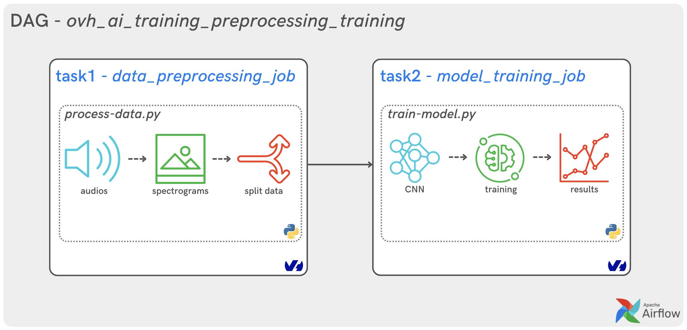
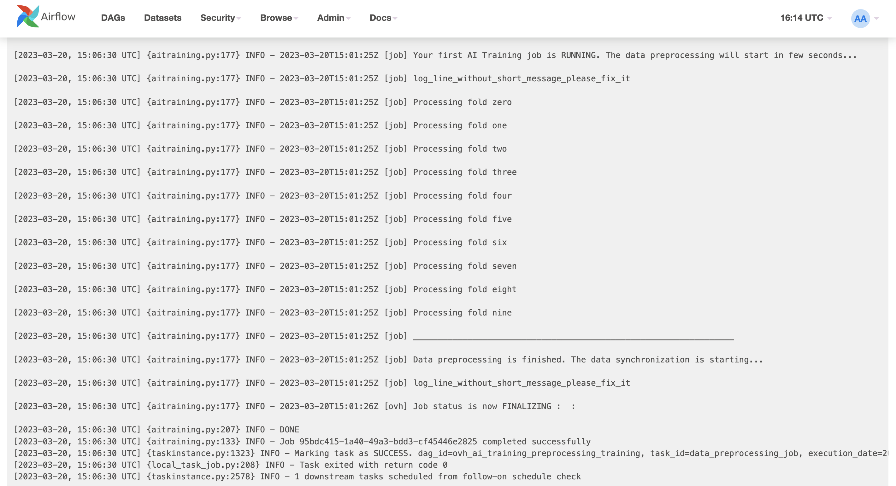
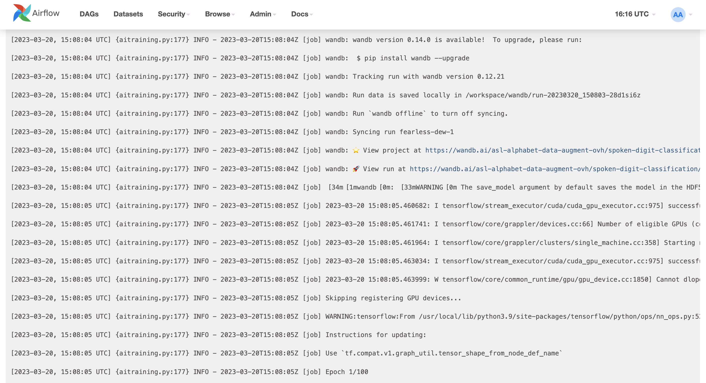

**Last updated 27th March, 2023.**

## Objective

You can now use the **AirFlow** `AiTrainingRunJobOperator` to run OVHcloud AI Training jobs.

This guide explains how to use AirFlow](https://airflow.apache.org/) to orchestrate your AI Training jobs. You will be able to create a simple DAG with two tasks:
- Data preprocessing (using CPU)
- AI model training (using GPU)

{.thumbnail}

> [!primary]
>
> If you have never used the `AiTrainingRunJobOperator`, please refer to the following documentation: [Apache AirFlow - Getting Started](LINK WHEN PUBLISHED)
>

## Requirements

- Access to the [OVHcloud Control Panel](https://www.ovh.com/auth/?action=gotomanager&from=https://www.ovh.co.uk/&ovhSubsidiary=GB)
- An AI project created inside a [Public Cloud project](https://www.ovhcloud.com/en-gb/public-cloud/) in your OVHcloud account
- A user for [AI Tools](https://docs.ovh.com/gb/en/publiccloud/ai/users/)
- Apache AirFlow [installed](https://airflow.apache.org/docs/apache-airflow/stable/installation/index.html) and operational
- An access [token](https://docs.ovh.com/gb/en/publiccloud/ai/cli/app-token-cli/) for your OVHcloud AI user

## Instructions

The tutorial is divided into two steps:
- the development of Python scripts to process data and then train Machine Learning model
- the creation and launching of the AirFlow DAG to process the data and train the model in AI Training jobs

### Develop your Python scripts and manage the data

This example is based on a existing AI Training tutorial: [Compare models with W&B for audio classification task](https://docs.ovh.com/gb/en/publiccloud/ai/training/tuto-models-comparaison-weights-and-biases/).

The goal is to classify audio files: recordings of numbers (0 to 9) spoken in English. You can find the **Spoken Digit Database** on [Kaggle](https://www.kaggle.com/datasets/subhajournal/free-spoken-digit-database).

*Database License: [Attribution 4.0 International (CC BY 4.0)](https://creativecommons.org/licenses/by/4.0/)*

To be able to classify audio, it is necessary to convert it (into an image for example). After the audio files have been converted into **spectrograms**, the goal is to train a **CNN** model.

For this, the AirFlow DAG will be composed of two tasks depending on each other.

{.thumbnail}

The first job will process the data while the second will be dedicated to model training.

Firstly, you have to create the Python scripts that will process the data and train the Machine Learning model. Then, must use Docker to containerize your project.

#### Create Python files

First, you have to create a Python file named `process-data.py`. Find more information about the full Python code [here](LINK GIT HUB_CODE) to get ready to use it.

Secondly, you must develop the Python script named `train-model.py` to be able to train the AI model. You can find the code [here](LINK GIT HUB_CODE).

Thirdly, you should add the original dataset into a dedicated [Object Storage container](https://docs.ovh.com/gb/en/publiccloud/ai/cli/data-cli/).

#### Upload the Spoken Digit Database to an Object Storage container

> [!primary]
>
> First, download the data on [Kaggle](https://www.kaggle.com/datasets/subhajournal/free-spoken-digit-database).
>

It’s a zip file (`audio_files.zip`)! We are going to push it into an object container named `spoken-digit`.

If you want to upload it from the [OVHcloud Control Panel](https://www.ovh.com/auth/?action=gotomanager&from=https://www.ovh.co.uk/&ovhSubsidiary=GB), go to the Object Storage section and [create a new object container](https://docs.ovh.com/gb/en/storage/object-storage/pcs/create-container/) by clicking `Object Storage` > `Create an object container`.

> [!primary]
>
> In the OVHcloud Control Panel, you can upload files but not folders. For instance, you can upload a .zip file to optimize the bandwidth, then unzip it later. You can also use the OVHcloud AI CLI to upload files and folders (and be more stable than through your browser).
>

If you want to run it with the CLI, just follow [this guide](https://docs.ovh.com/gb/en/publiccloud/ai/cli/access-object-storage-data/). You have to choose the region, the name of your container and the path where your data is located and use the following command:

```console
ovhai data upload <region> <container> <paths>
```

Finally, you have to look at the creation of the Docker image.

> [!primary]
>
> If you want to know how to build the dedicated custom Docker image and deploy your own container, you need to comply with a few rules like adding a specific user. Follow the previous tutorial: [AI Training - Tutorial - Compare models with W&B for audio classification task](https://docs.ovh.com/gb/en/publiccloud/ai/training/tuto-models-comparaison-weights-and-biases/#write-the-dockerfile-for-the-application).
>

If you don't want to follow the Docker image building phase, don't worry. We make it available to you. In this case, go to the **Deploy your first AirFlow DAG for AI Training jobs**.

> [!primary]
>
> We have made the Docker image available to you on a dedicated registry. You can use it in the following way: `priv-registry.gra.training.ai.cloud.ovh.net/ai-training-tutorials/airflow-preprocessing-training`
>

Let's get to the heart of the matter: **Apache AirFlow**.

### Deploy your first AirFlow DAG for AI Training jobs

An Apache AirFlow provider package for `ovhcloud` provider has been created. All classes for this provider package are in `airflow.providers.ovhcloud` Python package.

> [!primary]
>
> You can install this package on top of an existing `airflow 2.2+` installation via: `pip install apache-airflow-providers-ovhcloud`
>
> The package supports the following Python versions: `3.7`, `3.8`, `3.9`.
>

In the next few steps you will see the basic concepts to keep in mind when writing a **DAG** for use in [AI Training](https://www.ovhcloud.com/fr/public-cloud/ai-training/).

#### Create a Python file

Once AirFlow is installed, go to your dedicated `airflow` directory containing the `dags` folder and some other files.

Go to the `/dags` folder and create a new Python file: `ovh_ai_training_preprocessing_training.py`.

You are in the following state: `../your-airflow-directory/dags/ovh_ai_training_preprocessing_training.py`

#### Import dependencies

To create a **pipeline** in AirFlow, we need to import several modules.

- `DAG` module from `airflow` package
- `AiTrainingRunJobOperator` which is the OVHcloud AI Training operator from `airflow.providers.ovhcloud.operators.ai.aitraining` module
- `os` module to interact with the operating system
- `datetime` module to schedule the dags

```python
from airflow import DAG
from airflow.providers.ovhcloud.operators.ai.aitraining import AiTrainingRunJobOperator
import os
from datetime import datetime
```

#### Provide your OVHcloud access token

Replace `your_bearer` by your previously created token:

```python
os.environ["OVH_BEARER"] = "your_bearer"
```

#### Create a DAG object

We will now instantiate a **DAG object** to nest the tasks in the pipeline.

We pass the following as parameters:

- `dag_id`: it is string which is the unique identifier of the dag.
- `schedule_interval`: it sets the interval of the next DAG runs created by the scheduler. For more information, refer to this [documentation](https://airflow.apache.org/docs/apache-airflow/stable/core-concepts/dag-run.html).
- `start_date`: it indicates the timestamp from which the scheduler will attempt to backfill.
- `tags`: it allows you to tag your DAGs and use it for filtering in the UI.

```python
with DAG(
    dag_id='ovh_ai_training_preprocessing_training',
    schedule_interval=None,
    start_date=datetime(2023, 3, 20),
    tags=['preprocessing / training'],
) as dag:
```

#### Create two tasks

According to **AirFlow**, an object instantiated from an *operator* is called a *task*.

The operator allowing you to launch OVHcloud AI Training jobs is the following: `AiTrainingRunJobOperator`.

An AiTrainingRunJobOperator is used to launch AI Training jobs inside your DAG. We will create an AiTrainingRunJobOperator object that launches two AI Training jobs in order to process our data and then train our AI model.

Several parameters can be set as follows:

- `task_id`: like a DAG object has `dag_id`, an AiTrainingRunJobOperator object has an identifier called `task_id`.
- `bearer`: corresponds to your OVHcloud AI token bearer.
- `region`: you can choose between 2 regions, Gravelines `GRA` or Beauharnois `BHS`.
- `image`: precise the Docker image URL you want to use from shared or private registry.
- `name`: you can define the name of your AI Training job.
- `job_resources`: you can choose between CPU **or** GPU (not both).
- `asynchronous`: optionnal flag to get `job_id` after submitting the job to the OVHcloud API. At `False`, a websocket retrieves the logs from the AI Training job and displays them in the AirFlow DAG logs.

The first task is related to data preprocessing:

```python
data_preprocessing_job = AiTrainingRunJobOperator(
      task_id='data_preprocessing_job',
      bearer = os.environ.get('OVH_BEARER', 'bearer'),
      region = 'gra',
      image = 'priv-registry.gra.training.ai.cloud.ovh.net/ai-training-tutorials/airflow-preprocessing-training',
      name = 'data-preprocessing-ai-training-airflow',
      object_storage = [
        {
          "cache": False,
          "dataStore": {
             "alias": "GRA",
             "container": "spoken-digit-db",
          },
          "mountPath": "/workspace/data",
          "permission": "RW",
        }
      ],
      job_resources = {'cpu': 12,'gpu':0 },
      command = ['python', 'process-data.py'],
      asynchronous = False
    )
```

```python
model_training_job = AiTrainingRunJobOperator(
      task_id='model-training_job',
      bearer = os.environ.get('OVH_BEARER', 'bearer'),
      region = 'gra',
      image = 'priv-registry.gra.training.ai.cloud.ovh.net/ai-training-tutorials/airflow-preprocessing-training',
      name = 'model-training-ai-training-airflow',
      object_storage = [
        {
          "cache": False,
          "dataStore": {
             "alias": "GRA",
             "container": "spoken-digit-db",
          },
          "mountPath": "/workspace/data",
          "permission": "RO",
        }
      ],
      job_resources = {'cpu':0 ,'gpu':1 },
      command = ['python', 'train-model.py'],
      asynchronous = False
    )
```

#### Call the two tasks

> [!primary]
>
> The model training task will depend on the success of the data processing task.
>

```python
data_preprocessing_job >> model_training_job
```

#### Final DAG

After compiling all the elements of the DAG, the final code should look like this:

```python
from airflow import DAG
from airflow.providers.ovhcloud.operators.ai.aitraining import AiTrainingRunJobOperator
import os
from datetime import datetime

os.environ["OVH_BEARER"] = "your_bearer"

with DAG(

    dag_id='ovh_ai_training_preprocessing_training',
    schedule_interval=None,
    start_date=datetime(2023, 3, 15),
    tags=['preprocessing / training'],

) as dag:

    data_preprocessing_job = AiTrainingRunJobOperator(
      task_id='data_preprocessing_job',
      bearer = os.environ.get('OVH_BEARER', 'bearer'),
      region = 'gra',
      image = 'eleapttn/airflow-preprocessing-training:latest',
      name = 'data-preprocessing-ai-training-airflow',
      object_storage = [
        {
          "cache": False,
          "dataStore": {
             "alias": "GRA",
             "container": "spoken-digit-db",
          },
          "mountPath": "/workspace/data",
          "permission": "RW",
        }
      ],
      job_resources = {'cpu': 12,'gpu':0 },
      command = ['python', 'process-data.py'],
      asynchronous = False
    )

    model_training_job = AiTrainingRunJobOperator(
      task_id='model-training_job',
      bearer = os.environ.get('OVH_BEARER', 'bearer'),
      region = 'gra',
      image = 'eleapttn/airflow-preprocessing-training:latest',
      name = 'model-training-ai-training-airflow',
      object_storage = [
        {
          "cache": False,
          "dataStore": {
             "alias": "GRA",
             "container": "spoken-digit-db",
          },
          "mountPath": "/workspace/data",
          "permission": "RO",
        }
      ],
      job_resources = {'cpu':0 ,'gpu':1 },
      command = ['python', 'train-model.py'],
      asynchronous = False
    )

    data_preprocessing_job >> model_training_job
```

#### Execution of the DAG in Webserver interface

To see the file running, start your AirFlow **webserver** and **scheduler**. Go to http://localhost:8080/home (or your dedicated port for airflow), and you should see the following user interface.

{.thumbnail}

The DAG `ovh_ai_training_preprocessing_training` should run successfully. You can check the **Graph** view or **Grid** view by hovering over links and selecting options.

{.thumbnail}

You can also click on the `Log` button to check AI Training job logs during data preprocessing part.

{.thumbnail}

Finally, you can follow the evolution of Machine Learning model in the second task logs. You are also able to access to Weights & Biases by clicking on the link printed in the logs.

{.thumbnail}

Congratulations! You have processed your data and trained your model in AI Training jobs with **AirFlow**.

## Go further

- How to train ML model and track it with TensorBoard? Do it with AI Training and AirFlow by following to this [documentation](PUT THE_LINK_TUTO_4).
- Do you want to know how to train a ML model inside an AI Training job with Apache Airflow? Refer to this [documentation](PUT THE_LINK_TUTO_2).

## Feedback

Please feel free to send us your questions, feedback and suggestions to help our team improve the service on the OVHcloud [Discord server](https://discord.com/invite/KbrKSEettv)!
