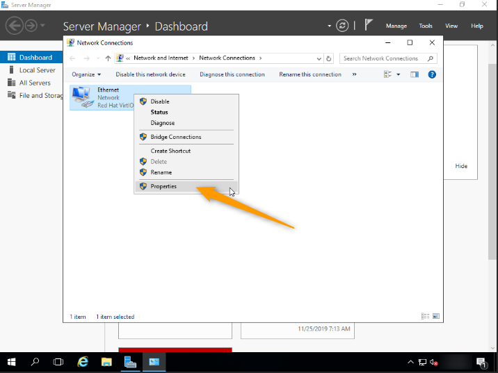

> [!primary]
> Diese Übersetzung wurde durch unseren Partner SYSTRAN automatisch erstellt. In manchen Fällen können ungenaue Formulierungen verwendet worden sein, z.B. bei der Beschriftung von Schaltflächen oder technischen Details. Bitte ziehen Sie beim geringsten Zweifel die englische oder französische Fassung der Anleitung zu Rate. Möchten Sie mithelfen, diese Übersetzung zu verbessern? Dann nutzen Sie dazu bitte den Button «Mitmachen» auf dieser Seite.
>

**Letzte Aktualisierung am 15.11.2022**

## Ziel

Internet Protocol Version 6 (IPv6) ist die neueste Version des Internet Protocol (IP). Seit Langem wird die Ausschöpfung der verfügbaren IPv4-Adressen erwartet. Diese Version soll Abhilfe schaffen, indem Adressen aus 128 Bits statt der herkömmlichen 32 Bits des IPv4 verwendet werden.

Jede Public Cloud Instanz wird mit einer IPv4-Adresse und einer IPv6-Adresse ausgeliefert.

Standardmäßig ist nur die IPv4-Adresse eingerichtet.

**Diese Anleitung erklärt, wie Sie eine IPv6-Adresse auf einer Public Cloud Instanz konfigurieren können.**

> [!primary]
> 
> Floating IP und Gateway sind derzeit nicht mit IPv6 kompatibel. Sie können IPv6 nur mit Instanzen im [Public Mode](#https://docs.ovh.com/de/publiccloud/network-services/networking-concepts/#publicmode) verwenden.
>

## Voraussetzungen

- Sie haben Zugriff auf Ihr [OVHcloud Kundencenter](https://www.ovh.com/auth/?action=gotomanager&from=https://www.ovh.de/&ovhSubsidiary=de).
- Sie verfügen über eine Public Cloud Instanz, wobei das Modell keine Rolle spielt.
- Sie haben Kenntnisse zu SSH.
- Sie haben Grundkenntnisse zu Netzwerken.


## In der praktischen Anwendung

> [!warning]
>
> Bitte beachten Sie, dass bei neueren Versionen von Linux-Betriebssystemen die IPv6-Adresse von Public-Cloud-Instanzen breits vorkonfiguriert ist. Überprüfen Sie deshalb die Konfigurationsdatei Ihres Betriebssystems, bevor Sie Änderungen vornehmen.
>


### Glossar

Hier ein kurzes Glossar der in dieser Anleitung verwendeten Begriffe:

|Glossar|Beschreibung|
|---|---|
|YOUR_IPV6|Die IPv6-Adresse, die Ihrem Dienst zugewiesen ist|
|IPv6_PREFIX|Das Präfix Ihres IPv6-Blockes (Bsp. für "2607:5300:60:62ac::/128": netmask = 128)|
|IPv6_GATEWAY|Das Gateway Ihres IPv6-Blocks|


### Netzwerk-Informationen abrufen

Loggen Sie sich in Ihrem [OVHcloud Kundencenter](https://www.ovh.com/auth/?action=gotomanager&from=https://www.ovh.de/&ovhSubsidiary=de) ein und wählen Sie Ihr `Public Cloud`{.action} Projekt aus. Wählen Sie das Menü `Instances`{.action} und klicken Sie dann auf `...`{.action} und `Instanz-Details`{.action} neben der gewünschten Instanz.

{.thumbnail}

Alle erforderlichen Informationen werden im Abschnitt **Netzwerke** angezeigt.

{.thumbnail}

### Beispiele für persistente Konfigurationen

> [!primary]
> **Beispiele**
> 
>Die untenstehenden Informationen dienen lediglich als Beispiele.
>
>Als Administrator Ihrer Dienste obliegt es Ihnen, diese an Ihre Distribution anzupassen.
>

> [!warning]
>
> Erstellen Sie immer ein Backup des Originals, bevor Sie eine Konfigurationsdatei bearbeiten.
>

<br>Verbinden Sie sich zunächst über SSH mit Ihrer Instanz.

#### Mit Debian

Ausgehend von eth0 als der Bezeichnung des Interface, sollte die hinzuzufügende Konfiguration wie folgt aussehen.

Anzupassende Datei (mit erhöhten Berechtigungen / root): `/etc/network/interfaces`

```console
iface eth0 inet6 static
address YOUR_IPV6
netmask IPV6_PREFIX
post-up /sbin/ip -6 route add IPV6_GATEWAY dev eth0
post-up /sbin/ip -6 route add default via IPV6_GATEWAY dev eth0
pre-down /sbin/ip -6 route del default via IPV6_GATEWAY dev eth0
pre-down /sbin/ip -6 route del IPV6_GATEWAY dev eth0
```

Hier ein konkretes Beispiel:

```console
iface eth0 inet6 static
address 2001:41d0:xxx:xxxx::999
netmask 128
post-up /sbin/ip -6 route add 2001:41d0:xxx:xxxx::111 dev eth0
post-up /sbin/ip -6 route add default via 2001:41d0:xxx:xxxx::111 dev eth0
pre-down /sbin/ip -6 route del default via 2001:41d0:xxx:xxxx::111 dev eth0
pre-down /sbin/ip -6 route del 2001:41d0:xxx:xxxx::111 dev eth0
```

#### Mit Ubuntu

Die Netzwerkkonfigurationsdateien befinden sich im Verzeichnis `/etc/netplan/`. Erstellen Sie zuerst eine Kopie der IPv6-Konfigurationsdatei:

```bash
cd /etc/netplan
cp 50-cloud-init.yaml 51-cloud-init-ipv6.yaml
```

So können Sie die IPv6-Konfiguration trennen und die Änderungen im Fehlerfall rückgängig machen.

Ausgehend von eth0 als der Bezeichnung des Interface, sollte die hinzuzufügende Konfiguration wie folgt aussehen.

Anzupassende Datei (mit erhöhten Berechtigungen / root): `/etc/netplan/51-cloud-init-ipv6.yaml`

```yaml
network:
    ethernets:
        eth0:
            dhcp6: false
            match:
                macaddress: fb:17:3r:39:56:75
            set-name: eth0
            addresses:
              - "YOUR_IPV6/IPv6_PREFIX"
            gateway6: "IPv6_GATEWAY"
            routes:
              - to: "IPv6_GATEWAY"
                scope: link
    version: 2
```

> [!warning]
>
> Es ist wichtig, dass die Zeilenausrichtung jedes Elements dieser Datei, wie im Beispiel dargestellt, eingehalten wird. Verwenden Sie nicht die Tabulationstaste, um den Abstand zu erzeugen. Nur die Leertaste ist notwendig.
>

Sie können Ihre Konfiguration mit folgendem Befehl testen:

```bash
netplan try
```

Ist die Änderung korrekt, verwenden Sie folgenden Befehl:

```bash
netplan apply
```

#### Mit RedHat / CentOS

Ausgehend von eth0 als der Bezeichnung des Interface, sollte die hinzuzufügende Konfiguration wie folgt aussehen.

Anzupassende Datei (mit erhöhten Berechtigungen / root): `/etc/sysconfig/network-scripts/ifcfg-eth0`

```console
IPV6INIT=yes
IPV6ADDR=YOUR_IPV6/IPV6_PREFIX
IPV6_DEFAULTGW=IPV6_GATEWAY
```

Hier ein praktisches Beispiel:

```console
IPV6INIT=yes
IPV6ADDR=2001:41d0:xxx:xxxx::999
IPV6_DEFAULTGW=2001:41d0:xxx:xxxx::111
```

#### Mit Windows

Gehen Sie in den Bereich `Netzwerkverbindungen`{.action} Ihrer Windows-Oberfläche.

{.thumbnail}

Öffnen Sie danach per Klick mit der rechten Maustaste auf Ihre Netzwerkschnittstelle `Eigenschaften`{.action}.

{.thumbnail}

Wählen Sie `IPv6`{.action} und klicken danach auf `Eigenschaften`{.action}.

{.thumbnail}

Tragen Sie schließlich die Informationen zu Ihrem IPv6 in die passenden Felder ein.

{.thumbnail}

## Diagnose

Sie haben IPv6 konfiguriert, aber es funktioniert dennoch nicht? 

Mit einem einfachen Mittel lässt sich herausfinden, ob der Fehler in der durchgeführten Konfigurierung, oder im Netzwerk von OVHcloud liegt.

Zunächst [stellen Sie Ihre Instanz auf den Rescuemodus "rescue-pro" um](https://docs.ovh.com/de/public-cloud/umstellung_einer_instanz_auf_den_rescue-modus/).

Nutzen Sie nun die nachfolgenden Befehle, um Ihre IP-Adresse nicht-persistent zu konfigurieren, wobei Sie die Platzhalter mit Ihren Spezifikationen ersetzen:

```bash
ip addr add YOUR_IPV6/IPV6_PREFIX dev eth0
ip -6 route add IPV6_GATEWAY dev eth0
ip -6 route add default via IPV6_GATEWAY dev eth0
```

Prüfen Sie Ihr Netzwerk erneut mit "ping6", zum Beispiel:

```bash
ping6 ipv6.google.com
```

Wenn Ihre Instanz antwortet, wurde wahrscheinlich ein Schritt in Ihrer ursprünglichen Konfigurierung nicht korrekt ausgeführt.

Zögern Sie jedenfalls nicht, sich mit Testergebnissen zu den oben erwähnten Angaben an unseren [Kundendienst zu wenden](https://www.ovh.com/manager/dedicated/#/support/tickets/new), um eine Analyse von unserer Seite zu erhalten.

## Weiterführende Informationen

Für den Austausch mit unserer User Community gehen Sie auf <https://community.ovh.com/en/>.
