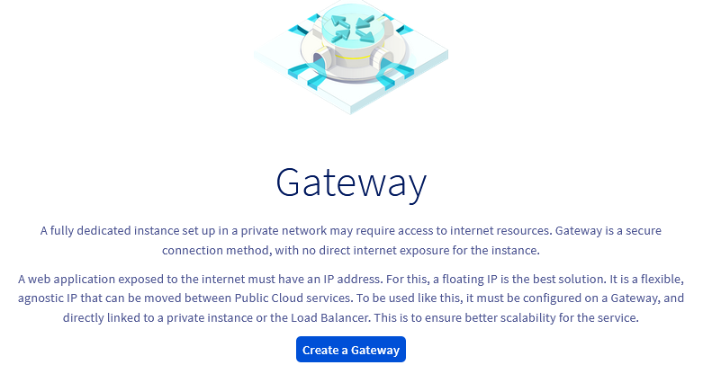
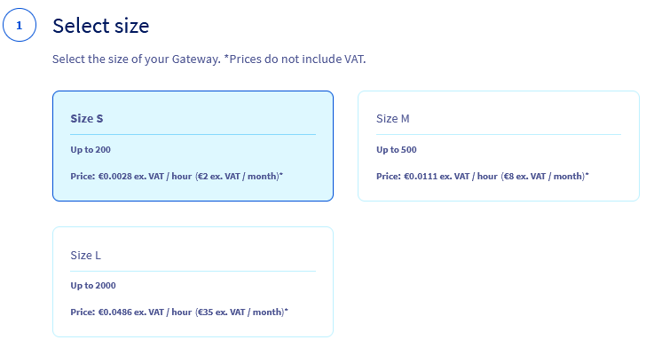
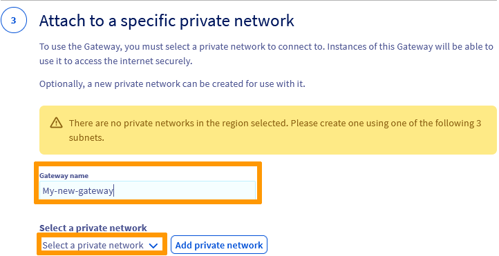
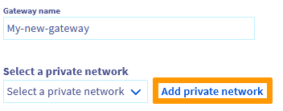

**Dernière mise à jour le 02/11/2022**

## Objectif

Une Gateway offre une méthode de connexion sortante sécurisée depuis vos instances en réseau privé, ou bien encore la possibilité d’utiliser des adresses Floating IP avec votre instance ou votre Load Balancer pour l’exposition de services.

Ces opérations peuvent être réalisées depuis l’[espace client OVHcloud](https://www.ovh.com/auth/?action=gotomanager&from=https://www.ovh.com/fr/&ovhSubsidiary=fr), l’[API OpenStack](https://docs.ovh.com/fr/public-cloud/prepare_the_environment_for_using_the_openstack_api/) ou l’[API OVHcloud](https://eu.api.ovh.com/).

**Apprenez à créer un réseau privé avec une Gateway**

## Prérequis

- Posséder un [projet Public Cloud](https://www.ovhcloud.com/fr/public-cloud/) dans votre compte OVHcloud
- Avoir accès à l’[API OVHcloud](https://eu.api.ovh.com/), à l’[espace client OVHcloud](https://www.ovh.com/auth/?action=gotomanager&from=https://www.ovh.com/fr/&ovhSubsidiary=fr) ou à l’environnement OpenStack ([Tutoriel](https://docs.ovh.com/fr/public-cloud/prepare_the_environment_for_using_the_openstack_api/))
- Pour OpenStack, il est nécessaire de mettre en place le client OpenStack

## En pratique

### Depuis l'espace client OVHcloud

> [!success]
> Cliquez sur les onglets ci-dessous pour afficher successivement chacune des 6 étapes.

> [!tabs]
> **Etape 1**
>>
>> Connectez-vous à votre [espace client OVHcloud](https://www.ovh.com/auth/?action=gotomanager&from=https://www.ovh.com/fr/&ovhSubsidiary=fr) et ouvrez votre projet `Public Cloud`{.action}.
>>
>> Cliquez sur `Gateway`{.action} dans le menu de gauche sous l'onglet **Network**.
>>
>> Veuillez noter qu'il est nécessaire d'avoir activé le vRack avant de poursuivre. Si vous n'en possédez pas, nous vous invitons à consulter cette [section](https://docs.ovh.com/fr/publiccloud/network-services/public-cloud-vrack/#activation) du guide correspondant.
>>
>> Cliquez ensuite sur le bouton `Créer une Gateway`{.action}. 
>>
>> {.thumbnail}
>>
> **Etape 2**
>>
>> Sélectionnez tout d'abord la taille de votre Public Gateway.
>> 
>> {.thumbnail}
>>
>> |Dimension|Bande passante|Tarif|
>> |---|---|---|
>> |S|jusqu’à 200Mbps|2€/mois, hors taxes|
>> |M|jusqu’à 500Mbps|8€/mois, hors taxes|
>> |L|jusqu’à 2Gbps|35€/mois, hors taxes|
>>
> **Etape 3**
>>
>> Sélectionnez ensuite une localisation pour votre Gateway. Il est préférable de créer une Public Gateway dans la région dans laquelle vous avez l'intention de déployer vos instances privées.
>>
>> {.thumbnail}
>>
> **Etape 4**
>>
>> La prochaine étape permet d'éditer le nom par défaut de votre Public Gateway et d'y associer un réseau privé. Vous pouvez utiliser la flèche déroulante pour sélectionner un réseau privé existant. Attention, seuls les réseaux privés à région unique sont pris en charge par Gateway.
>>
>> {.thumbnail}
>>
>> Vous pouvez aussi cliquer sur `Ajouter un réseau privé`{.action} pour créer un nouveau réseau privé (dans une boîte de dialogue simplifiée avec des valeurs prédéfinies).
>>
>> {.thumbnail}
>> 
>> Dans notre example, un réseau privé n'existe pas encore dans la région GRA9, nous en créons donc un.
>> 
>> Dans la fenêtre qui apparaît, attribuez un nom à votre réseau privé, sélectionnez un sous-réseau puis cliquez sur `Ajouter`{.action} pour lancer le processus.
>>
>> {.thumbnail}
>>
> **Etape 5**
>>
>> Une fois le réseau ajouté, cliquez sur `Créer une Gateway`{.action}.
>>
>> {.thumbnail}
>> 
>> La création peut prendre plusieurs minutes, il peut être nécessaire de rafraîchir la page après quelques minutes pour afficher le nouveau service.
>>
> **Etape 6**
>>
>> Une fois la création effectuée, vous disposez désormais d'un réseau privé lié à une Public Gateway. 
>>
>> Pour afficher votre réseau privé nouvellement créé, cliquez sur `Private network`{.action} dans le menu de gauche sous l'onglet **Network**.
>> 
>> {.thumbnail} 
>>
>> Vous pouvez afficher la Public Gateway dans la section `Gateway`{.action}.
>>
>> {.thumbnail}
>>

### Via l'API OpenStack

Avant de poursuivre, il est recommandé de consulter ces guides :

- [Préparer l’environnement pour utiliser l’API OpenStack](https://docs.ovh.com/fr/public-cloud/prepare_the_environment_for_using_the_openstack_api/)
- [Définir les variables d'environnement OpenStack](https://docs.ovh.com/fr/public-cloud/set-openstack-environment-variables/)
 
> [!tabs]
> **Étape 1**
>> Une fois votre environnement prêt, saisissez ce qui suit dans la ligne de commande :
>>
>> ```bash
>> openstack network create my_network
>>
>> openstack subnet create my_subnet —subnet-range <my_private_ip_range/mask> —network my_network —no-dhcp
>>
>> openstack router create my_router
>>
>> openstack router add subnet my_router my_subnet
>>
>> openstack router set —external-gateway Ext-Net my_router
>> ```
>> 

### Via l'API OVHcloud

> [!tabs]
> **Étape 1** 
>> 
>> Connectez-vous à l'interface APIv6 OVHcloud. Si besoin, aidez-vous du guide « [Premiers pas avec l'API OVHcloud](https://docs.ovh.com/fr/api/first-steps-with-ovh-api/) ».
>> 
>> Dans le cas où l'identifiant du projet est inconnu, les appels ci-dessous vous permettent de le récupérer.
>>
>> > [!api]
>> >
>> > @api {GET} /cloud/project
>>
>> > [!primary]
>> > Cet appel récupère la liste des projets.
>>
>> > [!api]
>> >
>> > @api {GET} /cloud/project/{serviceName}
>>
>> > [!primary]
>> > Cet appel identifie le projet via le champ "description".
>> >
>>
> **Étape 2**<br>
>> **Créez votre réseau privé avec une Public Gateway** 
>> 
>> > [!api]
>> >
>> > @api {POST} /cloud/project/{serviceName}/region/{regionName}/gateway
>>
>> Remplissez les champs selon le tableau suivant :
>>
>> |Champ|Description|
>> |---|---|
>> |serviceName|L'identifiant de votre projet|
>> |regionName|Par exemple : GRA9|
>> |model|Taille de votre public gateway (l, m, s) en fonction de vos besoins|
>> |name|Définissez un nom pour votre Public Gateway, vous pouvez également cliquer sur la flèche déroulante et sélectionner "null" pour un nom par défaut|
>> |name|Définissez un nom pour votre réseau privé, vous pouvez également cliquer sur la flèche déroulante et sélectionner "null" pour un nom par défaut|
>> |cidr|Le Bloc d'adresses IP pour votre sous-réseau| Ex : 192.168.1.0/24|
>> |enableDhcp|Cochez la case pour activer le DHCP|
>> |ipVersion|4|Cette option n'est pas encore disponible sur les IPv6|
>> 
>> L'identifiant VLAN (vlanId) est obligatoire, vous pouvez entrer une valeur (entre 2 et 4000) ou laisser le champ vide. Dans ce cas, le système attribura un vlanId par défaut.
>>
>> > [!primary]
>> >
>> > Il s'agit de l'étape de création du réseau privé avec une Public Gateway par région.
>> >
>> > Vous devrez faire la même opération pour chaque région où vos instances privées sont présentes.
>> 
>> La création prendra quelques minutes.
>>
>> Pour vérifier les détails de votre Public Gateway, vous pouvez utiliser l'appel suivant :
>>
>> > [!api]
>> >
>> > @api {GET} /cloud/project/{serviceName}/region/{regionName}/gateway
>> >
>> > Renseignez les champs avec les informations précédemment obtenues :
>> >
>> > **serviceName** : L'identifiant du projet Public Cloud
>> >
>> > **regionName** : Le nom de votre région
>> > Vous pouvez laisser le champ "subnetId" vide afin d'obtenir toutes les Gateway créées dans la région spécifiée.
>> >
>>

## Aller plus loin

Échangez avec notre communauté d'utilisateurs sur <https://community.ovh.com/>.