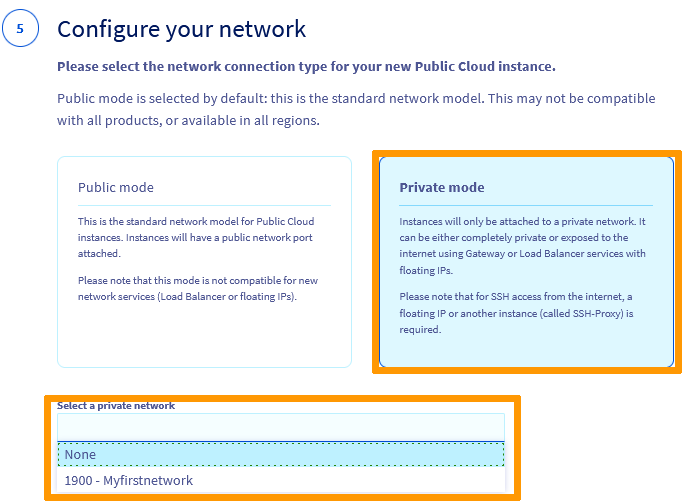
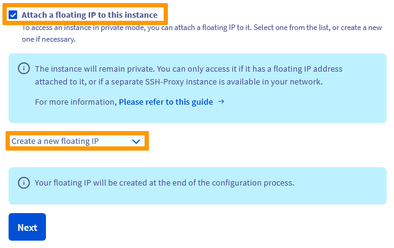
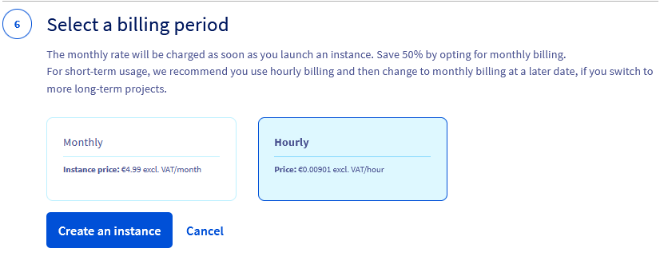

**Last updated 14th November 2022**

## Objective

Floating IPs are public IP addresses for [Public Cloud](https://www.ovhcloud.com/es/public-cloud/), used to expose a private instance or a private network service to the public network. You can read more about it on our dedicated [concepts page](https://docs.ovh.com/us/es/publiccloud/network-services/additional-ip-vs-floating-ip/).

**This guide explains how to attach Floating IP addresses to your instances.**

## Requirements

- A [Public Cloud project](https://www.ovhcloud.com/es/public-cloud/) in your OVHcloud account
- Access to the [OVHcloud API](https://ca.api.ovh.com/), the [OVHcloud Control Panel](https://ca.ovh.com/auth/?action=gotomanager&from=https://www.ovh.com/world/&ovhSubsidiary=ws) or the OpenStack command line environment ([Tutorial](https://docs.ovh.com/us/es/public-cloud/preparar_el_entorno_para_utilizar_la_api_de_openstack/))
- The [OpenStack Command Line Interface](https://docs.openstack.org/newton/user-guide/common/cli-install-openstack-command-line-clients.html){.external} tool installed on your working environment (optional)

## Understanding the Floating IP service

Floating IP is one of the services delivered by the OpenStack DVR (Distributed Virtual Router) services of the OVHcloud Public Cloud.

Floating IP allows you to create a public IP address and use it for your private network based VMs for incoming and outgoing traffic. Floating IP addresses can be attached and detached from your VMs at any time. 

You can hold Floating IP addresses without attaching them to any service. They remain available for your resources until they are manually deleted.

### Target configuration architecture

{.thumbnail}

The goal of this exercise is to create a VM (**vm4fip**) with a private local network (**test-network**) only, and use a router (**router1**) to set up a Floating IP.

Next, we will use this Floating IP to connect to the instance (VM) from the outside and check its access to the Internet.

## Instructions

### Via the OVHcloud Control Panel

#### Attaching a Floating IP to an instance

> [!success]
> Click one of the two tabs below depending on whether you want to attach a Floating IP to a new instance (**Option 1**) or an existing instance (**Option 2*).

> [!tabs]
> **Option 1**
>> 
>> **In case of a new instance**
>>
>> If you wish to attach a Floating IP to an existing instance, please skip to **Option 2** (second tab above).
>>
>> Log in to the [OVHcloud Control Panel](https://ca.ovh.com/auth/?action=gotomanager&from=https://www.ovh.com/world/&ovhSubsidiary=ws), go to the `Public Cloud`{.action} section and select the Public Cloud project concerned.
>> 
>> Before creating your instance, make sure you have created a [private network with Gateway](https://docs.ovh.com/us/es/publiccloud/network-services/creating-private-network-with-gateway/).
>>
>>
>> > [!warning]
>> > As of today, all regions do not support this feature. Make sure to create an instance in a valid region. For more information, please refer to our [regions availability](https://www.ovhcloud.com/es/public-cloud/regions-availability/) page. 
>> > 
>>
>> To create a new instance, follow [this guide](https://docs.ovh.com/us/es/public-cloud/public-cloud-primeros-pasos/#create-instance) if necessary. 
>>
>> In Step 5, you have the option to choose a mode for your instance: Public mode or Private mode to be used for your instance networking. 
>>
>> By default, the public mode is selected, but since we are creating an instance to which we will attach a Floating IP, we need to create an instance with a private network **ONLY**.
>>
>> Select the `Private mode`{.action} and click on the drop down list to select a private network of your choice (the network must have been previously created with a Gateway or linked to a Gateway). 
>>
>> If you select a private network that is not linked to a Gateway, the system will automatically create a Gateway of size "S" by default and attach it to your network.
>> 
>> {.thumbnail}
>>
>> In the next step, check the box next to `Attach a Floating IP to this Instance`{.action}, and select `Create a new Floating IP`{.action}.
>>
>> {.thumbnail}
>> 
>> When you have applied your choices, click `Next`{.action} to proceed to the final step and decide on a billing method.
>>
>> {.thumbnail}
>>
>> We recommend to choose hourly billing if there is any doubt regarding the usage period, because it is not possible to choose it after the service delivery. You will have the option to switch to a monthly subscription as soon as the instance is available on the “Instances” page.
>>
>> > [!warning]
>> > If you choose to be billed hourly, you will continue to be billed as long as the instance is not deleted. It does not matter if the instance is not actually used during this time. 
>> >
>>
>> Once you have made sure that your configuration choices are correct, click on the `Create an instance`{.action} button to finish creating your new instance. It may take a few minutes until your service is delivered.
>> 
>>
> **Option 2** 
>>
>> **In case of an existing instance (created with a private network only).**
>>
>> Please note that the private network must be linked to a gateway. For more information, consult this guide: [Creating a private network with Gateway](https://docs.ovh.com/us/es/publiccloud/network-services/creating-private-network-with-gateway/).
>>
>> In the public cloud section, click on `Public IPs`{.action} in the left-hand menu under **Network**.
>>
>> Click on `Floating IPs`{.action}, then on `Add a new IP`{.action}.
>>
>> {.thumbnail}
>>
>> Underneath "Select your public use", select the `Floating IPs (Public Cloud)`{.action}.
>> 
>> {.thumbnail}
>>
>> In the next step, choose a region for your Floating IPs. The region must be the same as that of the instance you wish to attach the Floating IP to.
>>
>> {.thumbnail}
>>
>>
>> > [!primary]
>> >
>> > Please note that only regions in which this service is available will be displayed.
>> >
>>
>> Next, click on the drop down list to select the instance to attach the Floating IP to, then select the network/IP (this will be in the default range selected when creating the private network of the instance). 
>>
>> {.thumbnail}
>> 
>> > [!primary]
>> > In case your instance is attached to two or more private networks, you will be presented with an equal amount of private IPs to select from, select the private IP of your choice.
>> > 
>> 
>> Once done, click on `Generate purchase order`{.action}. It may take a few minutes until your service is delivered.
>>
>> {.thumbnail}
>>

#### Detaching a Floating IP

This feature is currently only available via the [OpenStack API](#detachip). 

#### Deleting a Floating IP

In the public cloud section, click on `Public IPs`{.action} in the left-hand menu under **Network**.

In the `Floating IP`{.action} tab, click on the `...`{.action} next to the corresponding IP and select `Delete`{.action}.

{.thumbnail}

In the pop-up window, proceed with the deletion of the IP by clicking on `Confirm`{.action}.

### Via the OpenStack API

#### Attaching a Floating IP to an instance

> [!tabs]
> **Step 1**
>>
>> Create a router
>> 
>> ```bash
>> $ openstack router create router1
>> $ openstack router show router1 -c id -c status
>> +--------+--------------------------------------+
>> | Field  | Value                                |
>> +--------+--------------------------------------+
>> | id     | d2370b2f-18ba-4a23-886d-35c01ba2a957 |
>> | status | ACTIVE                               |
>> +--------+--------------------------------------+
>> ```
>>
> **Step 2**
>>
>> Create a private network if needed.<br> If you have one already, you can skip this step.
>>
>> ```bash
>> $ openstack network create test-network
>> $ openstack network show test-network -c id -c status
>> +--------+--------------------------------------+
>> | Field  | Value                                |
>> +--------+--------------------------------------+
>> | id     | a9753f63-889a-43b7-b3ea-258bd5008207 |
>> | status | ACTIVE                               |
>> +--------+--------------------------------------+
>> ```
>> 
> **Step 3** 
>>
>> Create a subnet for your **test-network**.<br> If you have one already, you can skip this step.
>>
>> The subnet should have the **DHCP** service enabled and a **gateway IP** configured.
>>
>> ```bash
>> $ openstack subnet create --subnet-range 192.168.0.1/24 --network test-network --dhcp --gateway 192.168.0.1 test-subnet
>> $ openstack subnet show test-subnet -c id -c gateway_ip -c enable_dhcp -c name
>> +-------------+--------------------------------------+
>> | Field       | Value                                |
>> +-------------+--------------------------------------+
>> | enable_dhcp | True                                 |
>> | gateway_ip  | 192.168.0.1                          |
>> | id          | c23df163-0d46-4928-91d6-956794c4de16 |
>> | name        | test-subnet                          |
>> +-------------+--------------------------------------+
>> ```
>>
> **Step 4**
>>
>> Add subnet to the **router1**.
>>
>> ```bash
>> $ openstack router add subnet router1 test-subnet
>> $ openstack router show router1 -c interfaces_info -c name
>> +-----------------+-----------------------------------------------------------------------------------------------------------------------------------------+
>> | Field           | Value                                                                                                                                   |
>> +-----------------+-----------------------------------------------------------------------------------------------------------------------------------------+
>> | interfaces_info | [{"port_id": "ec872f31-cfe5-4326-9aa2-30d2e5c60d20", "ip_address": "192.168.0.1", "subnet_id": "c23df163-0d46-4928-91d6-956794c4de16"}] |
>> | name            | router1                                                                                                                                 |
>> +-----------------+-----------------------------------------------------------------------------------------------------------------------------------------+
>> ```
>>
> **Step 5**
>>
>> Add a gateway to **router1** from the public shared network **Ext-Net**.
>> 
>> ```bash
>> $ openstack router set --external-gateway Ext-Net router1
>> $ openstack router show router1 -c external_gateway_info -c name
>> +-----------------------+------------------------------------------------------------------------------------------------------------------------------------------------------------------------------------------------------------------------------------------------------------------------------------------+
>> | Field                 | Value                                                                                                                                                                                                                                                                                    |
>> +-----------------------+------------------------------------------------------------------------------------------------------------------------------------------------------------------------------------------------------------------------------------------------------------------------------------------+
>> | external_gateway_info | {"network_id": "b2c02fdc-ffdf-40f6-9722-533bd7058c06", "external_fixed_ips": [{"subnet_id": "0f11270c-1113-4d4f-98de-eba83445d962", "ip_address": "141.94.208.45"}, {"subnet_id": "4aa6cac1-d5cd-4e25-b14b-7573aeabcab1", "ip_address": "2001:41d0:304:400::7dc"}], "enable_snat": true} |
>> | name                  | router1                                                                                                                                                                                                                                                                                  |
>> +-----------------------+------------------------------------------------------------------------------------------------------------------------------------------------------------------------------------------------------------------------------------------------------------------------------------------+
>> ```
>> 
> **Step 6**
>>
>> Create a **test-keypair** for SSH connection to your VM (do not forget to limit accesses to the private key file using the chmod command).
>>
>> ```bash
>> $ openstack keypair create --private-key ./test-key.rsa test-key
>> +-------------+-------------------------------------------------+
>> | Field       | Value                                           |
>> +-------------+-------------------------------------------------+
>> | fingerprint | 02:54:10:33:e4:b0:fb:4b:ec:4b:06:e8:0d:38:90:25 |
>> | name        | test-key                                        |
>> | user_id     | 0a3ef9fd2ea748e8935accf19d0278a8                |
>> +-------------+-------------------------------------------------+
>> $ chmod 600 ./test-key.rsa
>> ```
>>
> **Step 7**
>>
>> Spawn a VM with the **test-network** interface only.
>>
>> ```bash
>> $ openstack server create --image 'Ubuntu 22.04' --flavor s1-8 --key-name test-key --net test-network vm4fip
>> $ openstack server show vm4fip -c name -c status
>> +--------+--------+
>> | Field  | Value  |
>> +--------+--------+
>> | name   | vm4fip |
>> | status | ACTIVE |
>> +--------+--------+
>> ```
>>
>> Now we have a VM named **vm4fip** with a private interface only. This VM has no access outside **test-network**.
>> 
> **Step 8**
>>
>> Create a Floating IP from **Ext-Net** network.
>>
>> ```bash
>> $ openstack floating ip create Ext-Net
>> $ openstack floating ip list
>> +--------------------------------------+---------------------+------------------+------+--------------------------------------+----------------------------------+
>> | ID                                   | Floating IP Address | Fixed IP Address | Port | Floating Network                     | Project                          |
>> +--------------------------------------+---------------------+------------------+------+--------------------------------------+----------------------------------+
>> | 7b646f78-9344-440e-83c1-57c828a03718 | 169.254.10.25       | None             | None | b2c02fdc-ffdf-40f6-9722-533bd7058c06 | 25a9e81103504980809e3f7573d93da3 |
>> +--------------------------------------+---------------------+------------------+------+--------------------------------------+----------------------------------+
>> ```
>>
> **Step 9**
>>
>> Attach the Floating IP to VM **vm4fip**.
>>
>> ```bash
>> $ openstack server add floating ip vm4fip 169.254.10.25
>> $ openstack floating ip list
>> +--------------------------------------+---------------------+------------------+--------------------------------------+--------------------------------------+----------------------------------+
>> | ID                                   | Floating IP Address | Fixed IP Address | Port                                 | Floating Network                     | Project                          |
>> +--------------------------------------+---------------------+------------------+--------------------------------------+--------------------------------------+----------------------------------+
>> | 7b646f78-9344-440e-83c1-57c828a03718 | 169.254.10.25       | 192.168.0.201    | 1230869c-7116-4ee9-b688-8b6ebc153855 | b2c02fdc-ffdf-40f6-9722-533bd7058c06 | 25a9e81103504980809e3f7573d93da3 |
>> +--------------------------------------+---------------------+------------------+--------------------------------------+--------------------------------------+----------------------------------+
>> ```
>>
>> Your VM now pings via the Floating IP:
>> ```bash
>> $ ping 169.254.10.25
>> PING 169.254.10.25 (169.254.10.25) 56(84) bytes of data.
>> 64 bytes from 169.254.10.25: icmp_seq=1 ttl=52 time=0.641 ms
>> 64 bytes from 169.254.10.25: icmp_seq=2 ttl=52 time=1.06 ms
>> 64 bytes from 169.254.10.25: icmp_seq=3 ttl=52 time=0.744 ms
>> ^C
>> --- 169.254.10.25 ping statistics ---
>> 3 packets transmitted, 3 received, 0% packet loss, time 2024ms
>> rtt min/avg/max/mdev = 0.641/0.817/1.067/0.182 ms
>> ```
>>
>> You can connect to the vm4fip VM:
>>
>> ```bash
>> $  ssh ubuntu@169.254.10.25 -i ./test-key.rsa
>> Welcome to Ubuntu 22.04 LTS (GNU/Linux 5.15.0-25-generic x86_64)
>>
>> * Documentation:  https://help.ubuntu.com
>> * Management:     https://landscape.canonical.com
>> * Support:        https://ubuntu.com/advantage
>> 
>> ubuntu@vm4fip:~$ ip a
>> 1: lo: <LOOPBACK,UP,LOWER_UP> mtu 65536 qdisc noqueue state UNKNOWN group default qlen 1000
>> link/loopback 00:00:00:00:00:00 brd 00:00:00:00:00:00
>> inet 127.0.0.1/8 scope host lo
>> valid_lft forever preferred_lft forever
>> inet6 ::1/128 scope host
>> valid_lft forever preferred_lft forever
>> 2: ens3: <BROADCAST,MULTICAST,UP,LOWER_UP> mtu 9000 qdisc fq_codel state UP group default qlen 1000
>> link/ether fa:16:3e:24:b9:c2 brd ff:ff:ff:ff:ff:ff
>> altname enp0s3
>> inet 192.168.0.201/24 metric 100 brd 192.168.0.255 scope global dynamic ens3
>> valid_lft 85929sec preferred_lft 85929sec
>> inet6 fe80::f816:3eff:fe24:b9c2/64 scope link
>> valid_lft forever preferred_lft forever
>> ```
>>
>> As you can see, the VM only has a private IP but it is available from the Internet via the Floating IP.
>>
>> ```bash
>> ubuntu@vm4fip:~$ sudo resolvectl dns ens3 1.1.1.1
>> ubuntu@vm4fip:~$ curl ifconfig.me/ip
>> 169.254.10.25
>> ```
>>
>> > [!warning]
>> >
>> > Once a Floating IP is attached to a VM, it is exposed to the Internet. Always ensure that your VM and its services are properly protected by security groups or a VM firewall.
>> >

#### Detaching a Floating IP <a name="detachip"></a>

You can detach a Floating ip from your VM at anytime.

```bash
$ openstack server remove floating ip vm4fip 169.254.10.25
$ openstack floating ip list
+--------------------------------------+---------------------+------------------+------+--------------------------------------+----------------------------------+
| ID                                   | Floating IP Address | Fixed IP Address | Port | Floating Network                     | Project                          |
+--------------------------------------+---------------------+------------------+------+--------------------------------------+----------------------------------+
| 7b646f78-9344-440e-83c1-57c828a03718 | 169.254.10.25       | None             | None | b2c02fdc-ffdf-40f6-9722-533bd7058c06 | 25a9e81103504980809e3f7573d93da3 |
+--------------------------------------+---------------------+------------------+------+--------------------------------------+----------------------------------+
$ ping 169.254.10.25
PING 169.254.10.25 (169.254.10.25) 56(84) bytes of data.
^C
--- 169.254.10.25 ping statistics ---
2 packets transmitted, 0 received, 100% packet loss, time 1019ms
```

> [!warning]
> 
> Once a Floating IP is detached, it goes back to your pool of Floating IPs. The Floating IP can be reattached to the same VM or any other VMs in your VMs pool. Detaching a Floating IP does not delete it.
>

#### Deleting a Floating IP

To delete a Floating IP, you must do it explicitly:

```bash
$ openstack floating ip delete 169.254.10.25
$ openstack floating ip list
```

### Via the OVHcloud API

#### Attaching a Floating IP to an instance

With the OVHcloud API, you can only attach a Floating IP to an existing instance.

> [!tabs]
> **Step 1**
>> 
>> To begin, retrieve all the information you will need.
>>
>> For the project ID, the calls below allow you to retrieve it.
>>
>> > [!api]
>> >
>> > @api {GET} /cloud/project
>>
>>
>> > [!primary]
>> > This call retrieves the list of projects.
>> 
>> > [!api]
>> >
>> >@api {GET} /cloud/project/{serviceName}
>>
>> > [!primary]
>> > This call identifies the project via the "description" field.
>> 
> **Step 2**
>> 
>> For the instance ID, the call below allows you to retrieve it.
>>
>> > [!api]
>> >
>> > @api {GET} /cloud/project/{serviceName}/instance
>>
>>
>> > [!primary]
>> > Fill in the fields with the information previously obtained:
>> > **serviceName**: The project ID
>> >
>> > **region**: You can specify the region for quicker results
>> 
>> The creation will take a few moments.
>>
>>
> **Step 3**
>> Once you have gathered all the information, you can now create a Floating IP and attach it to an instance using the following call.
>> 
>> > [!api]
>> >
>> > @api {POST} /cloud/project/{serviceName}/region/{regionName}/instance/{instanceId}/floatingIp 
>>
>> Fill in the fields according the following table.
>>
>> |Field|Description| 
>> |---|---| 
>> |serviceName|ID of the project|
>> |regionName|Name of the region in which the instance is located|
>> |instanceId|ID of the instance|
>> |name|Define a name for your Gateway|
>> |ip|The private IP of the instance|
>>
>> > [!primary]
>> > The "gateway" property field should be left empty because you are attaching a Floating IP to an instance intially created with a private network **only** and already linked to a Gateway. Please note that for now, the Floating IP will not be created if the instance is linked to a private network that is not attached to a Gateway.
>> >
>> The creation will take a few moments.
>>


#### Detaching a Floating IP

This feature is currently only available via the [OpenStack API](#detachip). 

#### Deleting a Floating IP

To delete a Floating IP, use the following API calls.

First, retrieve the necessary information.

For the project ID, the calls below allow you to retrieve it.

> [!api]
>
> @api {GET} /cloud/project

> [!primary]
> This call retrieves the list of projects.
>

> [!api]
>
> @api {GET} /cloud/project/{serviceName}
>

> [!primary]
> This call identifies the project via the "description" field.
>

For the Floating IP ID, the call below allows you to retrieve it.

> [!api]
>
> @api {GET} /cloud/project/{serviceName}/region/{regionName}/floatingip
>

> [!primary]
> Fill in the fields with the information previously obtained:
>
> - **serviceName**: The project ID
> - **regionName**: The name of the region

Once the information has been retrieved, use the following call to delete the Floating IP.

> [!api]
>
> @api {DELETE} /cloud/project/{serviceName}/region/{regionName}/floatingip/{floatingIpId}
>

> [!primary]
> Fill in the fields with the information previously obtained:
>
> - **serviceName**: The project ID
> - **regionName**: The name of the region in which the floating is located
> - **floatingIpId**: The ID of the Floating IP

## Go further

Join our community of users on <https://community.ovh.com/en/>.