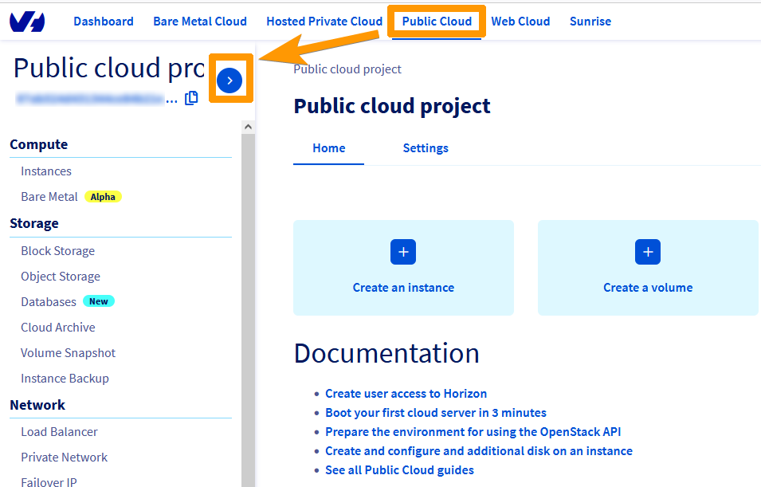
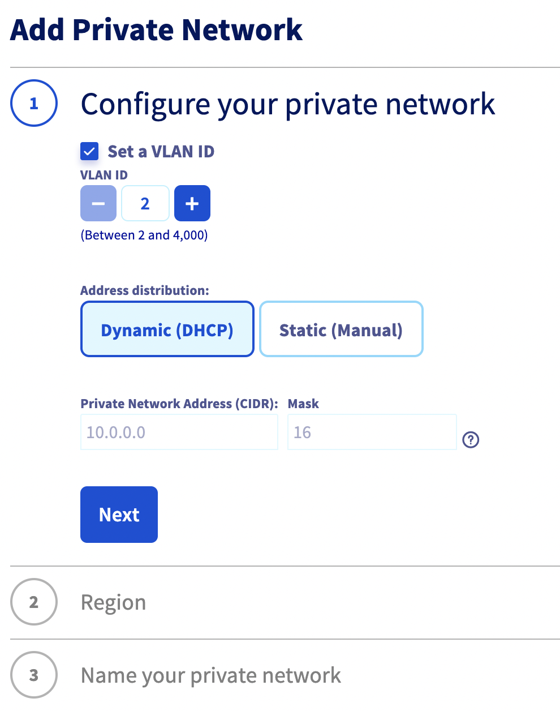
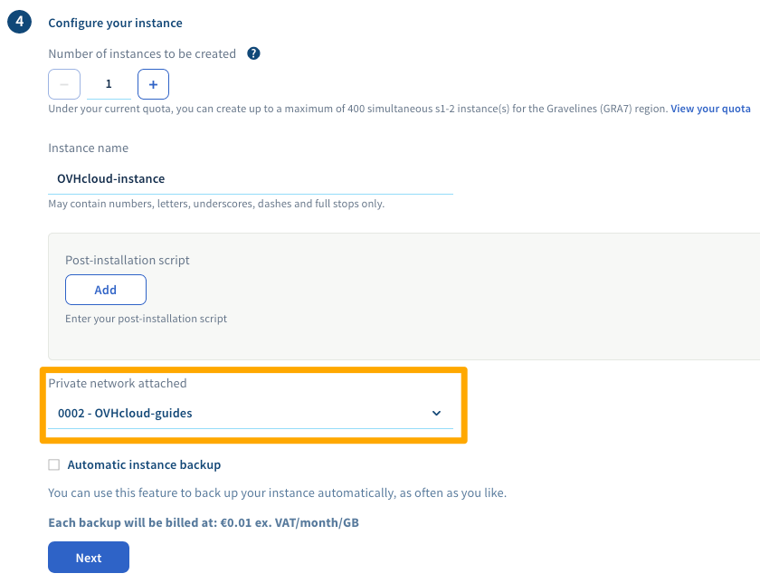
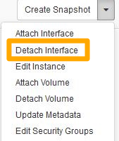

> [!primary]
> Esta traducción ha sido generada de forma automática por nuestro partner SYSTRAN. En algunos casos puede contener términos imprecisos, como en las etiquetas de los botones o los detalles técnicos. En caso de duda, le recomendamos que consulte la versión inglesa o francesa de la guía. Si quiere ayudarnos a mejorar esta traducción, por favor, utilice el botón «Contribuir» de esta página.
>

**Última actualización: 02/11/2022**

## Objetivo

El [vRack](https://www.ovh.com/world/es/soluciones/vrack/) OVHcloud es una solución de red privada que permite configurar el direccionamiento entre varios servidores dedicados de OVHcloud. Al mismo tiempo, le permite agregar [instancias de Public Cloud](https://docs.ovh.com/us/es/public-cloud/public-cloud-primeros-pasos/) a su red privada para crear una infraestructura de recursos físicos y virtuales.

**Esta guía le ayudará a configurar sus instancias de Public Cloud en el vRack.**

## Requisitos

- Tener un [proyecto de Public Cloud.](https://docs.ovh.com/us/es/public-cloud/crear_su_primer_proyecto_de_public_cloud/)
- Haber iniciado sesión en el [área de cliente de OVHcloud](https://ca.ovh.com/auth/?action=gotomanager&from=https://www.ovh.com/world/&ovhSubsidiary=ws).
- Haber [creado un usuario de OpenStack](https://docs.ovh.com/us/es/public-cloud/crear-y-eliminar-un-usuario-de-openstack/) (opcional).
- Conocimientos básicos de redes.

## Presentación de las interfaces

La creación de un vRack o la adición de una instancia a la red se pueden realizar mediante el área de cliente de OVHcloud, las APIv6 de OVHcloud, las API de OpenStack o la interfaz Horizon.

Según su perfil técnico y sus necesidades, deberá elegir qué interfaz o método utilizar. Así pues, para cada acción, le proponemos los distintos pasos posibles.

**Para empezar, a continuación se proporciona una breve descripción de las posibles acciones según el método/interfaz elegido.**

### Área de cliente de OVHcloud

El [área de cliente de OVHcloud](https://ca.ovh.com/auth/?action=gotomanager&from=https://www.ovh.com/world/&ovhSubsidiary=ws) es una interfaz completa y únicamente visual, lo que la convierte en una interfaz ideal si solo tiene una VLAN para gestionar. No podrá personalizar el rango de IP privadas, que estará únicamente en 10.x.x.x/16.

Las VLAN se desplegarán por defecto en todas las zonas. Solo tiene la posibilidad de activar la puerta de enlace.

También podrá gestionar la facturación de sus servicios desde el área de cliente de OVHcloud.

### Interfaz Horizon

Interfaz visual independiente de OVHcloud, [Horizon](https://horizon.cloud.ovh.net/auth/login/){.external} es la implementación original del panel de control de OpenStack, que proporciona una interfaz de usuario web a los servicios OpenStack, incluyendo Nova, Swift, Keystone, etc.

Esta completa interfaz técnica le permite gestionar casi todas las acciones de OpenStack. Será una de las interfaces necesarias si desea gestionar más de dos VLAN, añadir interfaces de red privadas a sus instancias, gestionar imágenes personalizadas, etc.

Consulte la guía [Conectarse a Horizon](https://docs.ovh.com/us/es/public-cloud/horizon/) para familiarizarse con Horizon.

> [!primary]
> Horizon que funciona por zonas. No olvide elegir su zona geográfica de trabajo en la parte superior izquierda de su interfaz (GRA5, SBG3, BHS1, etc.).
>

### OVHcloud APIv6

Cada acción que realice en el área de cliente de OVHcloud recurre a las [APIv6 de OVHcloud](https://ca.api.ovh.com/).
Puede incluso ir más lejos en las API que en el área de cliente.

La interfaz es menos visual que el área de cliente de OVHcloud, pero le permitirá realizar un gran número de acciones. De este modo, podrá gestionar y personalizar sus VLAN, añadir interfaces a sus instancias o crear servidores altamente personalizados.

A veces deberá obtener más información antes de utilizar una API específica.

Solo tiene que acceder a las API desde [nuestra página web](https://ca.api.ovh.com/), pero también puede crear sus scripts PHP o Python para llamar.

De este modo, podrá automatizar libremente las tareas básicas mediante scripts, optimizar sus propias funciones, etc.

Consulte la guía [Primeros pasos con las API de OVHcloud](https://docs.ovh.com/us/es/api/first-steps-with-ovh-api/), para familiarizarse con el uso de las APIv6 de OVHcloud.

### API OpenStack

Una vez que haya descargado e instalado las herramientas OpenStack, es posible administrar los servicios de Public Cloud con comandos Linux o Windows.

Este método requiere conocimientos Linux o Windows para aprovecharlo, pero permite disfrutar de toda la potencia de OpenStack a través de este método.

Según la capa que quiera gestionar, deberá utilizar el cliente **Nova** (Compute), **Neutron** (red), **Glance** (Image) o **Swift** (Object Storage). El último hijo de la familia, el cliente OpenStack, le permite gestionar directamente las capas de OpenStack.

Gracias a la API de OpenStack, también puede automatizar esta gestión a través de sus scripts.

Para familiarizarse con la API de OpenStack, consulte las siguientes guías:

- [Preparar el entorno para utilizar la API de OpenStack](https://docs.ovh.com/us/es/public-cloud/prepare_the_environment_for_using_the_openstack_api/)
- [Cargar las variables de entorno necesarias para OpenStack](https://docs.ovh.com/us/es/public-cloud/set-openstack-environment-variables/)

En ese caso, podrá utilizar las siguientes API dedicadas a OpenStack:

- Nova (compute)
- Glance (image)
- Cinder (image)
- Neutron (network)

> [!primary]
> En algunos casos será más fácil utilizar las API OpenStack y en otros, las API Nova, Neutron, etc.
>
> Asimismo, algunas funcionalidades pueden estar ausentes de la API OpenStack en función de la versión de su cliente y su sistema operativo.
En esta guía, hemos elegido las alternativas más sencillas e intuitivas.
Si desea más información sobre su uso, consulte la [documentación oficial de OpenStack](https://docs.openstack.org/){.external}.
>

## Procedimiento

### Etapa 1: Activar y gestionar un vRack <a name="activation"></a>

En primer lugar, es necesario crear un vRack.

Este producto es gratuito y solo tardarás unos minutos en estar disponibles. Sin embargo, es necesario crear y validar una orden de pedido.

Una vez que el vRack esté activo, encontrará este servicio bajo el nombre "pn-xxxxx".

#### Desde el área de cliente de OVHcloud

Conéctese al [área de cliente de OVHcloud](https://ca.ovh.com/auth/?action=gotomanager&from=https://www.ovh.com/world/&ovhSubsidiary=ws){.external}, acceda a la sección `Public Cloud`{.action} y seleccione el proyecto de Public Cloud que desee en la parte superior izquierda.

{.thumbnail}

En el menú lateral izquierdo, haga clic en `Private Network`{.action}. 

{.thumbnail}

Haga clic en el botón `Crear un vRack para empezar`{.action}. A continuación, deberá elegir entre crear un nuevo vRack o utilizar un vRack existente. En nuestro ejemplo, vamos a crear un nuevo vRack. A continuación, haga clic en `Crear`{.action}.

{.thumbnail}

Para continuar la configuración del vRack desde el área de cliente de OVHcloud, continúe leyendo esta guía: [Crear una VLAN en el vRack desde el área de cliente de OVHcloud](./#crear-una-vlan-desde-el-area-de-cliente-de-ovhcloud).

#### Desde la APIv6 de OVHcloud

Para activar y gestionar un vRack desde la APIv6 de OVHcloud, haga clic [aquí](https://docs.ovh.com/gb/en/publiccloud/network-services/public-cloud-vrack-apiv6/#step-1-activating-and-managing-a-vrack) (EN), para consultar la guía específica sobre este método.

### Etapa 2: Crear una VLAN en el vRack

Es necesario crear una VLAN (o red local virtual) para que las instancias conectadas al vRack puedan comunicarse entre sí.

En la solución Public Cloud, puede crear hasta 4000 VLAN en un único vRack. Esto significa que puede utilizar cada dirección IP privada hasta 4000 veces.
Así, por ejemplo, la IP 192.168.0.10 de la VLAN 2 es diferente de la IP 192.168.0.10 de la VLAN 42.

Esto puede ser útil para segmentar el vRack entre varias redes virtuales.

Desde el área de cliente de OVHcloud podrá utilizar la VLAN que desee, pero no podrá personalizar el rango de IP. El vRack estará activo en todas las zonas.

Con la APIv6 de OVHcloud podrá personalizar todos los parámetros: rango IP (10.0.0.0/16 por ejemplo), zona de despliegue, DHCP, Gateway, etc.

> [!primary]
> En los servidores dedicados, por defecto está en la VLAN 0. Para que la infraestructura OpenStack funcione, deberá indicar el número de su VLAN directamente a nivel de la infraestructura.
>
> A diferencia de los servidores dedicados, no es necesario « etiquetar » la VLAN directamente en una instancia de Public Cloud. 
>
> Para más información sobre la gestión de las VLAN del vRack de los servidores dedicados, consulte la siguiente guía: [Crear varias VLAN en el vRack](https://docs.ovh.com/us/es/dedicated/crear-vlan-vrack/).

> [!warning]
> El vRack es una infraestructura gestionada a nivel de OVHcloud, por lo que solo podrá administrarla desde el área de cliente de OVHcloud y las APIv6 de OVHcloud.
>
>OpenStack no está situada al mismo nivel de la infraestructura, por lo que no podrá personalizar las VLAN a través de Horizon o de las API OpenStack.
>

#### Crear una VLAN desde el área de cliente de OVHcloud

Una vez creado el vRack, vuelva a hacer clic en `Private Network`{.action} en el menú lateral izquierdo. 

{.thumbnail}

A continuación, haga clic en `Crear una red privada`{.action}. La página siguiente le permitirá personalizar varios parámetros.

{.thumbnail}

Si marca la casilla `Indicar un ID de VLAN`, deberá elegir un número de VLAN de 2 a 4000.

Si no marca la casilla `Indicar un ID de VLAN`, se mostrará por defecto en la VLAN 0.

Si desea que los servidores dedicados de OVHcloud se comuniquen con una VLAN « etiquetada », consulte la siguiente guía: [Crear varias VLAN en el vRack](https://docs.ovh.com/us/es/dedicated/crear-vlan-vrack/).

El rango DHCP predeterminado es 10.0.0.0/16. Para modificar el rango de IP, es necesario utilizar las APIv6 de OVHcloud.

Acepte las distintas regiones, introduzca un nombre para la red privada y haga clic en `Crear`{.action} para empezar a crearla. 

> [!primary]
> La creación de la red privada puede tardar varios minutos.
>

#### Crear una VLAN desde las APIv6 de OVHcloud

Para crear una VLAN desde las APIv6 de OVHcloud, haga clic [aquí](https://docs.ovh.com/gb/en/publiccloud/network-services/public-cloud-vrack-apiv6/#step-3-creating-a-vlan-in-the-vrack_1) (EN), para consultar la guía específica.

### Etapa 3: Integrar una instancia en el vRack

Puede darse dos situaciones:

- La instancia aún no existe.
- La instancia ya existe y debe añadirla al vRack.

#### Caso de una nueva instancia

##### **Desde el área de cliente de OVHcloud**

Consulte la guía [Crear una instancia desde el área de cliente](https://docs.ovh.com/us/es/public-cloud/public-cloud-primeros-pasos/#create-instance). Al crear una instancia, podrá especificar, en el paso 4, una red privada en la que integrar su instancia. Seleccione el vRack anteriormente creado en el menú desplegable que aparece.

{.thumbnail}

> [!warning]
> Al crear una nueva instancia, solo podrá conectar su instancia a un único vRack desde el área de cliente de OVHcloud.
> Para añadir varias interfaces diferentes, debe utilizar las API de OpenStack u Horizon.
>

##### **Desde la APIv6 de OVHcloud**

Haga clic [aquí](https://docs.ovh.com/gb/en/publiccloud/network-services/public-cloud-vrack-apiv6/#step-4-integrating-an-instance-into-the-vrack_1) (EN), para consultar la guía específica sobre este método.

##### **Desde la API OpenStack**

Para utilizar las API de OpenStack, no olvide preparar su propio entorno de trabajo, tal y como se indica en la [primera parte de esta guía](./#api-openstack).

Para crear una instancia directamente en el vRack, debe realizar esta operación.

###### Obtención de la información necesaria

Identificación de las redes públicas y privadas:

```bash
openstack network list
 
+--------------------------------------+------------+-------------------------------------+
| ID                                   | Name       | Subnets                             |
+--------------------------------------+------------+-------------------------------------+
| 12345678-90ab-cdef-xxxx-xxxxxxxxxxxx | MyVLAN-42  | xxxxxxxx-yyyy-xxxx-yyyy-xxxxxxxxxxxx|
| 34567890-12ab-cdef-xxxx-xxxxxxxxxxxx | Ext-Net    | zzzzzzzz-yyyy-xxxx-yyyy-xxxxxxxxxxxx|
| 67890123-4abc-ef12-xxxx-xxxxxxxxxxxx | MyVLAN_0   | yyyyyyyy-xxxx-xxxx-yyyy-xxxxxxxxxxxx|
+--------------------------------------+------------+-------------------------------------+
```

o

```bash
nova net-list
 
+--------------------------------------+------------+------+
| ID                                   | Label      | CIDR |
+--------------------------------------+------------+------+
| 12345678-90ab-cdef-xxxx-xxxxxxxxxxxx | MyVLAN-42  | None |
| 34567890-12ab-cdef-xxxx-xxxxxxxxxxxx | Ext-Net    | None |
| 67890123-4abc-ef12-xxxx-xxxxxxxxxxxx | MyVLAN_0   | None |
+--------------------------------------+------------+------+
```

> [!primary]
> Deberá indicar los ID de red correspondientes:
><br> - Ext-Net para tener una IP pública
><br> - El del o de las VLAN necesarias para su configuración
>

Recuerde también lo siguiente, tal y como se indica en la [guía de uso de la API Nova](https://docs.ovh.com/gb/en/public-cloud/starting-with-nova-api/) (EN):

- ID o nombre de la llave SSH OpenStack
- ID del tipo de instancia (flavor)
- ID de la imagen deseada (sistema operativo, snapshot, etc.)

###### Despliegue de la instancia

Con los elementos recuperados anteriormente, es posible crear una instancia incluyéndola directamente en el vRack:

```bash
nova boot --key-name SSHKEY --flavor [ID-flavor] --image [ID-Image] --nic net-id=[ID-Network 1] --nic net-id=[ID-Network 2] [instance name]

Example:
nova boot --key-name my-ssh-key --flavor xxxxxx-xxxx-xxxx-xxxx-xxxxxxxxxxxx --image yyyy-yyyy-yyyy-yyyy-yyyyyyyyyyyy --nic net-id=[id_Ext-Net] --nic net-id=[id_VLAN] NameOfInstance

+--------------------------------------+------------------------------------------------------+
| Property                             | Value                                                |
+--------------------------------------+------------------------------------------------------+
| OS-DCF:diskConfig                    | MANUAL                                               |
| OS-EXT-AZ:availability_zone          |                                                      |
| OS-EXT-STS:power_state               | 0                                                    |
| OS-EXT-STS:task_state                | scheduling                                           |
| OS-EXT-STS:vm_state                  | building                                             |
| OS-SRV-USG:launched_at               | -                                                    |
| OS-SRV-USG:terminated_at             | -                                                    |
| accessIPv4                           |                                                      |
| accessIPv6                           |                                                      |
| adminPass                            | xxxxxxxxxxxx                                         |
| config_drive                         |                                                      |
| created                              | YYYY-MM-DDTHH:MM:SSZ                                 |
| flavor                               | [Flavor type] (xxxxxx-xxxx-xxxx-xxxx-xxxxxxxxxxxx)   |
| hostId                               |                                                      |
| id                                   | xxxxxx-xxxx-xxxx-xxxx-xxxxxxxxxxxx                   |
| image                                | [Image type] (xxxxxx-xxxx-xxxx-xxxx-xxxxxxxxxxxx)    |
| key_name                             | [Name of key]                                        |
| metadata                             | {}                                                   |
| name                                 | [Name of instance]                                   |
| os-extended-volumes:volumes_attached | []                                                   |
| progress                             | 0                                                    |
| security_groups                      | default                                              |
| status                               | BUILD                                                |
| tenant_id                            | zzzzzzzzzzzzzzzzzzzzzzzzzzzzzzzz                     |
| updated                              | YYYY-MM-DDTHH:MM:SSZ                                 |
| user_id                              | zzzzzzzzzzzzzzzzzzzzzzzzzzzzzzzz                     |
+--------------------------------------+------------------------------------------------------+
```
o

```bash
openstack server create --key-name SSHKEY --flavor [ID-flavor] --image [ID-Image] --nic net-id=[ID-Network 1] --nic net-id=[ID-Network 2] [instance name]

Ejemplo:
openstack server create --key-name my-ssh-key --flavor xxxxxx-xxxx-xxxx-xxxx-xxxxxxxxxxxx --image yyyy-yyyy-yyyy-yyyy-yyyyyyyyyyyy --nic net-id=[id_Ext-Net] --nic net-id=[id_VLAN] NameOfInstance

+--------------------------------------+------------------------------------------------------+
| Property                             | Value                                                |
+--------------------------------------+------------------------------------------------------+
| OS-DCF:diskConfig                    | MANUAL                                               |
| OS-EXT-AZ:availability_zone          |                                                      |
| OS-EXT-STS:power_state               | 0                                                    |
| OS-EXT-STS:task_state                | scheduling                                           |
| OS-EXT-STS:vm_state                  | building                                             |
| OS-SRV-USG:launched_at               | -                                                    |
| OS-SRV-USG:terminated_at             | -                                                    |
| accessIPv4                           |                                                      |
| accessIPv6                           |                                                      |
| adminPass                            | xxxxxxxxxxxx                                         |
| config_drive                         |                                                      |
| created                              | YYYY-MM-DDTHH:MM:SSZ                                 |
| flavor                               | [Flavor type] (xxxxxx-xxxx-xxxx-xxxx-xxxxxxxxxxxx)   |
| hostId                               |                                                      |
| id                                   | xxxxxx-xxxx-xxxx-xxxx-xxxxxxxxxxxx                   |
| image                                | [Image type] (xxxxxx-xxxx-xxxx-xxxx-xxxxxxxxxxxx)    |
| key_name                             | [Name of key]                                        |
| metadata                             | {}                                                   |
| name                                 | [Name of instance]                                   |
| os-extended-volumes:volumes_attached | []                                                   |
| progress                             | 0                                                    |
| security_groups                      | default                                              |
| status                               | BUILD                                                |
| tenant_id                            | zzzzzzzzzzzzzzzzzzzzzzzzzzzzzzzz                     |
| updated                              | YYYY-MM-DDTHH:MM:SSZ                                 |
| user_id                              | zzzzzzzzzzzzzzzzzzzzzzzzzzzzzzzz                     |
+--------------------------------------+------------------------------------------------------+
```

Puede definir la dirección IP de la instancia de su interfaz vRack a nivel de OpenStack.

Para ello, puede añadir un simple argumento a la función "—nic":

`--nic net-id=[ID-Network],v4-fixed-ip=[IP_static_vRack]`

Por ejemplo:

`--nic net-id=[ID-vRack],v4-fixed-ip=192.168.0.42`

###### Verificación de la instancia

A continuación, compruebe que la lista de instancias existentes es correcta para encontrar el servidor creado:

```bash
openstack server list
+--------------------------------------+---------------------+--------+--------------------------------------------------+--------------------+
| ID                                   |       Name          | Status | Networks                                         |     Image Name     |
+--------------------------------------+---------------------+--------+--------------------------------------------------+--------------------+
| xxxxxx-xxxx-xxxx-xxxx-xxxxxxxxxxxxxx | [Name of instance]  | ACTIVE | Ext-Net=[IP_V4], [IP_V6]; MyVrack=[IP_V4_vRack]  | [Name-of-instance] |
+--------------------------------------+---------------------+--------+--------------------------------------------------+--------------------+
```

```bash
nova list
+--------------------------------------+--------------------+--------+------------+-------------+--------------------------------------------------+
| ID                                   | Name               | Status | Task State | Power State | Networks                                         |
+--------------------------------------+--------------------+--------+------------+-------------+--------------------------------------------------+
| xxxxxx-xxxx-xxxx-xxxx-xxxxxxxxxxxx   | [Name of instance] | ACTIVE | -          | Running     | Ext-Net=[IP_V4], [IP_V6]; MyVrack=[IP_V4_vRack]  |
+--------------------------------------+--------------------+--------+------------+-------------+--------------------------------------------------+
```


#### Caso de una instancia ya existente

El área de cliente de OVHcloud permite asociar una instancia a una o más redes privadas, pero no ofrece una configuración avanzada de las interfaces de red. Si quiere personalizarlas más, deberá administrarlas, o bien a través de las API de OVHcloud, o bien a través de las API de OpenStack, o bien a través de Horizon.

Añada una nueva interfaz de red al servidor, además de la que ya existe.

Por ejemplo, si tiene una interfaz pública *eth0*, agregará la interfaz *eth1*.

> [!warning]
> La configuración de esta nueva interfaz rara vez es automática.
> Deberá configurarla en DHCP o IP fija según su infraestructura.
>


##### **Desde el área de cliente de OVHcloud** 

Conéctese al [área de cliente de OVHcloud](https://ca.ovh.com/auth/?action=gotomanager&from=https://www.ovh.com/world/&ovhSubsidiary=ws){.external}, acceda a la sección `Public Cloud`{.action} y seleccione el proyecto de Public Cloud correspondiente en la parte superior izquierda.

En la columna izquierda, haga clic en `Instances`{.action}. Haga clic en el botón `...`{.action} a la derecha de la instancia correspondiente y, seguidamente, en `Detalles de la instancia`{.action}.

{.thumbnail}

Se mostrará el panel de control de la instancia. Haga clic en el botón `...`{.action} a la derecha de "Red(es) privada(s)" y, seguidamente, en `Asociar una red`{.action}.

{.thumbnail}

En la nueva ventana, seleccione la red o redes privadas que quiera asociar a la instancia y haga clic en `Asociar`{.action}.

{.thumbnail}

##### **Gestión de las interfaces de red desde las APIv6 de OVHcloud**

Haga clic [aquí](https://docs.ovh.com/gb/en/publiccloud/network-services/public-cloud-vrack-apiv6/#in-case-of-an-existing-instance_1) (EN), para consultar la guía específica sobre este método.

##### **Gestión de las interfaces de red desde OpenStack Horizon**

Conéctese a la interfaz [Horizon](https://horizon.cloud.ovh.net/auth/login/){.external} utilizando el método que se indica en la [primera parte de esta guía](./#interfaz-horizon).

Conéctese a su zona de trabajo:

{.thumbnail}

Acceda a `Compute` y seleccione `Instances`.

{.thumbnail}

###### Añadir una interfaz privada

Para añadir una interfaz, haga clic en la flecha que le permitirá acceder a las acciones que pueda realizar en la instancia, en la columna "Actions". Haga clic en `Attach Interface`{.action}.

{.thumbnail}

Seleccione la interfaz y acepte:

{.thumbnail}

> [!primary]
> El servicio de OVHcloud dispondrá de una nueva interfaz de red, además de la interfaz pública (Ext-net).
><br>En el resumen de la instancia, podrá ver la dirección IP privada asignada automáticamente a su interfaz.
><br>que deberá utilizar configurando la interfaz a través del DHCP o utilizando sus propias IP mediante una configuración de IP estática.
>

###### Eliminación de una interfaz privada

> [!warning]
> La eliminación de una interfaz es definitiva.
>
>En caso de que elimine la interfaz "Ext-Net" (IP pública), esta dirección se liberará y volverá a estar en circulación. Así que no se podría reasignar.
><br>Esta operación solo es necesaria si desea aislar su servidor en el vRack (interfaz "Ext-Net") o sacarlo de una VLAN.
>

Para eliminar una interfaz, haga clic en la flecha que le permitirá acceder a las acciones que pueda realizar en la instancia, en la columna "Actions". Haga clic en `Detach Interface`{.action}.

{.thumbnail}

Seleccione la interfaz que desea eliminar y acepte:

{.thumbnail}

##### **Administrar interfaces de red con las API OpenStack**

Para utilizar las API de OpenStack, no olvide preparar su propio entorno de trabajo, tal y como se indica en la [primera parte de esta guía](./#api-openstack).

Por lo tanto, para integrar una instancia existente en el vRack, deberá realizar lo siguiente:

###### Recuperando la información necesaria

Identificación de las instancias:

```bash
openstack server list
 
+--------------------------------------+--------------+--------+------------------------------------------------------------------------+------------+
| ID                                   | Name         | Status | Networks                                                               | Image Name |
+--------------------------------------+--------------+--------+------------------------------------------------------------------------+------------+
| 12345678-90ab-cdef-xxxx-xxxxxxxxxxxx | My-Instance  | ACTIVE | Ext-Net=xx.xx.xx.xx, 2001:41d0:yyyy:yyyy::yyyy; MyVrack=192.168.0.124  | Debian 9   |
+--------------------------------------+--------------+--------+------------------------------------------------------------------------+------------+
```

o

```bash
nova list
 
+--------------------------------------+--------------+--------+------------+-------------+----------------------------------------------------------------------+
| ID                                   | Name         | Status | Task State | Power State | Networks                                                             |
+--------------------------------------+--------------+--------+------------+-------------+----------------------------------------------------------------------+
| 12345678-90ab-cdef-xxxx-xxxxxxxxxxxx | My-Instance  | ACTIVE | -          | Running     | Ext-Net=xx.xx.xx.xx,2001:41d0:yyyy:yyyy::yyyy;MyVrack=192.168.0.124  |
+--------------------------------------+--------------+--------+------------+-------------+----------------------------------------------------------------------+
```

Identificación de las redes públicas y privadas:

```bash
openstack network list
 
+--------------------------------------+------------+-------------------------------------+
| ID                                   | Name       | Subnets                             |
+--------------------------------------+------------+-------------------------------------+
| 12345678-90ab-cdef-xxxx-xxxxxxxxxxxx | MyVLAN-42  | xxxxxxxx-yyyy-xxxx-yyyy-xxxxxxxxxxxx|
| 34567890-12ab-cdef-xxxx-xxxxxxxxxxxx | Ext-Net    | zzzzzzzz-yyyy-xxxx-yyyy-xxxxxxxxxxxx|
| 67890123-4abc-ef12-xxxx-xxxxxxxxxxxx | MyVLAN-0   | yyyyyyyy-xxxx-xxxx-yyyy-xxxxxxxxxxxx|
+--------------------------------------+------------+-------------------------------------+
```

o

```bash
nova net-list
 
+--------------------------------------+------------+------+
| ID                                   | Label      | CIDR |
+--------------------------------------+------------+------+
| 12345678-90ab-cdef-xxxx-xxxxxxxxxxxx | MyVLAN-42  | None |
| 34567890-12ab-cdef-xxxx-xxxxxxxxxxxx | Ext-Net    | None |
| 67890123-4abc-ef12-xxxx-xxxxxxxxxxxx | MyVLAN-0   | None |
+--------------------------------------+------------+------+
```

> [!primary]
> Deberá indicar los ID de red correspondientes:
><br> - Ext-Net para tener una IP pública
><br> - El del o de las VLAN necesarias para su configuración
>

###### Añadir una interfaz privada

Para asociar una nueva interfaz, puede realizar el siguiente comando:

```bash
nova interface-attach --net-id <ID-VLAN> <ID-instance>
```

por ejemplo,

```bash
nova interface-attach --net-id 12345678-90ab-cdef-xxxx-xxxxxxxxxxxx 12345678-90ab-cdef-xxxx-xxxxxxxxxxxx
```

Compruebe que la acción se ha realizado correctamente:

```bash
nova show <ID-instancia>
 
+--------------------------------------+----------------------------------------------------------+
| Property                             | Value                                                    |
+--------------------------------------+----------------------------------------------------------+
| Ext-Net network                      | xx.xx.xx.xx, 2001:41d0:xxx:xxxx::xxxx                    | => su IP pública
| MyVLAN-42 network                    | 192.168.0.x                                              | => su IP privada
[...]
```

o

```bash
openstack server show <ID-instance>
+--------------------------------------+-------------------------------------------------------------------------+
| Field                                | Value                                                                   |
+--------------------------------------+-------------------------------------------------------------------------+
[...]
| addresses                            | Ext-Net=xx.xx.xx.xx, 2001:41d0:xxx:xxxx::xxxx ; MyVLAN-42=192.168.0.x   | => su IP pública ; su IP privada                                                                     
[...]
```

###### Eliminación de una interfaz

> [!warning]
> La eliminación de una interfaz es definitiva.
>
> En caso de que elimine la interfaz "Ext-Net" (IP pública), esta dirección se liberará y volverá a estar en circulación. Así que no se podría reasignar.
><br>Esta operación solo es necesaria si desea aislar su servidor en el vRack (interfaz "Ext-Net") o sacarlo de una VLAN.
>

Para desvincular una interfaz, es necesario identificar en primer lugar el puerto Neutron que se habrá creado.

Para ello, utilice los siguientes comandos:

```bash
neutron port-list
+--------------------------------------+------+-------------------+---------------------------------------------------------------------------------------------------+
| id                                   | name | mac_address       | fixed_ips                                                                                         |
+--------------------------------------+------+-------------------+---------------------------------------------------------------------------------------------------+
| 12345678-abcd-ef01-2345-678910abcdef |      | fa:xx:xx:xx:xx:xx | {"subnet_id": "01234567-8901-abscdef12345678910abcd", "ip_address": "192.168.0.x"}                |
| 09876543-210a-bcde-f098-76543210abcd |      | fa:yy:yy:yy:yy:yy | {"subnet_id": "65432109-abcd-ef09-8765-43210abcdef1", "ip_address": "2001:41d0:xxx:xxxx::xxxx"}   |
|                                      |      |                   | {"subnet_id": "abcdef12-3456-7890-abcd-ef1234567890", "ip_address": "YY.YY.YY.YY"}                |
+--------------------------------------+------+-------------------+---------------------------------------------------------------------------------------------------+
```

o

```bash
openstack port list
+--------------------------------------+------+-------------------+-------------------------------------------------------------------------------------------+
| ID                                   | Name | MAC Address       | Fixed IP Addresses                                                                        |
+--------------------------------------+------+-------------------+-------------------------------------------------------------------------------------------+
| 12345678-abcd-ef01-2345-678910abcdef |      | fa:xx:xx:xx:xx:xx | ip_address='192.168.0.xx', subnet_id='301234567-8901-abscdef12345678910abcd'              |
| 09876543-210a-bcde-f098-76543210abcd |      | fa:yy:yy:yy:yy:yy | ip_address='2001:41d0:xxx:xxxx::xxxx', subnet_id='65432109-abcd-ef09-8765-43210abcdef1'   |
|                                      |      |                   | ip_address='YY.YY.YY.YY', subnet_id='abcdef12-3456-7890-abcd-ef1234567890'                |
+--------------------------------------+------+-------------------+-------------------------------------------------------------------------------------------+
```

Una vez identificado el puerto a eliminar, puede ejecutar el siguiente comando:

```bash
nova interface-detach <ID_instance> <port_id>
```

por ejemplo,

```bash
nova interface-detach 12345678-90ab-cdef-xxxx-xxxxxxxxxxxx 12345678-abcd-ef01-2345-678910abcdef
```

## Más información

[Configuración del vRack Public Cloud desde las APIv6 de OVHcloud](https://docs.ovh.com/gb/en/publiccloud/network-services/public-cloud-vrack-apiv6/) (EN)

[Servidores dedicados - Crear varias VLAN en el vRack](https://docs.ovh.com/us/es/dedicated/crear-vlan-vrack/)

Interactúe con nuestra comunidad de usuarios en <https://community.ovh.com/en/>.
