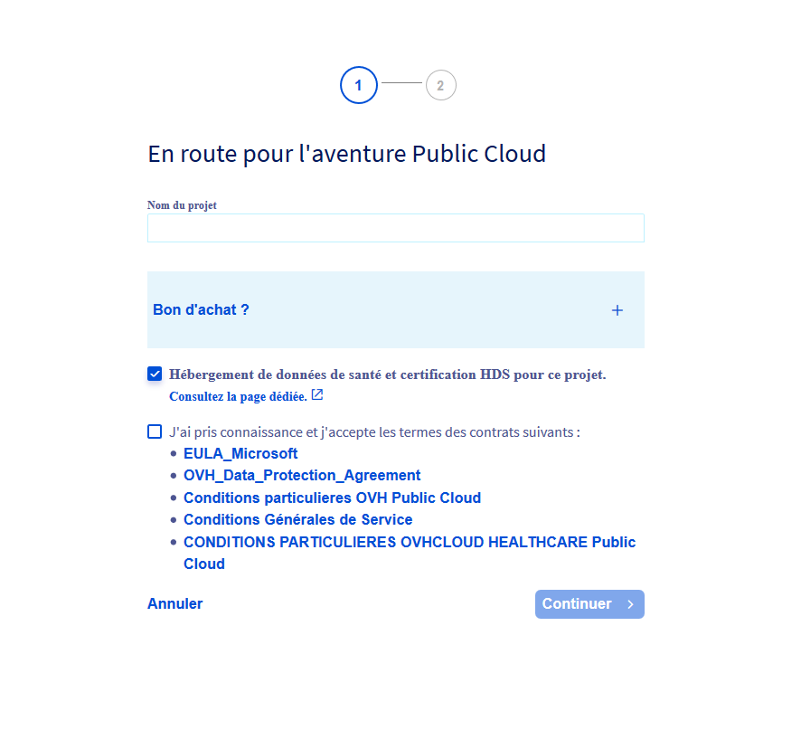

> [!primary]
> Diese Übersetzung wurde durch unseren Partner SYSTRAN automatisch erstellt. In manchen Fällen können ungenaue Formulierungen verwendet worden sein, z.B. bei der Beschriftung von Schaltflächen oder technischen Details. Bitte ziehen Sie beim geringsten Zweifel die englische oder französische Fassung der Anleitung zu Rate. Möchten Sie mithelfen, diese Übersetzung zu verbessern? Dann nutzen Sie dazu bitte den Button «Mitmachen» auf dieser Seite.
>

**Stand 22.03.2021**

## Ziel

Damit Ihre Infrastrukturen und Public-Cloud-Plattformen [mit dem Hosting von Gesundheitsdaten](https://www.ovhcloud.com/de/enterprise/certification-conformity/hds/) in Frankreich kompatibel sind, müssen diese als "Hosting von Gesundheitsdaten (HDS)" zertifiziert werden.

Die Public Cloud Dienste von OVHcloud sind für bestimmte Tätigkeiten, die im Zertifizierungsrahmen [der Digitalen Agentur](https://esante.gouv.fr/labels-certifications/hds/certification-des-hebergeurs-de-donnees-de-sante){.external} für Gesundheit aufgeführt sind, als HDS zertifiziert.

|Public Cloud Dienstleistungen|HDS-zertifizierte Tätigkeiten|
|---|---|
|Compute, Storage (Block, Object, Archive, Snapshot, Instance Backup)|1,2,3,4,6|
|Managed Kubernetes Service, Cloud Database, Data Processing (Spark), AI Training, ML Serving|1,2,3,4,5,6|

> [!primary]
>
> Die Managed Private Registry und Big Data Cluster (Hadoop) fallen bis dato nicht unter den HDS-Zertifizierungsbereich.
>

**Hier erfahren Sie, wie Sie die Option für das Hosting von Gesundheitsdaten für Ihr Public Cloud Projekt aktivieren.**

## Voraussetzungen

- Sie sind in Ihrem [OVHcloud Kundencenter](https://www.ovh.com/auth/?action=gotomanager&from=https://www.ovh.de/&ovhSubsidiary=de){.external} angemeldet.
- Sie haben den [Business oder Enterprise Support](https://www.ovhcloud.com/de/support-levels/) für Ihren OVHcloud Account abonniert.

## In der praktischen Anwendung

### HDS-Option aktivieren, wenn ein neues Public Cloud Projekt erstellt wird

Erstellen Sie [in Ihrem OVHcloud Kundencenter](https://www.ovh.com/auth/?action=gotomanager&from=https://www.ovh.de/&ovhSubsidiary=de) ein neues Public Cloud Projekt.

Wenn Sie den Business oder Enterprise Support-Level abonniert haben, können Sie das Kästchen `Hosting von Gesundheitsdaten und HDS-Zertifizierung für dieses Projekt ankreuzen`.

Sie haben dann Zugriff auf die besonderen Bedingungen für das Hosting von Gesundheitsdaten. Nehmen Sie diese zur Kenntnis und setzen Sie ein Häkchen. Klicken Sie auf `Weiter`{.action}, um die Erstellung Ihres Projekts abzuschließen. Die Dienste dieses Projekts werden gemäß den Vertragsbedingungen als HDS zertifiziert.

{.thumbnail}

### Die HDS Option für ein existierendes Public Cloud Projekt aktivieren

Wählen Sie [in Ihrem OVHcloud Kundencenter](https://www.ovh.com/auth/?action=gotomanager&from=https://www.ovh.de/&ovhSubsidiary=de) das Public Cloud-Projekt aus, für das die Dienste HDS-zertifiziert werden sollen.

Klicken Sie auf `Settings`{.action}. Wenn Sie den Business oder Enterprise Support-Level abonniert haben, können Sie das Kästchen `Hosting von Gesundheitsdaten und HDS-Zertifizierung für dieses Projekt ankreuzen`.

Sie haben dann Zugriff auf die besonderen Bedingungen für das Hosting von Gesundheitsdaten.

Nehmen Sie diese zur Kenntnis und setzen Sie ein Häkchen bei der Annahme der Verträge. Klicken Sie dann `auf Update`{.action}, um die Berücksichtigung der HDS-Zertifizierung für Ihr Projekt gemäß den Vertragsbedingungen abzuschließen.

{.thumbnail}

## Weiterführende Informationen

[Public Cloud Dokumentation](./)

Für den Austausch mit unserer User Community gehen Sie auf <https://community.ovh.com/en/>.
