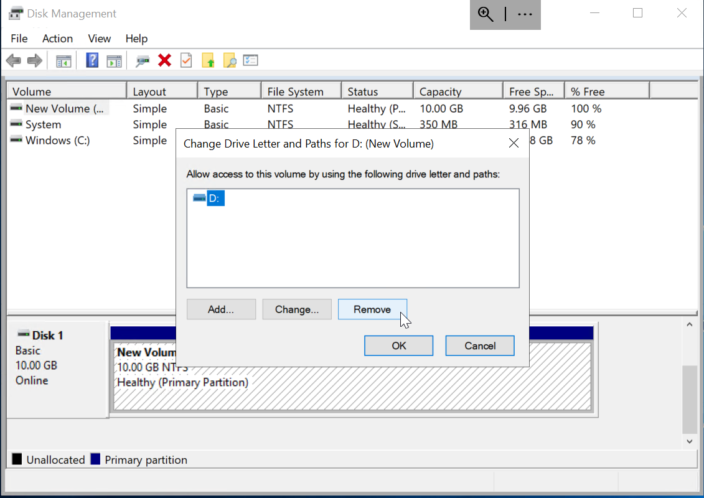
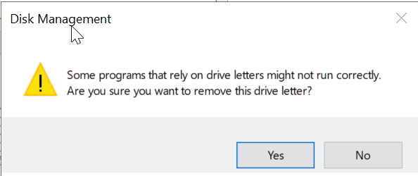

> [!primary]
> Esta traducción ha sido generada de forma automática por nuestro partner SYSTRAN. En algunos casos puede contener términos imprecisos, como en las etiquetas de los botones o los detalles técnicos. En caso de duda, le recomendamos que consulte la versión inglesa o francesa de la guía. Si quiere ayudarnos a mejorar esta traducción, por favor, utilice el botón «Contribuir» de esta página.
> 

**Última actualización: 03/03/2023**

## Objetivo

Puede crear discos adicionales para sus instancias de Public Cloud.
Esto puede ser útil en los siguientes casos:

- Si quiere aumentar su capacidad de almacenamiento sin tener que cambiar el modelo de instancia.
- Si quiere disponer de un espacio de almacenamiento de alta disponibilidad y buen rendimiento.
- Si desea transferir su almacenamiento y sus datos a otra instancia.

**Esta guía explica cómo crear un disco adicional y configurarlo en una instancia.**

## Requisitos

- Tienes acceso a tu [Panel de configuración de OVHcloud](https://www.ovh.com/auth/?action=gotomanager&from=https://www.ovh.es/&ovhSubsidiary=es).
- Disponer de una instancia de [Public Cloud](https://www.ovhcloud.com/es-es/public-cloud/){.external} en su cuenta de OVHcloud.
- Tener acceso de administrador (root) a su instancia a través de SSH.

> [!warning]
> Esta funcionalidad no está actualmente disponible para instancias Metal.
>

## Procedimiento

### Asociar un nuevo volumen

Conéctese al [Panel de configuración de OVHcloud](https://www.ovh.com/auth/?action=gotomanager&from=https://www.ovh.es/&ovhSubsidiary=es), acceda a la sección `Public Cloud`{.action} y seleccione el proyecto de Public Cloud correspondiente. A continuación, abra `Block Storage`{.action} en el menú de la izquierda.

En esta sección, haga clic en el botón `Crear un volumen`{.action}.

{.thumbnail}

Siga los pasos de configuración para seleccionar las opciones de ubicación, tipo de disco y capacidad de disco. Introduzca un nombre para el volumen y haga clic en `Crear el volumen`{.action}.

{.thumbnail}

El nuevo disco se mostrará en el área de cliente.

{.thumbnail}

A la derecha del volumen, haga clic en el botón `...`{.action} y seleccione `Asociar a la instancia`{.action}.

{.thumbnail}

En la nueva ventana, seleccione una instancia de la lista y haga clic en `Confirmar`{.action} para asociar el disco.

{.thumbnail}

A continuación comenzará el proceso de vinculación del disco a su instancia. La operación puede tardar unos minutos.

> [!warning]
> No abandone la página actual del área de cliente de OVHcloud cuando se esté conectando el disco. Esto podría interrumpir el proceso.
>

### Configuración del nuevo disco

Los siguientes ejemplos implican que está conectado como usuario con los permisos suficientes.

#### En Linux

Abra una [conexión SSH a su instancia](https://docs.ovh.com/es/public-cloud/public-cloud-primeros-pasos/#connect-to-instance) y utilice el siguiente comando para mostrar los discos asociados.

```bash
~$ admin@server-1:~$ lsblk

NAME MAJ:MIN RM SIZE RO TYPE MOUNTPOINT
vda 254:0 0 10G 0 disk
└─vda1 254:1 0 10G 0 part /
vdb 254:16 0 10G 0 disk
```

> [!primary]
>
> En este ejemplo, `vda` hace referencia al disco por defecto de la instancia. El disco adicional se llamará `vdb`.
>

Cree una partición en el disco adicional con los siguientes comandos.

```bash
~$ admin@server-1:~$ sudo fdisk /dev/vdb

Welcome to fdisk (util-linux 2.25.2).
Changes will remain in memory only, until you decide to write them.
Be careful before using the write command.

Device does not contain a recognized partition table.
Created a new DOS disklabel with disk identifier 0x95c4adcc.
```

```bash
Command (m for help): n

Partition type
p primary (0 primary, 0 extended, 4 free)
e extended (container for logical partitions)
Select (default p):
Using default response p.
Partition number (1-4, default 1):
First sector (2048-20971519, default 2048):
Last sector, +sectors or +size{K,M,G,T,P} (2048-20971519, default 20971519):

Created a new partition 1 of type 'Linux' and of size 10 GiB.
```

```bash
Command (m for help): w

The partition table has been altered.
Calling ioctl() to re-read partition table.
Syncing disks.
```

A continuación, forme la nueva partición `vdb1` con el siguiente comando:

```bash
~$ admin@server-1:~$ sudo mkfs.ext4 /dev/vdb1
mke2fs 1.42.12 (29-Aug-2014)
Creating filesystem with 2621184 4k blocks and 655360 inodes
Filesystem UUID: 781be788-c4be-462b-b946-88429a43c0cf
Superblock backups stored on blocks:
32768, 98304, 163840, 229376, 294912, 819200, 884736, 1605632

Allocating group tables: done
Writing inode tables: done
Creating journal (32768 blocks): done
Writing superblocks and filesystem accounting information: done
```

monte la partición con los siguientes comandos:

```bash
admin@server-1:~$ sudo mkdir /mnt/disk
admin@server-1:~$ sudo mount /dev/vdb1 /mnt/disk/
```

Por último, compruebe el punto de montaje utilizando el siguiente comando:

```bash
~$ admin@server-1:~$ df -h

Filesystem Size Used Avail Use% Mounted on
/dev/vda1 9.8G 840M 8.6G 9% /
udev 10M 0 10M 0% /dev
tmpfs 393M 5.2M 388M 2% /run
tmpfs 982M 0 982M 0% /dev/shm
tmpfs 5.0M 0 5.0M 0% /run/lock
tmpfs 982M 0 982M 0% /sys/fs/cgroup
/dev/vdb1 9.8G 23M 9.2G 1% /mnt/disk
```

> [!primary]
>
> El montaje no es persistente, ya que el disco se desvinculará al reiniciar la instancia. Para automatizar el montaje, es necesario editar el archivo `fstab`.
>

En primer lugar, consulte el UUID (block ID) del nuevo volumen:

```bash
~$ admin@server-1:~$ sudo blkid

/dev/vda1: UUID="51ba13e7-398b-45f3-b5f3-fdfbe556f62c" TYPE="ext4" PARTUUID="000132ff-01"
/dev/vdb1: UUID="2e4a9012-bf0e-41ef-bf9a-fbf350803ac5" TYPE="ext4" PARTUUID="95c4adcc-01"
```

Abra `/etc/fstab` con un editor de texto:

```
~$ sudo nano /etc/fstab
```

Añada la siguiente línea al archivo y sustituya el UUID por el suyo:

```console
UUID=2e4a9012-bf0e-41ef-bf9a-fbf350803ac5 /mnt/disk ext4 nofail 0 0
```

Guarde y salga del editor. El disco debe montarse automáticamente cada vez que se reinicie.

#### En Windows

Establezca una conexión RDP (Remote Desktop) con su instancia Windows.

Una vez que se haya conectado, haga clic derecho en el botón `Iniciar`{.action} y abra `Gestión de discos`{.action}.

{.thumbnail}

El nuevo disco se mostrará como volumen desconocido con espacio no asignado.

{.thumbnail}

Si el disco está marcado como desconectado, deberá inicializarlo primero. Para ello, puede utilizar la [interfaz de usuario Windows](#initDiskManagement) o la [utilidad DISKPART](#initDiskpart). De lo contrario, realice el [formateo del disco en Gestión de discos](#formatDiskManagement).

##### **Iniciar el disco en Gestión de discos** <a name="initDiskManagement"></a>

Haga clic derecho en el disco y seleccione `En línea`{.action}. 

Si el disco está indicado aquí como desconectado, probablemente se deba a una política en la instancia. Para solucionar el problema, haga clic derecho en el disco y seleccione `On-line`{.action}.

{.thumbnail}

Haga clic derecho de nuevo y seleccione `Inicializar disco`{.action}.

{.thumbnail}

A continuación, seleccione `MBR`{.action} y haga clic en `Aceptar`{.action}.

{.thumbnail}

##### **Iniciar el disco con DISKPART** <a name="initDiskpart"></a>

Haga clic derecho en el botón `Iniciar`{.action} y abra `Ejecutar`{.action}.

{.thumbnail}

Pulse `cmd` y haga clic en `Aceptar`{.action} para abrir la aplicación de línea de órdenes.

{.thumbnail}

En el pedido, abra DISKPART:

```
C:\> diskpart
```

Utilice la siguiente serie de comandos DISKPART para poner el disco `en línea`:

```
DISKPART> san

SAN Policy : Offline Shared
```

```
DISKPART> san policy = OnlineAll

DiskPart successfully changed the SAN policy for the current operating system .

- Implementation of the strategy on the extra disk:
[Code] DISKPART> list disk

Disk ### Status Size Free Dyn Gpt
-------- ------------- ------- ------- --- ---
Disk 0 Online 200 GB 0 B
* Disk 1 Offline 10 GB 1024 KB
```

``` 
DISKPART> select disk 1

Disk 1 is now the selected disk.
```

```
DISKPART> attributes disk clear readonly

Disk attributes cleared successfully.
```

```
DISKPART> attributes disk

Current Read-only State : No
Read-only : No
Boot Disk : No
Pagefile Disk : No
Hibernation File Disk : No
Crashdump Disk : No
Clustered Disk : No
```

```
DISKPART> online disk

DiskPart successfully onlined the selected disk.
```

##### **Formateado del disco** <a name="formatDiskManagement"></a>

En la herramienta de `gestión de discos`{.action}, haga clic derecho en el nuevo disco y seleccione `Nuevo volumen simple...`{.action}.

{.thumbnail}

En el asistente, haga clic en `Siguiente`{.action} para especificar el tamaño del volumen. Por defecto, debe estar al máximo. Haga clic en `Siguiente`{.action} para continuar.

{.thumbnail}

Deje la nueva letra predeterminada o seleccione otra y haga clic en `Siguiente`{.action}.

{.thumbnail}

Asigne un nombre al volumen (opcional) y confirme las opciones de formato haciendo clic en `Siguiente`{.action}.

{.thumbnail}

En la última ventana, haga clic en `Finalizar`{.action} para dar formato al disco.

{.thumbnail}

El disco estará disponible como lector en el explorador de archivos.


### Desvincular un volumen

Si desea desvincular un volumen de su instancia, la mejor práctica es desmontar el volumen del sistema operativo antes de desvincularlo de la instancia.

> [!warning]
>
> Se puede mostrar un mensaje de error si se están ejecutando programas o procesos en el disco adicional. En ese caso, se recomienda detener todos los procesos antes de continuar.
>

#### En Linux

Abra una [conexión SSH a su instancia](https://docs.ovh.com/es/public-cloud/public-cloud-primeros-pasos/#3-crear-una-instancia) y utilice el siguiente comando para mostrar los discos asociados.

```bash
~$ admin@server-1:~$ lsblk

NAME   MAJ:MIN RM  SIZE RO TYPE MOUNTPOINT
vda 254:0 0 10G 0 disk
└vda1 254:1 0 10G 0 part /
vdb 8:0 0 10G 0 disk
└ vb1:1 0 10G 0 part /mnt/disk
```

Desmonte la partición utilizando el siguiente comando:

```bash
~$ admin@server-1:~$ sudo umount /dev/vdb1
```

Elimine el ID del dispositivo fstab para finalizar el proceso de desmontaje. Si no se realiza, la partición se recuperará después de un reinicio.

```bash
~$ admin@server-1:~$ sudo nano /etc/fstab
```

Guarde y salga del editor.

Acceda a la sección `Public Cloud`{.action} de su área de cliente de OVHcloud y haga clic en `Block Storage`{.action} en el menú de la izquierda, en **Storage**.

Haga clic en el botón `...`{.action} junto al volumen correspondiente y seleccione `Desvincular de la instancia`{.action}.

{.thumbnail}

Haga clic en `Confirmar`{.action} en la nueva ventana para iniciar el proceso.

{.thumbnail}

#### En Windows

Establezca una conexión RDP (Remote Desktop) con su instancia Windows.

Una vez que se haya conectado, haga clic derecho en el menú `Iniciar`{.action} y abra `Administración de discos`{.action}.

{.thumbnail}

Haga clic derecho en el volumen que desee desmontar y seleccione `Cambiar la letra y rutas de acceso de unidad...`{.action}.

{.thumbnail}

Haga clic en `Quitar`{.action} para eliminar el disco.

{.thumbnail}

Haga clic en `Sí`{.action} para confirmar la eliminación de la letra de la unidad de disco.

{.thumbnail}

Una vez que haya terminado, puede cerrar la ventana de gestión del disco.

Acceda a la sección `Public Cloud`{.action} de su área de cliente de OVHcloud y haga clic en `Block Storage`{.action} en el menú de la izquierda, en **Storage**.

Haga clic en el botón `...`{.action} junto al volumen correspondiente y seleccione `Desvincular de la instancia`{.action}.

{.thumbnail}

Haga clic en `Confirmar`{.action} en la nueva ventana para iniciar el proceso.

{.thumbnail}

## Más información

Interactúe con nuestra comunidad de usuarios en <https://community.ovh.com/en/>.