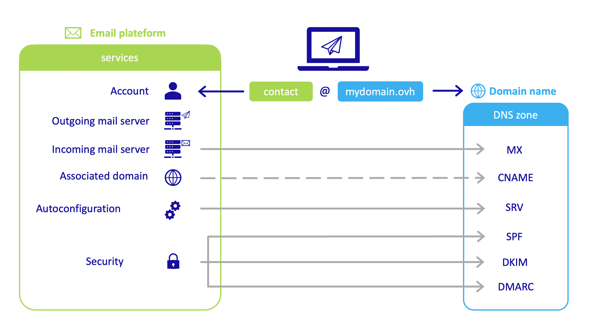
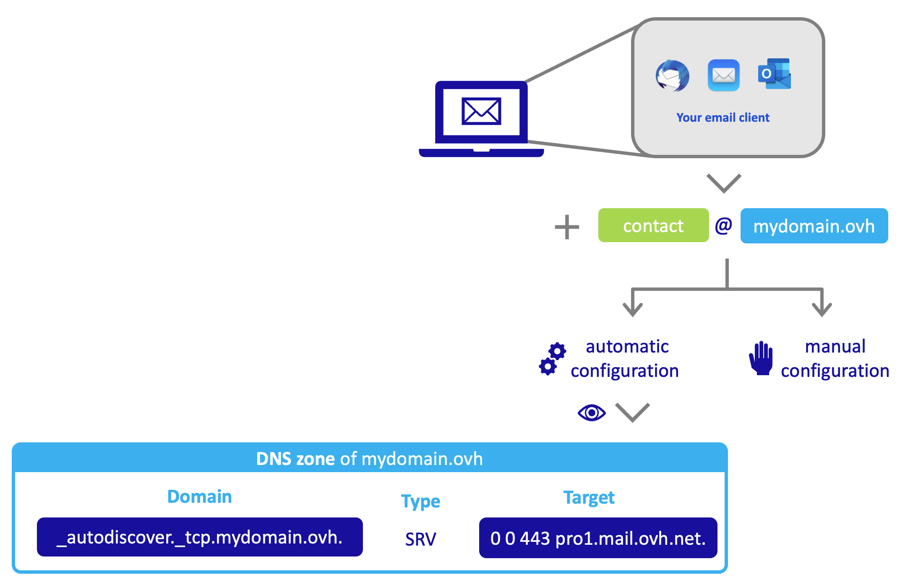
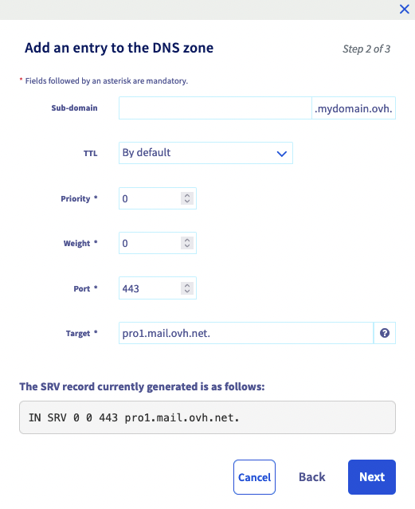
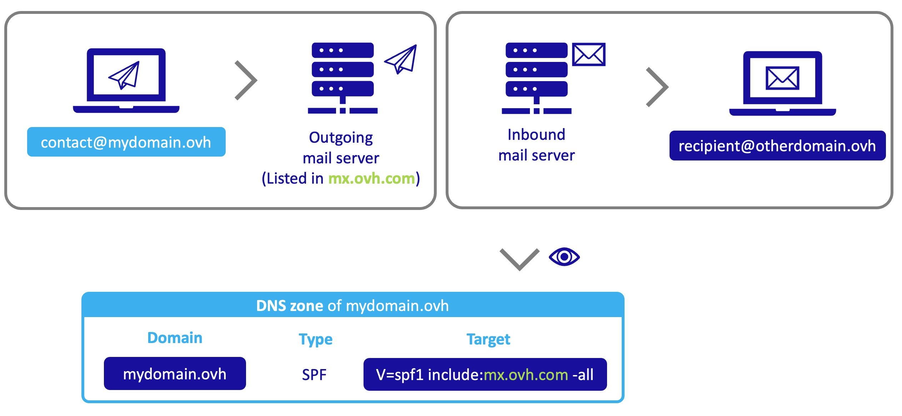
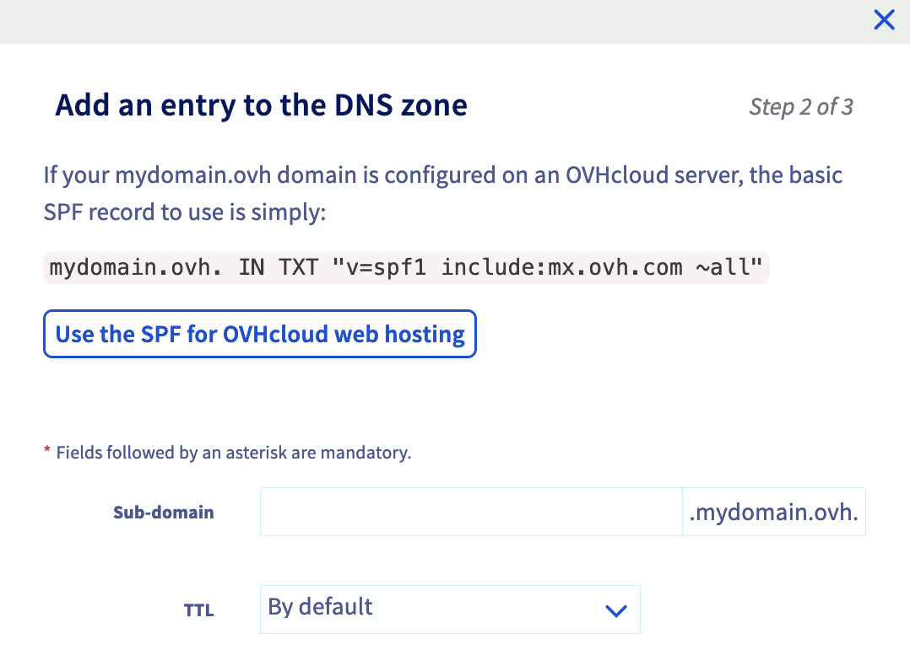
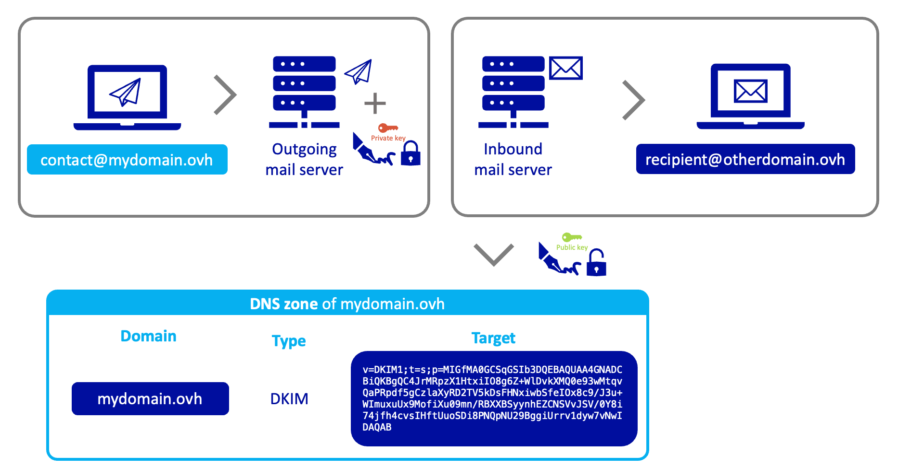

**Dernière mise à jour le 29/03/2023**

## Objectif

Lorsque vous commandez un service e-mail, vous devez l'associer à l'un de vos noms de domaine. Pour que votre service e-mail fonctionne avec votre nom de domaine, une configuration DNS est nécessaire. Plus particulièrement, la [zone DNS](https://docs.ovh.com/fr/domains/editer-ma-zone-dns/) de votre nom de domaine.

Il existe plusieurs types d'enregistrement DNS associés à la configuration d'un service e-mail OVHcloud. Dans ce guide, nous allons aborder chacuns de ces enregistrements et leur utilité.

**Découvrez comment configurer votre zone DNS pour votre servie e-mail.**

## Prérequis

- Disposer d'un accès à la gestion du nom de domaine concerné.
- Être connecté à votre [espace client OVHcloud](https://www.ovh.com/auth/?action=gotomanager&from=https://www.ovh.com/fr/&ovhSubsidiary=fr){.external}.
- Disposer d'une solution e-mail OVHcloud préalablement configurée (**MX Plan**, proposée parmi nos [offres d’hébergement web](https://www.ovhcloud.com/fr/web-hosting/), incluse dans un [hébergement Start10M gratuit](https://www.ovhcloud.com/fr/domains/free-web-hosting/) ou commandée séparément comme solution autonome, telle que [**Hosted Exchange**](https://www.ovhcloud.com/fr/emails/hosted-exchange/) ou [**Email Pro**](https://www.ovhcloud.com/fr/emails/email-pro/).

## En pratique

> [!primary]
>
> Ce guide énumère les différents éléments de configuration dans la zone DNS de votre nom de domaine, les enregistrements que nous allons évoquer sont pour la plupart configurés par défaut dans votre zone DNS ou automatiquement lorsque vous commandez votre plateforme e-mail chez OVHcloud. Le but ici est de comprendre le rôle de chacun de ces enregistrements DNS et de pouvoir les configurer de manière autonome lorsque votre nom de domaine est géré dans un autre espace client ou gérer chez un autre prestataire.

Votre plateforme e-mail est composée de différents « services » pour former un ensemble fonctionnel :

- **le compte** (Account) : il se matérialise par le nom qui précède le « @ ». Il désigne un utilisateur.
- **le nom de domaine associé** (Associated domain) : il se matérialise par le nom qui suit le « @ ». Il désigne un groupe d'utilisateurs et permet la diffusion vers internet.
- **le serveur e-mail sortant** (Outgoing mail server) : il permet d'émettre les e-mails vers une autre adresse e-mail.
- **le serveur e-mail entrant** (Incoming mail server) : il permet la réception et le traitement des e-mails à livrer aux comptes de la plateforme.
- **configuration automatique** (Autoconfiguration) : ces paramètres permettent de configurer automatiquement votre adresse e-mail sur vote logiciel de messagerie.
- **Sécurité** (Security) : éléments permettant de sécuriser les échanges entre l'émetteur et le récepteur pour éviter l'usurpation et la diffusion de courrier indésirable.

Certains de ces services dépendent des serveurs DNS du nom de domaine associé à votre plateforme e-mail et nécessitent une configuration de la zone DNS:

- [**MX**](#mx) : enregistrement DNS relatif à la réception des e-mails.
- [**CNAME**](#cname) : enregistrement DNS temporaire permettant d'authentifier le nom de domaine sur la plateforme e-mail
- [**SRV**](#srv) : enregistrement DNS permettant la configuration automatique d'une adresse e-mail sur un logiciel de messagerie.
- [**SPF**](#spf) : enregistrement DNS relatif à l'authentification du nom de domaine.
- [**DKIM**](#dkim) : enregistrement DNS relatif à l'authentification du contenu d'un e-mail.
- [**DMARC**](#dmarc) : enregistrement DNS d'authentification des e-mails envoyés utilisant les méthodes SPF et DKIM.

{.thumbnail}

### Enregistrement MX 

Les enregistrement MX (**M**ail e**X**change) permettent de relier votre nom de domaine à votre serveur e-mail. Nous allons nous appuyer sur le schéma ci-dessous.

Lorsque l'adresse **sender@otherdomain.ovh** envoie un e-mail vers **contact@mydomain.ovh**, le serveur qui envoie l'e-mail (Outgoing mail server) va intérroger la zone DNS du nom de domaine **mydomain.ovh** et récupérer les enregistrements **MX** pour délivrer l'e-mail.

{.thumbnail}

L'e-mail sera envoyer vers l'URL **mx0.mail.ovh.net** qui est précédée de la valeur **0**. Cette valeur est appellé priorité, la plus faible est intérrogé en premier et la plus élevée en dernier. Cela signifie que la présence de plusieurs enregistrements permet de pallier une absence de réponse de l'enregistrement MX ayant la plus faible priorité.

Voici à quoi ressemble l'ajout de cet enregistrement MX dans la zone DNS:

{.thumbnail .w-640}

> Pour configurer vos enregistrements MX dans votre zone DNS, consultez notre guide [Ajouter un champ MX à la configuration de son nom de domaine](https://docs.ovh.com/fr/domains/mail-mutualise-guide-de-configuration-mx-avec-zone-dns-ovh/)

### Enregistrement CNAME 

L'enregistrement CNAME est utilisé en temps qu'alias, il pointe vers une URL qui pointe elle-même vers une adresse IP. Ça n'est donc pas un enregistrement lié à un service e-mail par nature.

Dans le cadre de nos offres [**Hosted Exchange**](https://www.ovhcloud.com/fr/emails/hosted-exchange/) et [**Email Pro**](https://www.ovhcloud.com/fr/emails/email-pro/), cet enregistrement CNAME est utilisé pour définir un code de validation qui sera visible dans la zone DNS du nom de domaine à valider. Le but est de vérifier que l'utilisateur de la plateforme e-mail a bien la main sur le nom de domaine qu'il ajoute. 

> [!primary]
>
> Si le nom de domaine ajouté est géré dans le même espace client que la plateforme e-mail, il n'y a pas d'enregistrement CNAME à configurer.

Comme décrit dans le schéma ci-dessous, lorsque l'on ajoute le nom de domaine **mydomain.ovh** à sa plateforme e-mail. Un code de validation est généré par la plateforme, « ***abcd1-check*** » dans notre exemple. Ce code doit être ajouté sous la forme d'un enregistrement CNAME dans la zone DNS du nom de domaine.

{.thumbnail}

Le code doit être ajouté en tant que sous-domaine lors de l'ajout de l'enregistrement CNAME dans la zone DNS. La saisie de l'enregistrement se présente de la même manière que ci-dessous.

{.thumbnail .w-640}

> Pour configurer l'ajout d'un nom de domaine qui n'est pas géré sur le même espace client OVHcloud que votre plateforme e-mail ou un nom de domaine hors OVHcloud, consultez notre guide [Créer un champ CNAME à l’ajout d’un domaine associé](https://docs.ovh.com/fr/microsoft-collaborative-solutions/exchange-ajouter-un-champ-de-type-cname/)

### Enregistrement SRV « autodiscover » 

Le rôle de l'enregistrement SRV est d'orienter la requête vers un service en lui indiquant le protocole et le port à utiliser.

Dans le cadre de nos offres [**Hosted Exchange**](https://www.ovhcloud.com/fr/emails/hosted-exchange/) et [**Email Pro**](https://www.ovhcloud.com/fr/emails/email-pro/), c'est le service de découverte « **autodiscover** » qui est utilisé en passant par le protocole **TCP** via le **port 443** (port SLL sécurisé).

Exemple, vous configurez pour la première fois votre adresse [**Email Pro**](https://www.ovhcloud.com/fr/emails/email-pro/) **contact@mydomain.ovh** sur votre logiciel de messagerie (Firefox, Mail de macOS, Outlook, etc.), le logiciel vous propose de la configurer automatiquement ou manuellement. En choisissant la configuration automatique (automatic configuration), le logiciel va intérroger l'enregistrement SRV utilisant le service « autodiscover » qui lui transmettra l'URL du serveur e-mail **pro1.mail.ovh.net**.

{.thumbnail}

L'enregistrement SRV dispose de valeurs de priorité et de poids, ces deux valeurs définissent l'ordre de traitement des enregistrements SRV. Elles resteront à **0** afin d'être lu en premier, quelque soit la présence d'un autre enregistrement SRV. le port **443** qui est ici utilisé, correspond au port SSL sécurisé. Et enfin l'URL du serveur e-mail **pro1.mail.ovh.net**.

> [!warning]
>
> Il ne faut pas confondre l'URL des serveurs e-mail que l'on ajoute dans un enregistrement SRV et les serveurs e-mail des enregistrements MX qui n'ont pas les mêmes rôles.

{.thumbnail .w-640}

### Enregistrement SPF 

L'enregistrement SPF (**S**ender **P**olicy **F**ramework) a pour but de lister les serveurs e-mail de confiance qui envoient des e-mails sous le nom de domaine concerné. Si on se base sur le schéma ci-dessous, lorsque vous envoyez un e-mail depuis l'adresse **contact@mydomain.ovh**, le serveur de réception (**Inbound mail serveur**) du destinataire va intérroger le nom de domaine **mydomain.ovh** et vérifier que le serveur sortant (**Outgoing mail server**) qui a envoyé l'e-mail, soit bien listé dans l'enregistrement SPF de **mydomain.ovh**.

{.thumbnail}

Lors de la configuration de votre enregistrement SPF, il est important de lister l'ensemble des services légitimes qui seront amenés à envoyer des e-mails sous le nom de domaine concerné. Par exemple, si vous n'utilisez que les offres e-mail OVHcloud, l'URL **« mx.ovh.com »** liste l'ensemble des serveurs d'envoi avec l'argument `include`:

{.thumbnail .w-640}

> Pour configurer l'ajout de domaine sur votre plateforme e-mail, consultez notre guide [Configurer un enregistrement SPF sur son nom de domaine](https://docs.ovh.com/fr/domains/le-champ-spf/)

### Enregistrement DKIM 

L'enregistrement DKIM (**D**omain**K**eys **I**dentified **M**ail) permet de signer les e-mails pour éviter l'usurpation de celles-ci. Cette signature fonctionne sur le principe de clé privée / clé publique.

Lorsque vous envoyez un e-mail depuis **contact@mydomain.ovh**, une signature cryptée à l'aide d'une clé privée (private key) est ajoutée dans l'entête de l'e-mail. Le destinataire **recipient@otherdomain.ovh** pourra décrypter cette signature avec la clé publique (Public key) visible dans la zone DNS de **mydomain.ovh**. La signature est créée à partir du contenu de l'e-mail envoyé, cela signifie que si l'e-mail est modifié lors du transit, la signature ne correspondra pas avec le contenu ce qui provoquera l'échec de la vérification DKIM sur le serveur destinataire.

{.thumbnail}

### Enregistrement DMARC 

L'enregistrement DMARC (**D**omain-based **M**essage **A**uthentication, **R**eporting and **C**onformance) est une norme de sécurité qui s'appuie sur les 2 méthodes de sécurité e-mail **SPF** et **DKIM**. Les arguments inscrits dans l'enregistrement DMARC orientent le destinataire sur la manière de traiter les e-mails selon le résultat SPF et/ou DKIM. Une adresse e-mail peut être définie dans l'enregistrement DMARC, celle-ci recevra un rapport sur les échecs d'authentification.

Exemple, lorsque vous envoyez un e-mail depuis **contact@mydomain.ovh** vers l'adresse **recipient@otherdomain.ovh**, le serveur de réception qui prend en charge DMARC récupère les instructions dans l'enregistrement DMARC de la zone de DNS de **mydomain.ovh**, en fonction des résultats SPF et/ou DKIM. Ainsi le destinataire pourra isoler les e-mails indésirables selon la directive DMARC. Un rapport d'échec est envoyé sur l'adresse **report@mydomain.ovh** pour que l'expéditeur puisse identifier les échanges qui ont échoués au test SPF et/ou DKIM

{.thumbnail}

## Aller plus loin

Si vous souhaitez bénéficier d'une assistance à l'usage et à la configuration de vos solutions OVHcloud, nous vous proposons de consulter nos différentes [offres de support](https://www.ovhcloud.com/fr/support-levels/).

Échangez avec notre communauté d'utilisateurs sur <https://community.ovh.com/>.