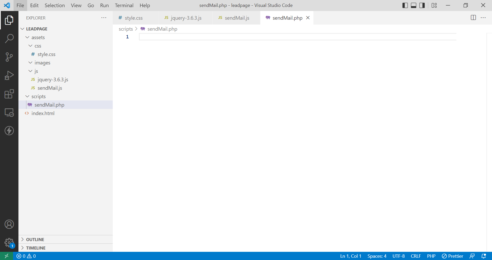

**Dernière mise à jour le 25/01/2023**

> [!warning]
>
> OVHcloud met à votre disposition des services dont la configuration, la gestion et la responsabilité vous incombent. Il vous revient de ce fait d'en assurer le bon fonctionnement.
> 
> Si vous éprouvez des difficultés à suivre les étapes de ce tutoriel, nous vous recommandons de faire appel à un [prestataire spécialisé](https://partner.ovhcloud.com/fr/) . En effet, nous ne serons pas en mesure de vous fournir une assistance. Plus d'informations dans la section [« Aller plus loin »](#go-further) de ce guide.
>

## Objectif

Connectez-vous avec votre public, collectez des prospects qualifiés et vendez vos services avec une simple page web.
Créez votre présence en ligne et développez votre mailing liste d'abonnés grâce ...

Créez votre présence en ligne et développez votre mailing liste d'abonnés, Connectez-vous avec votre public, collectez des prospects qualifiés avec une simple page web.


## Prérequis

- Disposer d'un [nom de domaine](https://www.ovhcloud.com/fr/domains/)
- Avoir souscrit à une offre d'[hébergement web OVHcloud](https://www.ovh.com/fr/hebergement-web/)
- Être en capacité d'utiliser un éditeur de texte sur votre ordinateur ou un IDE
- Avoir installé un client FTP comme [FileZilla](https://filezilla-project.org/download.php).
- Avoir quelques notions de programmation web (HTML, CSS, JavaScript et PHP)

Consultez le tutoriel [« Créer sa page web personnelle chez OVHcloud »](https://docs.ovh.com/fr/hosting/create-your-own-web-page/) pour vous familiariser avec les concepts de programmation utilisés.

## En pratique

Sur une unique page web unique seront disposés des éléments d'illustration et de texte, chacun renvoyant vers un formulaire sur le bas de page.

Ce formulaire qui permettra la récupération des données saisies et l'envoi vers l'adresse mail de votre choix via un script en PHP.

### Mise en place des fichiers

Les fichiers seront organisés de la façon suivante :

- un fichier `index.html` à la racine du site
- un répertoire `assets` qui inclura des répertoires `css` (feuilles de style), `images` (images de fond, illustrations) et `js` (librairie jQuery et script d'envoi du formulaire en AJAX)
- un répertoire `scripts` qui contiendra le code PHP qui enverra le contenu du formulaire sur l'adresse mail de votre choix.

{.thumbnail}

### Le fichier index.html

Le fichier `index.html` doit être positionné à la racine. C'est ce fichier qui sera interprété par le serveur lors des visites sur votre site.

```html
<!DOCTYPE html>
<html lang="en">
<head>
    <meta charset="UTF-8">
    <meta http-equiv="X-UA-Compatible" content="IE=edge">
    <meta name="viewport" content="width=device-width, initial-scale=1.0">
    <title>My web site</title>
</head>
<body>
    
</body>
</html>
```

### La feuille de style

Créez un fichier `style.css` qui sera placé dans le répertoire `assets/css` :

{.thumbnail}

### Les fichiers JavaScript

Le projet intégrera deux fichiers JavaScript : la librairie jQuery et le script d'envoi des données du formulaire vers le serveur.

Sur le site de [jQuery](https://jquery.com/), allez sur la page [Download jQuery](https://jquery.com/download/) et récupérez la dernière version de la librairie (clic-droit, enregistrer sous). Placez ce fichier dans le répertoire `assets/js` :

{.thumbnail}

Créez un fichier vide `sendMail.js` que vous placerez dans le même répertoire :

{.thumbnail}

### Le fichier PHP

L'envoi de mail se fait par un script PHP. Dans le répertoire `scripts`, créez un fichier `sendMail.php` :

{.thumbnail}

### Lier la feuille de style et les scripts JavaScript à la page HTML

Ajouter dans la balise `<head>` les balises `<script>`et `<link>` indiquant au navigateur quels fichiers utiliser :

```html
<!DOCTYPE html>
<html lang="en">
<head>
    <meta charset="UTF-8">
    <meta http-equiv="X-UA-Compatible" content="IE=edge">
    <meta name="viewport" content="width=device-width, initial-scale=1.0">
    <title>My web site</title>
    <link rel="stylesheet" href="assets/css/style.css" />
    <script src="assets/js/jquery-3.6.3.js"></script>
    <script src="assets/js/sendMail.js"></script>
</head>
```

### Ajouter des titres, des contenus et des images

Ajoutez un titre, un sous-titre et du contenu alternant texte et illustrations :

```html
<body>
    <main>
        <section>
            <h1>A title</h1>
            <h2>A subtile</h2>
        </section>
        <section>
            <div class="container">
                <div>
                    <p>Some content here</p>
                    <p><button><a href="#sendMessageFrom">Use the form below</a></button></p>
                </div>
                
            </div>
            <div class="container">
                
                <div>
                    <p>Some content here</p>
                    <p><button><a href="#sendMessageFrom">Contact us</a></button></p>
                </div>
            </div>
            <div class="container">
                <div>
                    <p>Some content here</p>
                    <p><button><a href="#sendMessageFrom">Use the form below</a></button></p>
                </div>
                
            </div>
            <div class="container">
                
                <div>
                    <p>Some content here</p>
                    <p><button><a href="#sendMessageFrom">Contact us</a></button></p>
                </div>
            </div>
        </section>
    </main>
</body>
```

### Favicon

Ajoutez un fichier `favicon` à la racine du site :

{.thumbnail}

Et modifiez le contenu de `<head>` en ajoutant une balise `<link>` pour lier le fichier HTML au favicon :

```html
<head>
    <meta charset="UTF-8">
    <meta http-equiv="X-UA-Compatible" content="IE=edge">
    <meta name="viewport" content="width=device-width, initial-scale=1.0">
    <title>My web site</title>
    <link rel="icon" href="favicon.ico" />
    <link rel="stylesheet" href="assets/css/style.css" />
    <script src="assets/js/jquery-3.6.3.js"></script>
    <script src="assets/js/sendMail.js"></script>
</head>
```

Disposez vos images dans le répertoire `assets/images` :

{.thumbnail}

## Aller plus loin <a name="go-further"></a>

Pour des prestations spécialisées (référencement, développement, etc), contactez les [partenaires OVHcloud](https://partner.ovhcloud.com/fr/).

Si vous souhaitez bénéficier d'une assistance à l'usage et à la configuration de vos solutions OVHcloud, nous vous proposons de consulter nos différentes [offres de support](https://www.ovhcloud.com/fr/support-levels/).

Échangez avec notre communauté d'utilisateurs sur <https://community.ovh.com>.