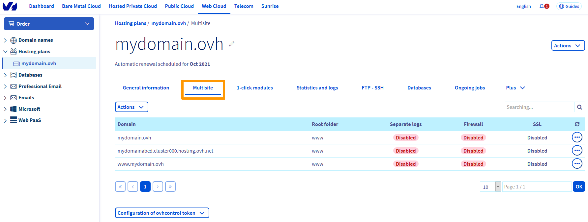
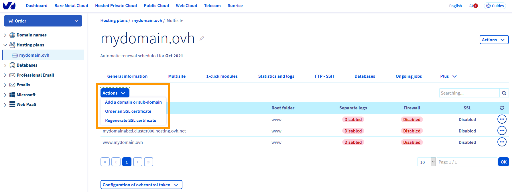

> [!primary]
> Questa traduzione è stata generata automaticamente dal nostro partner SYSTRAN. I contenuti potrebbero presentare imprecisioni, ad esempio la nomenclatura dei pulsanti o alcuni dettagli tecnici. In caso di dubbi consigliamo di fare riferimento alla versione inglese o francese della guida. Per aiutarci a migliorare questa traduzione, utilizza il pulsante "Modifica" di questa pagina.
>

**Ultimo aggiornamento: 22/08/2022**

## Obiettivo

Su una stessa soluzione di hosting è possibile ospitare più siti Internet, anche se i domini non sono registrati in OVHcloud.

**Questa guida ti mostra come configurare un multisito sul tuo hosting Web OVHcloud.**

## Prerequisiti

- Disporre di una soluzione [di hosting Web OVHcloud](https://www.ovhcloud.com/it/web-hosting/){.external} compatibile
- Disporre di uno o più [domini](https://www.ovhcloud.com/it/domains/){.external}
- Poter modificare la configurazione dei tuoi domini (la [zona DNS](../../domains/web_hosting_modifica_la_tua_zona_dns/#capire-il-concetto-di-dns))
- Avere accesso allo [Spazio Cliente OVHcloud](https://www.ovh.com/auth/?action=gotomanager&from=https://www.ovh.it/&ovhSubsidiary=it){.external}

## Procedura

### Step 1: accedi alla gestione del multisito

Accedi allo [Spazio Cliente OVHcloud](https://www.ovh.com/auth/?action=gotomanager&from=https://www.ovh.it/&ovhSubsidiary=it){.external} e seleziona `Web Cloud`{.action}. clicca su `Hosting`{.action}, seleziona il tuo servizio e clicca sulla scheda `Multisito`{.action}.

Visualizzi una tabella con tutti i domini e i sottodomini aggiunti alla tua soluzione di hosting Web. alcuni dei quali sono stati creati automaticamente durante l’installazione.

> [!primary]
>
> Se migri il tuo sito e desideri evitare interruzioni di servizio, segui lo [Step 3: mettere online](#site-online) il tuo sito Web
>

{.thumbnail}

### Step 2: aggiungi un dominio o un sottodominio

Per aggiungere un nuovo dominio o sottodominio al tuo hosting Web, clicca sul pulsante `Azioni`{.action} a sinistra e poi su `Aggiungi un dominio o un sottodominio`{.action}, seleziona la scheda che appare.

{.thumbnail}

- **Aggiungi un dominio registrato in OVHcloud**:

Nello Spazio Cliente OVHcloud vengono mostrati solo i domini per i quali sei [contatto tecnico o amministratore](../../customer/gestisci_i_tuoi_contatti/). Selezionane uno dalla lista e clicca su `Seguente`{.action}. Prosegui seguendo lo [Step 2.1: aggiungere un dominio registrato in OVHcloud](#add-ovhcloud-domain).

- **Aggiungi un dominio esterno**

Nel caso di un dominio esterno al tuo account cliente (altro identificativo cliente) o esterno a OVHcloud (provider di domini terzi), seleziona `Aggiungi un dominio esterno`{.action} e clicca su `Seguente`{.action}. e prosegui seguendo lo[Step 2.2: aggiungi un dominio esterno](#add-external-domain).

{.thumbnail}

#### Step 2.1: aggiungere un dominio registrato in OVHcloud 

> [!warning]
> Questo step è valido solo se hai selezionato l'opzione "Aggiungi un dominio registrato in OVHcloud". Il dominio o la sua zona DNS devono trovarsi **nello Spazio Cliente**. Per i domini esterni, passa allo [Step 2.2: aggiungere un dominio esterno](#add-external-domain){.external}.

A questo punto è necessario personalizzare l'aggiunta del dominio o sottodominio. In base al piano di [hosting Web](https://www.ovhcloud.com/it/web-hosting/){.external} attivato, alcune opzioni potrebbero non essere disponibili.

> [!primary]
> Per aggiungere un sottodominio, è necessario selezionare il dominio principale nella lista (ad esempio: midomain.ovh). Lo step successivo ti permetterà di indicare il sottodominio (esempio: **blog**.mydomain.ovh).

{.thumbnail}

|Campo|Descrizione|
|---|---|
|Dominio|Di default, il dominio selezionato viene inserito automaticamente.  È possibile aggiungere un sottodominio (ad esempio, **blog**.mydomain.ovh) e creare contemporaneamente il sottodominio "www" corrispondente (ad esempio, **www.blog**.mydomain.ovh). Questo dominio corrisponderà al nome del sito che vuoi pubblicare online.|
|Cartella di root|Definisci la cartella, sul tuo spazio di archiviazione, verso cui il dominio punta. È in questo spazio che i file del sito dovranno essere messi online. Ad esempio, per blog.mydomain.ovh, la cartella di root potrebbe essere "blog". Se la cartella non esiste, verrà creata automaticamente.|
|SSL|Permette di usufruire di una connessione sicura (https://) sul dominio selezionato.  Per maggiori informazioni, accedi alla pagina relativa ai [certificati SSL](https://www.ovhcloud.com/it/web-hosting/options/ssl/){.external}. Attivando contemporaneamente le opzioni SSL e CDN (Content Delivery Network), potrai usufruire anche del protocollo **HTTP2**.|
|Attiva la CDN|Permette di attivare la CDN sul dominio selezionato memorizzando in cache gli elementi statici di un sito, ad esempio le immagini. Per maggiori informazioni, accedi alla pagina relativa alla [CDN](https://www.ovhcloud.com/it/web-hosting/options/cdn/){.external}.  Attivando contemporaneamente le opzioni SSL e CDN (Content Delivery Network), potrai usufruire anche del protocollo **HTTP2**.|
|IP del Paese|Permette di usufruire di un indirizzo IP geolocalizzato (a scelta tra diversi Paesi) per il dominio selezionato. Per maggiori informazioni, accedi alla pagina relativa agli [IP](https://www.ovhcloud.com/it/web-hosting/options/){.external}. |
|Attiva il firewall|Permette di attivare un firewall (analisi del traffico) sul dominio selezionato.  Per maggiori informazioni, accedi alla pagina relativa a [Mod Security](https://www.ovhcloud.com/it/web-hosting/options/){.external}.|
|Log separati|Permette di attivare un nuovo spazio di log sul dominio selezionato. Dovrai scegliere, tra quelli disponibili nella lista, il dominio che determinerà il nome di accesso al nuovo spazio. Per maggiori informazioni, accedi alla [pagina relativa alle statistiche dettagliate](https://www.ovhcloud.com/it/web-hosting/uc-website-traffic-analysis/){.external}.|

> [!warning]
>
> Non è possibile attivare log separati per un dominio esterno. Questa opzione è disponibile solo per i domini registrati in OVHcloud.
>

Una volta inseriti tutti i dati, clicca su `Seguente`{.action} e verifica la correttezza delle informazioni inserite.

{.thumbnail}

Selezionando un dominio registrato in OVHcloud, hai la possibilità di modificarne automaticamente o manualmente la configurazione DNS:

- **Per una configurazione DNS automatica**, spunta la casella `Configurazione automatica (consigliata)`{.action}
- **Per una configurazione DNS manuale**, deseleziona la casella `Configurazione automatica (consigliata)`{.action} e recupera i parametri da modificare. Per eseguire questa operazione, consulta la guida [Modificare una zona DNS di OVHcloud](../../domains/web_hosting_modifica_la_tua_zona_dns/){.external}.

Clicca su `Conferma`{.action} per aggiungere il dominio. Questa operazione potrebbe richiedere circa un’ora per essere completata e la propagazione della nuova configurazione DNS da 1 a 24 ore per diventare effettiva.

Ora che il dominio è stato aggiunto, passa allo [Step 3: mettere online](#site-online) il tuo sito Web

#### Step 2.2: aggiungere un dominio esterno 

 Questo step è valido solo se hai selezionato l'opzione "Aggiungi un dominio esterno".
 
 Il dominio non è registrato in OVHcloud **o** non è registrato nel **tuo** account. 

 > Prima di proseguire, è preferibile modificare la zona DNS del dominio esterno.
 >
 > La modifica della configurazione del nome di dominio esterno (la sua zona DNS) deve essere effettuata dall'interfaccia del provider che la gestisce. Se il provider è OVHcloud, consulta la guida ["Modificare una zona DNS OVHcloud"](../../domains/web_hosting_modifica_la_tua_zona_dns/){.external}. La propagazione delle modifiche potrebbe richiedere da 1 a 24 ore.
>
> Di seguito trovi i 2 elementi da modificare relativi alla configurazione DNS del tuo dominio esterno:
>
> |Campo|Dove trovare l’informazione|Azione da realizzare|
> |---|---|---|
> |TXT|Nella scheda `Multisito`{.action}, clicca sul pulsante `Configura il token ovhcontrol`{.action} in basso a sinistra.|Consente a OVHcloud di assicurarsi che l'aggiunta di ciascun dominio esterno sia legittima. Provvedi a creare il record TXT con il sottodominio ovhcontrol (ad esempio, ovhcontrol.mydomain.ovh) nella zona DNS che è l'autorità per il dominio da aggiungere.  Per aggiungere `blog.mydomain.ovh` è necessario creare il record per il sottodominio `ovhcontrol.mydomain.ovh` e non `ovhcontrol.blog.mydomain.ovh`.  Per recuperarla, consulta i [server DNS](../../domains/web_hosting_gestisci_il_tuo_server_dns/#capire-il-concetto-di-dns) a cui è associato il tuo dominio. Dovrai convalidare solo il dominio principale, non tutti i sottodomini.|
>
> {.thumbnail}
>
> |Campo|Dove trovare l’informazione|Azione da realizzare|
> |---|---|---|
> |A e AAAA|Nella scheda `Informazioni generali`{.action}, in corrispondenza di **IPv4** e **IPv6**.|Questi due record permettono che il dominio mostri il sito Internet ospitato nel tuo hosting Web.  Associa il tuo dominio o sottodominio all'indirizzo IP del tuo hosting.|
>
> {.thumbnail}
>

 Una volta selezionato il dominio che vuoi associare all’hosting, è necessario personalizzarne i parametri. Tieni presente che alcune delle opzioni incluse nel tuo piano di [hosting Web](https://www.ovhcloud.com/it/web-hosting/){.external} non potranno essere attivate durante questo processo: sarà prima necessario aggiungere il dominio e modificare i parametri del multisito.

|Campo|Descrizione|
|---|---|
|Dominio|Inserisci il dominio che vuoi utilizzare. Se necessario, aggiungi un sottodominio (ad esempio, **blog**.mydomain.ovh) e crei contemporaneamente il sottodominio "www" corrispondente (ad esempio, **www.blog**.mydomain.ovh). Questo dominio corrisponderà al nome del sito che vuoi pubblicare online. Ti ricordiamo che, per poter completare l’aggiunta del dominio, devi essere in grado di modificarne la configurazione (zona DNS).|
|Cartella di root| Definisci la cartella, sul tuo spazio di archiviazione, verso cui il dominio punta. È in questo spazio che i file del sito dovranno essere messi online. Ad esempio, per blog.mydomain.ovh, la cartella di root potrebbe essere "blog". Se la cartella non esiste, verrà creata automaticamente.|
|Attiva l’IPv6|Permette di attivare il protocollo IPv6 sul dominio selezionato.  Per maggiori informazioni, accedi alla pagina relativa agli [IP](https://www.ovhcloud.com/it/web-hosting/options/){.external}. |

Una volta inseriti tutti i dati, clicca su `Seguente`{.action} e verifica la correttezza delle informazioni inserite.

{.thumbnail}

Per aggiungere un dominio esterno a OVHcloud è necessaria una conferma aggiuntiva obbligatoria. In questo modo siamo in grado di assicurarci che l'aggiunta del dominio esterno sia legittima. Un messaggio ti inviterà a modificare la configurazione DNS del dominio.

{.thumbnail}

annota i parametri indicati e clicca su `Conferma`{.action}. A questo punto, il dominio viene aggiunto temporaneamente, per il tempo necessario a modificare la configurazione DNS.

> [!warning]
>
> Per aggiungere correttamente il dominio è necessario **effettuare rapidamente** queste modifiche. In caso contrario, l'aggiunta del tuo dominio sarà annullata.
>

### Step 3: mettere online il tuo sito Web 

Una volta che il nome del dominio è stato aggiunto, non ti resta che pubblicare online il sito associato. Ti ricordiamo che questa operazione dovrà essere effettuata nella cartella root indicata nello step precedente.

Per semplificare la procedura, OVHcloud mette a disposizione i moduli in 1 click, template pronti all'uso grazie ai quali il sito verrà installato automaticamente nella cartella root. Per maggiori informazioni, consulta la guida [Installare i moduli in 1 click OVHcloud](../hosting_condiviso_guida_ai_moduli_degli_hosting_condivisi/){.external}. 

Se invece vuoi effettuare un’installazione manuale, assicurati di avere a disposizione i file del sito e caricali nella corretta cartella root del tuo spazio di storage. Per maggiori informazioni, consulta la guida [Mettere online un sito Internet su un hosting Web](../hosting_condiviso_come_mettere_online_il_tuo_sito/){.external}.

> [!primary]
>
> Per aggiungere più siti Web, ripeti questa operazione.
>
> Ti consigliamo però di prestare la massima attenzione:  maggiore è il numero di siti ospitati, più alto sarà il numero di risorse necessarie. [La pagina delle nostre soluzioni di hosting Web](https://www.ovhcloud.com/it/web-hosting/){.external} indica il numero di siti Internet raccomandati che puoi ospitare sul tuo spazio.
>

## Per saperne di più

[Installare i moduli in 1 click OVHcloud](../hosting_condiviso_guida_ai_moduli_degli_hosting_condivisi/){.external}

[Modificare una zona DNS OVHcloud](https://docs.ovh.com/it/domains/web_hosting_modifica_la_tua_zona_dns/){.external}

[Mettere online un sito Internet su un hosting Web](../hosting_condiviso_come_mettere_online_il_tuo_sito/){.external}

Per usufruire di un supporto per l'utilizzo e la configurazione delle soluzioni OVHcloud, è possibile consultare le diverse [offerte di supporto](https://www.ovhcloud.com/it/support-levels/).

Contatta la nostra Community di utenti all’indirizzo <https://community.ovh.com/en/>.
