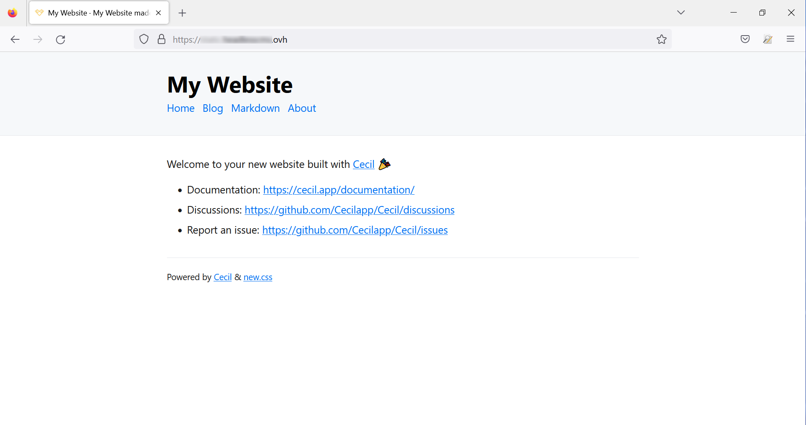
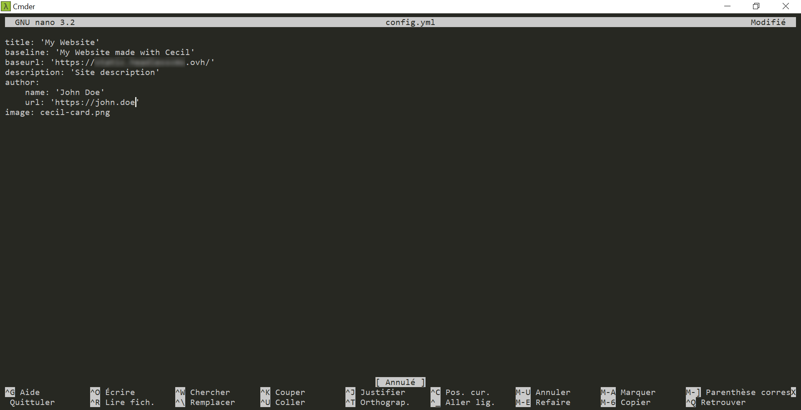
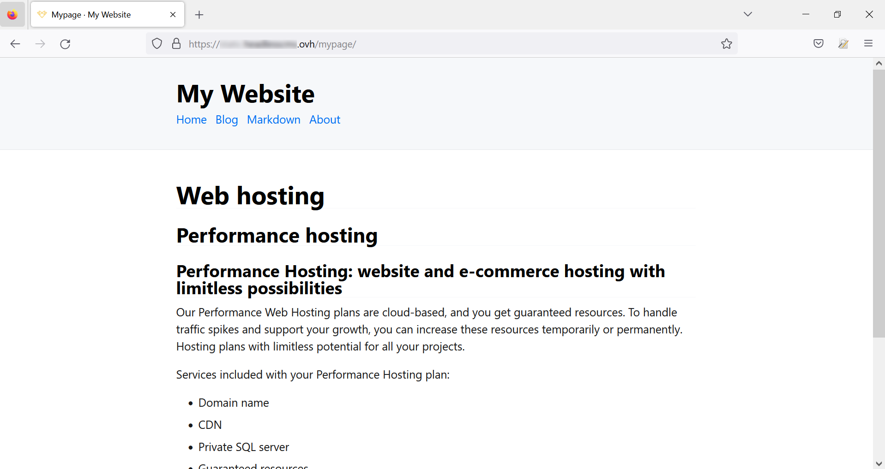

**Letzte Aktualisierung am 18.01.2023**

> [!primary]
> Diese Übersetzung wurde durch unseren Partner SYSTRAN automatisch erstellt. In manchen Fällen können ungenaue Formulierungen verwendet worden sein, z.B. bei der Beschriftung von Schaltflächen oder technischen Details. Bitte ziehen Sie beim geringsten Zweifel die englische oder französische Fassung der Anleitung zu Rate. Möchten Sie mithelfen, diese Übersetzung zu verbessern? Dann nutzen Sie dazu bitte den Button «Mitmachen» auf dieser Seite.
>

## Ziel

Dieses Tutorial zeigt Ihnen, wie Sie [Cecil](https://cecil.app/){.external} installieren und konfigurieren können. Es ist eine in PHP geschriebene Anwendung, die statische Webseiten generieren und verwalten kann.

Eine im Wesentlichen aus statischen Seiten bestehende Website garantiert Ihren Besuchern eine bessere Ladezeit und eine höhere Sicherheit. Ohne dynamischen Inhalt sind Ihre Seiten robuster gegen Cyber-Angriffe. Das Erzeugen von statischen Seiten erlaubt mehr Freiheiten bei der Seiten-Erstellung. Sie sparen auch Zeit, da Sie nicht bei Null anfangen müssen.

**In diesem Tutorial wird erläutert, wie Sie mit Cecil Ihre statische Website mit einer modernen Template-Engine (Jamstack) erstellen können.**

> [!warning]
> OVHcloud stellt Ihnen Dienstleistungen zur Verfügung, für deren Konfiguration und Verwaltung Sie die alleinige Verantwortung tragen. Es liegt somit bei Ihnen, sicherzustellen, dass diese ordnungsgemäß funktionieren.
>
> Wenn Sie Schwierigkeiten haben, die Schritte in diesem Tutorial durchzuführen, empfehlen wir, einen [spezialisierten Dienstleister](https://partner.ovhcloud.com/de/directory/) zu kontaktieren oder Ihre Fragen in der OVHcloud Community zu stellen. Leider können wir Ihnen für administrative Aufgaben keine weitergehende technische Unterstützung anbieten. Weitere Informationen finden Sie am [Ende dieser Anleitung](#go-further).
>

## Voraussetzungen

- Sie verfügen über ein [OVHcloud Webhosting](https://www.ovhcloud.com/de/web-hosting/) mit SSH-Zugang. Über diesen Zugriff können Sie eine oder mehrere Alternativlösungen online installieren, ergänzend zu den Webhosting-Standarddiensten.
- Sie sind mit der Befehlszeileneingabe vertraut.
- Sie können Ihre Dateien per FTP mit einem Client wie [FileZilla](https://docs.ovh.com/de/hosting/webhosting_hilfe_zur_verwendung_von_filezilla/) übertragen.
- Sie haben Ihre DNS-Zone konfiguriert, um Ihren Domainnamen (oder eine Subdomain) auf Ihr Webhosting zu verweisen. Dies ist besonders relevant, wenn Sie auf Ihrem Hosting mehrere Websites als [Multisites](https://docs.ovh.com/de/hosting/multisites-mehrere-websites-konfigurieren/) hosten möchten.
- Sie haben [Composer](https://getcomposer.org/){.external} installiert, mit der Datei `composer.phar` im Wurzelverzeichnis Ihres Webhostings oder im Zielordner Ihres Domainnamens.

## In der praktischen Anwendung

Mit [Webhostings](https://www.ovhcloud.com/de/web-hosting/) können Sie Domainnamen oder Subdomains für mehrere Websites deklarieren. Sie benötigen einen Domainnamen oder eine Subdomain, um Ihre mit **Cecil** erstellte Seite zu veröffentlichen.

Um Ihnen dabei zu helfen, einen Domainnamen oder eine Subdomain zu deklarieren, verwenden Sie unsere Anleitung "[Mehrere Websites auf einem Webhosting einrichten](https://docs.ovh.com/de/hosting/multisites-mehrere-websites-konfigurieren/)".

### Erstellen Sie das Verzeichnis für Ihre Dateien

Sobald Sie sich über SSH auf Ihrem Webhosting eingeloggt haben, erstellen Sie ein Root-Verzeichnis mit dem folgenden Befehl:

```sh
mkdir mystaticwebsite
```

Ersetzen Sie `mystaticwebsite` durch den Ordnernamen Ihrer Wahl (ohne Akzente und Leerzeichen).

Wechseln Sie anschließend zu diesem Ordner:

```sh
cd mystaticwebsite
```

Ersetzen Sie `mystaticwebsite` durch Ihren Ordnernamen.

### Download

Laden Sie in dem Verzeichnis, das Sie gerade erstellt haben, Cecil herunter:

```sh
curl -OL https://github.com/Cecilapp/Cecil/releases/latest/download/cecil.phar
```

### Installation

Starten Sie die Cecil-Installation mit dem folgenden Befehl:

```sh
php cecil.phar new:site
```

Tragen Sie die angeforderten Informationen ein:

- Titel Ihrer Webseite
- Eine _Baseline_ für Ihre Webseite
- URL Ihrer Seite (Beispiel: `https://mywebsite.ovh`)
- Eine Beschreibung Ihrer Seite

{.thumbnail}

Nachdem Sie diese Informationen eingegeben haben, können Sie die Website mit dem folgenden Befehl bereitstellen:

```sh
php cecil.phar build
```

Wenn Sie den Inhalt des Verzeichnisses anzeigen, finden Sie dort das Verzeichnis `_site`. Dieses Verzeichnis enthält alle HTML-Dateien und *Assets*:

{.thumbnail}

Sie können nun das Ergebnis sehen, indem Sie Ihren Domainnamen aufufen:

{.thumbnail}

#### Konfiguration des Domainnamens

Um die Ergebnisse in Ihrem Browser anzuzeigen, muss Ihr Domainname auf das Verzeichnis `_site` verweisen, das Sie bei der Installation von **Cecil** erstellt haben.

Wenn Ihr Domainname bei OVHcloud gehostet wird, können Sie unsere Anleitungen zur [DNS-Konfiguration](https://docs.ovh.com/de/domains/webhosting_bearbeiten_der_dns_zone/) und Einrichtung von [Multisites auf Ihrem Webhosting](https://docs.ovh.com/de/hosting/multisites-mehrere-websites-konfigurieren/) zu Hilfe nehmen.

### Ihre Webseite konfigurieren

Allgemeine Informationen zu Ihrer Website können Sie in der Datei `config.yml` konfigurieren:

```sh
nano config.yml
```

Ersetzen Sie die Standardinformationen durch Ihre eigenen, und speichern Sie die Datei.

{.thumbnail}

### Neue Seite erstellen

Sie können Webseiten mithilfe von Dateien im Markdown-Format erstellen. Diese Seiten können angepasst werden. **Cecil** enthält [Twig](https://twig.symfony.com/){.external}, die Template Engine, die standardmäßig für das [Symfony](https://symfony.com/){.external} Framework verwendet wird.

Ordner und Dateien sind wie folgt organisiert:

- `assets`: Enthält Grafiken, Audio, Video, JavaScript und Formatvorlagen (CSS, Sass).
- `layouts`: Enthält Templates.
- `pages`: Enthält Markdown-Dateien.
- `_site`: Verzeichnis, in dem sich die generierten Dateien befinden und auf das der Domainname verweist.
- `static`: Enthält alle statischen PDF-Dateien.

#### Erstellen einer Markdown-Datei in der Befehlszeile

Geben Sie im Stammverzeichnis der Seite den folgenden Befehl ein:

```sh
php cecil.phar new:page mypage.md
```

Ersetzen Sie `mypage` durch den Namen Ihrer Seite.

Anschließend wird im Stammverzeichnis `/pages` die Datei `mypage.md` erstellt.

{.thumbnail}

#### Statische Dateien generieren

Geben Sie im Stammverzeichnis den folgenden Befehl ein:

```sh
php cecil.phar build
```

Ihre Datei befindet sich im Ordner `_site/mypage/`:

{.thumbnail}

Sie können sie auf dem Server öffnen, indem Sie die URL Ihrer Seite gefolgt von `/mypage/` eingeben:

{.thumbnail}

### Passen Sie Ihre Website-Dateien an

#### Auf dem Server arbeiten

Markdown-Dateien können direkt auf dem Webhosting-Server bearbeitet werden. Mit dem SSH-Zugang der [Performance Hostings](https://www.ovhcloud.com/de/web-hosting/performance-offer/) können Sie [GNU nano](https://nano-editor.org/){.external}, [vi](https://ex-vi.sourceforge.net/){.external} oder [vim](https://www.vim.org/){.external} verwenden.

Die Screenshots dieses Tutorials wurden unter **GNU nano** erstellt.

Bearbeiten Sie die Datei `mypage.md` im Verzeichnis `pages`, indem Sie im Stammverzeichnis den folgenden Befehl eingeben:

```sh
nano pages/mypage.md
```

Ersetzen Sie `mypage` durch den Namen Ihrer eigenen Seite.

{.thumbnail}

Fügen Sie Zeilen mithilfe der Markdown-Syntax hinzu:

{.thumbnail}

Löschen Sie die Dateien im Cache mit dem folgenden Befehl:

```sh
php cecil.phar clear
```

Erstellen Sie Ihre Seiten neu (*build*), nachdem Sie Ihre Datei gespeichert haben:

```sh
php cecil.phar build
```

Kehren Sie dann zu Ihrer Seite zurück, um das Ergebnis zu sehen:

{.thumbnail}

#### Arbeitsumgebung ändern

Wenn Sie es vorziehen, Ihren gewohnten Code-Editor zu verwenden, melden Sie sich mit einem FTP-Client auf Ihrem Server an, um die Dateien auf Ihren Computer zu übertragen:

{.thumbnail}

Sie können nun die Dateien in Ihrer I.D.E. bearbeiten:

{.thumbnail}

Laden Sie einfach Ihre veränderten oder neuen Dateien auf den Server und führen Sie *build* aus, um Ihre Seiten online zu stellen.

### Die erstellte Seite zum Menü Ihrer Seite hinzufügen

Um diese neue Seite zum Website-Menü hinzuzufügen, ändern Sie manuell den Header der `.md`-Datei, indem Sie die folgende Zeile hinzufügen:

```sh
menu: main
```

### Fazit

**Cecil** ist ein Tool, mit dem eine statische Site aus *Markdown*-Dateien erstellt werden kann. Diese Markup-Sprache ist einfacher zu implementieren als HTML. Die Organisation von Markdown-Dateien bestimmt die Hierarchie Ihrer Webseiten.<br/>
Die Verwendung einer Template Engine, die in der Web-Entwickler-Community weit verbreitet ist, ermöglicht es Ihnen, viele Quellen im Internet zu finden, um eine professionell aussehende Benutzeroberfläche zu entwerfen.

## Weiterführende Informationen <a name="go-further"></a>

[Offizielle Webseite von Cecil](https://cecil.app/){.external}

[Hilfe zum Markdown-Format](https://www.markdownguide.org/){.external}

[Verwendung von FileZilla](https://docs.ovh.com/de/hosting/webhosting_hilfe_zur_verwendung_von_filezilla/)

Für den Austausch mit unserer User Community gehen Sie auf <https://community.ovh.com/en/>.