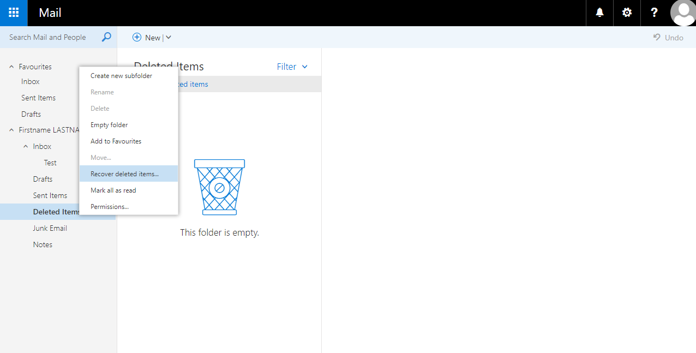
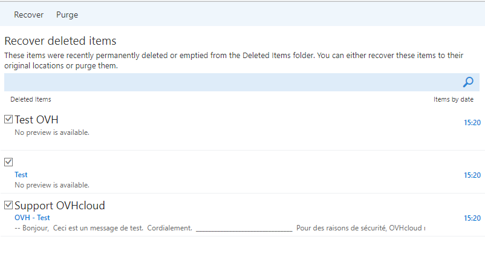
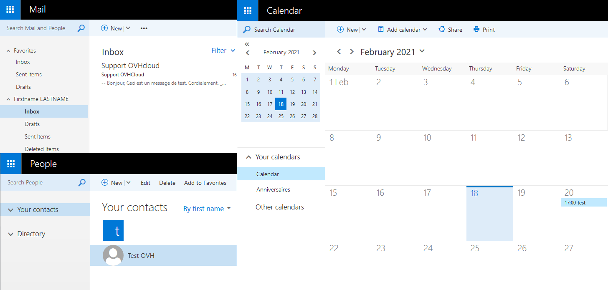

## Objectif

Vous avez supprimé par erreur un ou plusieurs éléments (mail, contact, rendez-vous du calendrier) et vous avez vidé votre corbeille. Il est possible de les retrouver pendant 14 jours après leur suppression avec l’option Récupérer les éléments supprimés.

## Prérequis

Disposer d'une [offre e-mail OVHcloud](https://www.ovh.com/fr/emails/){.external} compatible avec OWA.
Être connecté au [webmail] (https://www.ovh.com/fr/mail/) {.external}.

## En pratique

### Comprendre la retention des elements supprimes

La rétention des éléments supprimés (corbeille vidée) est disponible durant 14 jours pour les éléments suivants :

- e-mail
- contact
- calendrier
- Taches

La récupération des éléments supprimés peut être effectuée depuis le webmail (OWA) pour toutes les offres e-mail qui en disposent et depuis un client Outlook version 2013 et supérieure pour les comptes Exchange.

> [!alert]
>
> Certaines suppressions ne peuvent pas être récupérées depuis la récupération des
> éléments supprimés. Notamment lors d'un souci de synchronisation entre un
> périphérique (client de messagerie, smartphone) et le serveur Exchange. Dans
> ce cas des éléments peuvent être supprimés définitivement sans être placé
> dans la récupération des éléments supprimés.
> 

### Depuis le webmail (OWA)

#### MX Plan, E-mail Pro et Exchange 2016 ou supérieur
Connectez-vous au [webmail] (https://www.ovh.com/fr/mail/) {.external}.

Pour les offres de type Private Exchange, le lien de connexion correspond au nom que vous avez choisi pour votre certificat.

Une fois connecté, faites un clic droit dans le menu de gauche sur “Éléments supprimés” puis “Récupérer les éléments supprimés”.

{.thumbnail}

Vous pouvez sélectionner plusieurs éléments en maintenant la touche “Ctrl” de votre clavier, puis en sélectionnant les éléments souhaités ou en les cochant.

Voici un exemple contenant un e-mail, un contact et un événement de calendrier.

{.thumbnail}

Validez ensuite votre restauration en cliquant sur “récupérer”.

Il est aussi possible de vider la liste des éléments, ils seront alors définitivement supprimés du serveur.

> [!success]
>
> Il est possible de sélectionner différent types d'éléments simultanément et d'effectuer la restauration.
> Chaque type d'élément sera alors placé dans la catégorie qui le concerne.
> 

Si les éléments ont été correctement sélectionnés, il seront restaurés dans leur catégorie respective.

{.thumbnail}

#### Exchange 2010

Le lien de connexion au webmail Exchange 2010 correspond au nom que vous avez choisi pour votre certificat.

Une fois connecté, faites un clic droit dans le menu de gauche sur “Éléments supprimés” puis “Récupérer les éléments supprimés”.

{.thumbnail}

Vous pouvez sélectionner plusieurs éléments en maintenant la touche “Ctrl” de votre clavier puis en sélectionnant les éléments souhaités.

Dans cet exemple les éléments concernés sont :

- un e-mail
- un contact
- rendez-vous du calendrier.

Une fois la sélection effectuée, cliquez sur l’icône en forme d’enveloppe pour restaurer ces éléments.

{.thumbnail}

Vous pourrez alors choisir ou restaurez vos éléments.

Si vous souhaitez restaurer des e-mail dans un répertoire particulier, il est possible de le créer depuis la récupération des éléments supprimés.

> [!alert]
>
> Vous pouvez restaurez plusieurs éléments simultanément mais il est
> nécessaire de restaurer des éléments de même nature (mail, contact,
> calendrier) car une seule destination est possible à la fois. Si vous restaurez
> un élément de type calendrier dans la boite de reception, celui-ci
> n'apparaitra plus depuis le webmail. Il faudra configurer le compte dans un
> client lourd de messagerie pour le retrouver.
> 

{.thumbnail}

Si les éléments ont été correctement sélectionnés, il seront restaurés dans leur catégorie respective.

{.thumbnail}

#### Depuis Outlook 2013/2016

Il est possible de restaurer les éléments supprimés depuis Outlook 2013/2016 pour les comptes Exchange uniquement. Les éléments sélectionnés seront restaurés dans la corbeille et il faudra les déplacer vers la section concernée manuellement.

Démarrez Outlook puis faites un clic droit sur “Éléments supprimée” puis Récupérer les éléments supprimées

{.thumbnail}

Une pop-up s’ouvre afin de choisir les éléments à restaurer.

{.thumbnail}

> [!success]
>
> La restauration depuis Outlook est différente par rapport au webmail (OWA) car
> Outlook restaure les éléments dans la corbeille. Il est ensuite nécessaire de
> déplacer manuellement les éléments.
> 

Une fois la restauration terminée, vous retrouvez les éléments dans la corbeille et pouvez les gérer à nouveau.

{.thumbnail}
