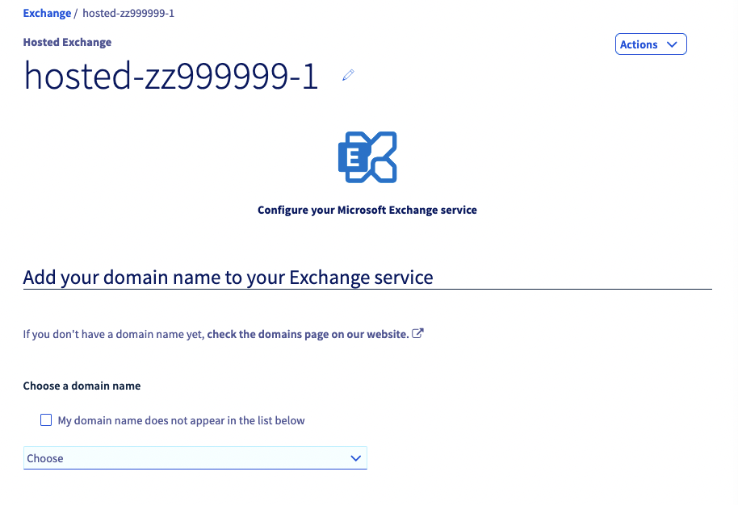
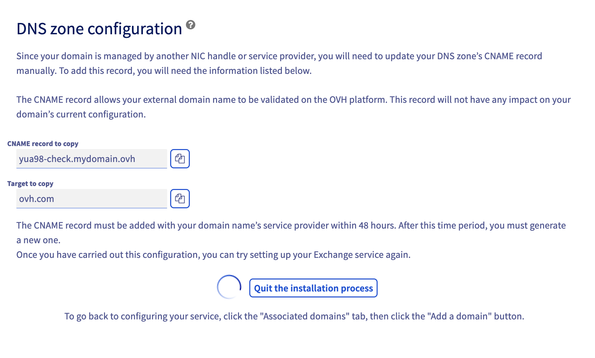

> [!primary]
> Diese Übersetzung wurde durch unseren Partner SYSTRAN automatisch erstellt. In manchen Fällen können ungenaue Formulierungen verwendet worden sein, z.B. bei der Beschriftung von Schaltflächen oder technischen Details. Bitte ziehen Sie beim geringsten Zweifel die englische oder französische Fassung der Anleitung zu Rate. Möchten Sie mithelfen, diese Übersetzung zu verbessern? Dann nutzen Sie dazu bitte den Button «Mitmachen» auf dieser Seite.
>

**Letzte Aktualisierung am 06.03.2023**

## Ziel

Mit Hosted Exchange verfügen Sie über professionelle E-Mail-Accounts mit erweiterten Funktionen für kollaboratives Arbeiten wie der Synchronisation von Kalendern und Kontakten.

**In dieser Anleitung erfahren Sie, wie Sie Ihren Hosted Exchange Dienst einrichten.**

## Voraussetzungen

- Sie haben bereits einen [OVHcloud Exchange](https://www.ovhcloud.com/de/emails/hosted-exchange/) Dienst eingerichtet.
- Sie haben die E-Mail mit der Installationsbestätigung für Ihren Hosted Exchange erhalten.
- Sie verfügen über einen Domainnamen.
- Sie haben Zugriff auf Ihr [OVHcloud Kundencenter](https://www.ovh.com/auth/?action=gotomanager&from=https://www.ovh.de/&ovhSubsidiary=de).

## In der praktischen Anwendung

### Zugang zur Verwaltung Ihrer Dienstleistung

Wenn Ihr Hosted Exchange eingerichtet und verfügbar ist, können Sie es über Ihr [OVHcloud Kundencenter](https://www.ovh.com/auth/?action=gotomanager&from=https://www.ovh.de/&ovhSubsidiary=de) verwalten.

Gehen Sie hierzu in Ihrem Kundencenter auf `Microsoft`{.action} und anschließend auf `Exchange`{.action}. Klicken Sie dann auf den Namen des entsprechenden Hosted Exchange Dienstes.

> [!primary]
>
> Der Name Ihres Hosted Exchange Angebots im OVHcloud Kundencenter beginnt mit **hosted-**, enthält anschließend einen Teil Ihrer Kundenkennung und endet mit einer Zahl (1 für den ersten installierten Hosted Exchange Dienst, 2 für den zweiten etc.).
>

### Die erste Konfiguration der Dienstleistung durchführen

Bevor Sie Ihr Hosted Exchange verwenden können, muss der Dienst eingerichtet werden. Nach der Erstkonfigurationen können Sie Ihre neuen Exchange E-Mail-Accounts nutzen.

Wenn Sie das Verwaltungsinterface Ihres Hosted Exchange zum ersten Mal aufrufen, öffnet sich zunächst ein Konfigurationsassistent. Um zu beginnen, klicken Sie auf den Button `Starten`{.action}.

Im Konfigurationsassistenten können Sie mehrere Einstellungen je nach Ihrer Situation vornehmen:

#### Einen Domainnamen auswählen

Wählen Sie einen Ihrer Domainnamen aus der Liste aus oder setzen Sie einen Haken `Meine Domain ist nicht in der unten stehenden Liste aufgeführt`, um eine Domain anzugeben, die nicht in Ihrem Kundencenter verwaltet wird, **aber konfigurierbar ist**.

{.thumbnail}

#### Werden Sie ausschließlich OVH Exchange mit dieser Domain verwenden?

Die Frage "**Werden Sie ausschließlich das OVH Exchange Angebot für diese Domain verwenden?**" bestimmt den Konfigurationstyp Ihrer Domain. 

- Wenn Sie ein Exchange Angebot allein oder zusammen mit anderen **E-Mail-Angeboten von OVHcloud** verwenden, kann die Konfiguration automatisch oder manuell erfolgen, indem Sie ausschließlich die E-Mail-Server von OVHcloud verwenden.
- Wenn Sie Ihr Exchange Angebot zusätzlich zu einem E-Mail-Dienst **außerhalb des OVHcloud E-Mail Angebots** verwenden, werden Sie aufgefordert, die URL des Empfangsservers Ihres externen E-Mail-Dienstes unter der Rubrik `Relay-Server (SMTP)` anzugeben.

{.thumbnail}

#### Wie möchten Sie Ihre DNS Zone konfigurieren?

- **Automatische Konfiguration**: Der angegebene Domainname wird automatisch auf der Ebene der DNS-Zone konfiguriert, sofern diese innerhalb desselben OVHcloud Kunden-Accounts wie Ihr Exchange Dienst verwaltet wird.
- **Manuelle Konfiguration**: Der Domainname wird über ein anderes Interface verwaltet, etwa bei einem anderen Anbieter, oder Sie möchten Ihre Konfiguration selbst erstellen.  Sie finden die einzugebenden Werte am Ende des Konfigurationsprozesses oder im Bereich `Assoziierte Domains`{.action} Ihres Dienstes.

{.thumbnail}

#### **Konfiguration der Exchange Accounts**

Legen Sie den Namen Ihrer Exchange E-Mail-Adressen fest und fügen Sie zusätzliche Informationen hinzu.

{.thumbnail}

#### **Sonderfall**

- Wenn Sie Ihre Exchange Plattform mit einem Domainnamen konfigurieren, der nicht über dieselbe Kundenkennung verwaltet wird, oder bei einem anderen Domainnamen-Anbieter, sehen Sie das folgende Fenster: 
{.thumbnail .w-640} 
In diesem Fenster können Sie einen **CNAME-Eintrag** zur DNS-Zone der Domain hinzufügen. Mit diesem Eintrag wird überprüft dass Sie zur Verwaltung des Domainnamens berechtigt sind. 

> [!warning]
> Ohne diese Validierung über CNAME-Eintrag ist es nicht möglich, Exchange mit diesem Domainnamen zu verwenden.

- Wenn Sie Ihre Exchange Plattform mit einem Domainnamen konfigurieren, der nicht über dieselbe Kundenkennung verwaltet wird, oder bei einem anderen Domainnamen-Anbieter, oder wenn Sie sich dafür entschieden haben, Ihren Domainnamen manuell zu konfigurieren, öffnet sich das folgende Fenster: 
{.thumbnail .w-640} 
Hier finden Sie die einzugebenden Werte für Ihre DNS Zone. Die **MX Einträge** entsprechen den Eingangsservern Ihrer E-Mails. Der **SRV-Eintrag** dient der automatischen Konfiguration Ihrer E-Mail-Accounts.

Details zur Konfiguration Ihrer DNS-Zone für Ihren E-Mail-Dienst finden Sie auf der Seite "[MX-Eintrag zur Konfiguration Ihrer Domain hinzufügen](https://docs.ovh.com/de/domains/webhosting_e-mail_mx-konfiguration_mit_dns_zone_von_ovh/)".

### Zusätzliche Domainnamen hinzufügen (optional)

Wenn die erste Konfiguration Ihres Domainnamens abgeschlossen ist, können Sie über den Assistenten auch zusätzliche Domainnamen konfigurieren, wenn Sie es noch nicht getan haben.

> [!warning]
>
> Alle für Ihren Exchange Dienst erstellten Adressen werden im Adressverzeichnis dieses Dienstes aufgeführt, darunter auch Adressen mit einer anderen Domain. Wenn Sie nicht möchten, dass bestimmte Domains im Adressbuch angezeigt werden, benötigen Sie einen neuen Hosted Exchange Dienst für die betreffenden Domains.
>

Um eine neue Domain hinzuzufügen, wählen Sie in Ihrem [OVHcloud Kundencenter](https://www.ovh.com/auth/?action=gotomanager&from=https://www.ovh.de/&ovhSubsidiary=de) den betreffenden Hosted Exchange Dienst aus und klicken Sie auf den Tab `Assoziierte Domains`{.action}. Die Tabelle zeigt die Domains an, die aktuell für Ihre Dienstleistung konfiguriert sind oder gerade eingerichtet werden. Um eine weitere Domain hinzuzufügen, klicken Sie auf den Button `Eine Domain hinzufügen`{.action} und folgen Sie dem Assistenten.

Für weitere Informationen, lesen Sie bitte die Anleitung [Eine Domain zu Ihrem Exchange Dienst hinzufügen](https://docs.ovh.com/de/microsoft-collaborative-solutions/domain-zu-exchange-hinzufugen/).

> [!primary]
>
> Wenn für die Konfiguration einer Domain eine besondere Aktion erforderlich ist, erscheint in der Tabelle ein roter Vermerk in der Spalte `Diagnose`{.action}. Klicken Sie auf das rote Feld, um die notwendigen Aktionen anzuzeigen. Wenn diese Domain nicht die OVHcloud Konfiguration (die DNS-Server von OVHcloud) verwendet, müssen die Änderungen über das Interface vorgenommen werden, mit dem Sie die Konfiguration Ihrer Domain verwalten können. 
>

### Zusätzliche Exchange Accounts konfigurieren (optional)

Sie können zusätzliche Accounts konfigurieren, wenn Sie das nicht bereits über den Assistenten getan haben.

Klicken Sie hierzu in Ihrem [OVHcloud Kundencenter](https://www.ovh.com/auth/?action=gotomanager&from=https://www.ovh.de/&ovhSubsidiary=de) auf den betreffenden Hosted Exchange Dienst und anschließend auf den Tab `E-Mail Accounts`{.action}. Die Tabelle zeigt die E-Mail-Accounts an, die aktuell für Ihre Dienstleistung konfiguriert sind oder gerade eingerichtet werden.

Die Accounts, deren Konfiguration in Bearbeitung ist, werden in der Tabelle mit der Endung „*@configure.me*“ angezeigt. Um die Accounts zu konfigurieren, klicken Sie auf das Stift-Symbol und folgen Sie den angezeigten Schritten.

> [!primary]
>
> Wiederholen Sie diesen Schritt so oft wie nötig, je nach Anzahl Ihrer Accounts. Sie können weitere Accounts über den Button `Aktionen`{.action} bestellen und dann auf `Accounts bestellen`{.action} klicken.
>

### E-Mail-Adressen verwenden

Nachdem Sie Ihre Accounts fertig eingerichtet haben, können Sie diese nun verwenden. OVHcloud stellt hierzu die Webmail **Outlook Web Application** (OWA) zur Verfügung. Sie können sich über folgenden Link einloggen: [https://mail.ovh.net/de/](https://www.ovhcloud.com/de/mail/). Geben Sie hierzu die Zugangsdaten zu Ihrer E-Mail-Adresse ein. Weitere Anleitungen zur Verwendung von OWA finden Sie in unserer Dokumentation unter folgendem Link: [https://docs.ovh.com/de/microsoft-collaborative-solutions/](https://docs.ovh.com/de/microsoft-collaborative-solutions/).

Wenn Sie Ihre E-Mail-Adresse auf einem E-Mail-Client oder auf einem Gerät (beispielsweise einem Smartphone oder einem Tablet) einrichten möchten, finden Sie die entsprechende Dokumentation unter [https://docs.ovh.com/de/microsoft-collaborative-solutions/](https://docs.ovh.com/de/microsoft-collaborative-solutions/). Vergewissern Sie sich, dass der E-Mail-Client mit Ihrer Dienstleistung kompatibel ist, damit Ihre Exchange Adresse optimal funktioniert.

OVHcloud bietet über das [OVHcloud Kundencenter](https://www.ovh.com/auth/?action=gotomanager&from=https://www.ovh.de/&ovhSubsidiary=de) optional Outlook-Lizenzen mit Ihrem Exchange E-Mail-Account an.

Um eine Domain mit dieser Endung bestellen zu können, lesen Sie unsere Anleitung ["Eine Outlook-Lizenz für Exchange beziehen"](https://docs.ovh.com/de/microsoft-collaborative-solutions/exchange-outlook-lizenz/). 

Sie können auch Office 365 Lizenzen auf der Seite [https://www.ovhcloud.com/de/collaborative-tools/microsoft-365/](https://www.ovhcloud.com/de/collaborative-tools/microsoft-365/) erhalten. Wir empfehlen Ihnen, eine dieser Lösungen zu verwenden, wenn Sie den Outlook E-Mail-Client oder weitere Software der Office Suite nutzen möchten.

> [!primary]
>
> Mit Exchange können Sie alle Einstellungen (Filter, Signaturen, Ordner etc.), die Sie in einer kompatiblen Webanwendung oder einem kompatiblen E-Mail-Client verwenden, synchronisieren.
> So sind alle Ihre Daten stets verfügbar, egal ob Sie Exchange auf mehreren Geräten und über verschiedene Zugänge (Webmail, kompatible E-Mail-Clients, Apps) verwenden.
>

### Die kollaborativen Funktionen einrichten (optional)

Nun, da Ihr Hosted Exchange Dienst konfiguriert und funktionsfähig ist, können Sie die kollaborativen Funktionen des Dienstes in Ihrem [OVHcloud Kundencenter einrichten](https://www.ovh.com/auth/?action=gotomanager&from=https://www.ovh.de/&ovhSubsidiary=de). Mithilfe dieser Funktionen können Sie unter anderem Ressourcen anlegen (Räume, Equipment etc.) und Gruppen erstellen.

Um die verschiedenen Funktionen zu aktivieren, wählen Sie in Ihrem [OVHcloud Kundencenter](https://www.ovh.com/auth/?action=gotomanager&from=https://www.ovh.de/&ovhSubsidiary=de) den betreffenden Hosted Exchange Dienst aus und wählen Sie dann aus den Tabs, in denen die durchzuführende Aktion angezeigt wird.

Weitere Anleitungen zu den Funktionen finden Sie in unserer Dokumentation unter [https://docs.ovh.com/de/microsoft-collaborative-solutions/](https://docs.ovh.com/de/microsoft-collaborative-solutions/).

## Weiterführende Informationen

[Kontaktgruppen erstellen](https://docs.ovh.com/de/microsoft-collaborative-solutions/exchange_20132016_verwendung_der_gruppen_mailinglisten/)

[Freigegebenes Postfach erstellen und verwenden](https://docs.ovh.com/de/microsoft-collaborative-solutions/exchange-verwendung-freigegebene-accounts/)

[Verwendung von Ressourcen-Accounts](https://docs.ovh.com/de/microsoft-collaborative-solutions/exchange_20132016_verwendung_der_ressourcen-accounts/)

[Berechtigungen für einen E-Mail Account übertragen](https://docs.ovh.com/de/microsoft-collaborative-solutions/exchange_2013_send_as_versand_als/)

[Ordner in OWA freigeben](https://docs.ovh.com/de/microsoft-collaborative-solutions/exchange_2016_einen_ordner_via_owa_webmail_freigeben/)

[Die Abrechnung für Ihre Exchange Accounts verwalten](https://docs.ovh.com/de/microsoft-collaborative-solutions/exchange-abrechnung-verwalten/)

Für den Austausch mit unserer User Community gehen Sie auf <https://community.ovh.com/en/>.
