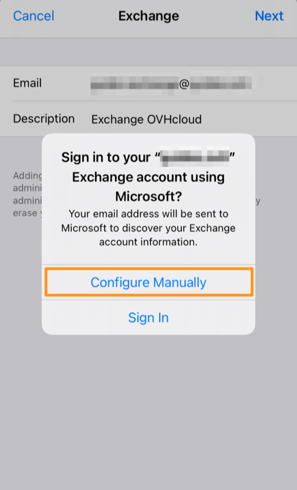

> [!primary]
> Tłumaczenie zostało wygenerowane automatycznie przez system naszego partnera SYSTRAN. W niektórych przypadkach mogą wystąpić nieprecyzyjne sformułowania, na przykład w tłumaczeniu nazw przycisków lub szczegółów technicznych. W przypadku jakichkolwiek wątpliwości zalecamy zapoznanie się z angielską/francuską wersją przewodnika. Jeśli chcesz przyczynić się do ulepszenia tłumaczenia, kliknij przycisk „Zaproponuj zmianę” na tej stronie.
> 

**Ostatnia aktualizacja z dnia 21-05-2020**

## Wprowadzenie

Konta Exchange mogą być skonfigurowane w jednym z kompatybilnych programów pocztowych.  Dzięki temu możesz używać Twojego konta e-mail, korzystając z wybranej przez Ciebie aplikacji.

**Dowiedz się, jak skonfigurować Twoje konto Exchange na urządzeniu iPhone lub iPad przy użyciu aplikacji Mail.**

> [!warning]
>
> OVHcloud udostępnia różnorodne usługi, jednak to Ty odpowiadasz za ich konfigurację i zarządzanie nimi. Ponosisz więc odpowiedzialność za ich prawidłowe funkcjonowanie.
>
> Niniejszy przewodnik ułatwi Ci realizację bieżących zadań. W przypadku trudności zalecamy skorzystanie z pomocy wyspecjalizowanego webmastera lub kontakt z producentem oprogramowania. Niestety firma OVHcloud nie będzie mogła udzielić wsparcia w tym zakresie. Więcej informacji znajduje się w sekcji „Sprawdź również”.
>

## Wymagania początkowe

- Posiadanie [konta e-mail Exchange](https://www.ovhcloud.com/pl/emails/){.external}
- Instalacja aplikacji Mail na Twoim urządzeniu iOS
- Posiadanie danych do logowania do konta e-mail, które chcesz skonfigurować.

## W praktyce

### Dodaj konto 

> [!primary]
>
> Poniżej stosujemy przykładową nazwę serwera: ex**?*.mail.ovh.net. Chcesz zastąpić "? "cyfrą wskazującą serwer Twojej usługi E-mail Pro.
>
> Liczbę tę odnajdziesz w [Panelu klienta OVHcloud](https://www.ovh.com/auth/?action=gotomanager&from=https://www.ovh.pl/&ovhSubsidiary=pl){.external}, w sekcji `Web Cloud`{.action}, a następnie w wersji `Microsoft`{.action}.
> Kliknij `Exchange`{.action}, a następnie wybraną platformę Exchange. Nazwa serwera jest widoczna w ramce **Połączenie** w karcie `Informacje ogólne`{.action}.
>

Na ekranie Twojego urządzenia wybierz `Ustawienia`{.action} (ikona koła zębatego). Konto można dodawać na różne sposoby, w zależności od wersji iOS:

- **Dla systemu iOS 7, 8, 9 i 10**: kliknij `Mail, Kontakty, Kalendarz`{.action}, a następnie `Dodaj konto`{.action}. Wybierz `Inne`{.action}, następnie `Dodaj konto Mail`{.action}. Następnie przejdź do etapu 5 poniższej tabeli.

- **Dla systemu iOS 1**: kliknij `Konta i hasła`{.action}, a następnie `Dodaj konto`{.action}. Wybierz`Inne`{.action}, następnie `Dodaj konto Mail`{.action}. Następnie przejdź do etapu 5 poniższej tabeli.

- **Dla obecnych** wersji: postępuj zgodnie z instrukcjami z poniższej tabeli.

| | |
|---|---|
|{.thumbnail}|1. W `Ustawieniach` przejdź do `Mail`.    2. Kliknij `Konta`.   3. Kliknij `Dodaj konto`.   4. Wybierz `Microsoft Exchange`.|
|5. Wpisz swój **adres e-mail** i **opis** konta e-mail, naciśnij przycisk `Dalej`.  6. Wybierz `Konfigurację ręczną`.  |{.thumbnail}|
|{.thumbnail}|7. Wpisz:  - serwer **ex?.mail.ovh.net** ( zastąp **?** przez [numer serwera Exchange](#addaccount))  - Twój **kompletny adres e-mail** w nazwie użytkownika  - hasło do Twojego konta e-mail|
|8. Upewnij się, czy zaznaczyłeś co najmniej `Mail`{.action}, aby aplikacja mogła korzystać z tego konta. Pozostałe aplikacje (jak *Kalendarz* czy *Notatki*) mogą używać niektórych funkcji do pracy zespołowej dostępnych w programie Exchange.  9. Kliknij `Zapisz`, aby dokończyć dodawanie konta exchange.|{.thumbnail}|

Wykonaj test wysyłki e-maili, aby sprawdzić, czy konto zostało poprawnie skonfigurowane.

### Użyj konta e-mail

Po zakończeniu konfiguracji konto jest gotowe do użytku. Możesz teraz zacząć wysyłać i odbierać wiadomości.

OVHcloud oferuje również aplikację internetową posiadającą [funkcje do pracy zespołowej Exchange](https://www.ovhcloud.com/pl/emails/){.external} dostępną pod adresem <https://www.ovh.pl/mail/>. Możesz się do niej zalogować, używając tych samych danych, których użyłeś do logowania się do konta e-mail.

> [!primary]
>
> W przypadku problemów z odbieraniem lub wysyłką e-maili, sprawdź nasz [FAQ dotyczący usług e-mail OVHcloud](https://docs.ovh.com/pl/emails/faq-konta-email/).
>

## Sprawdź również

[Konfiguracja konta e-mail włączonego do usługi MX Plan lub do usługi hostingu na urządzeniu iPhone lub iPad](https://docs.ovh.com/pl/emails/hosting_www_konfiguracja_na_iphone_ios_91/)

[Konfiguracja konta e-mail Pro na urządzeniu iPhone lub iPad](https://docs.ovh.com/pl/emails-pro/konfiguracja-iphone/)

[Najczęściej zadawane pytania dotyczące kont e-mail](https://docs.ovh.com/pl/emails/faq-konta-email/)

Dołącz do społeczności naszych użytkowników na stronie <https://community.ovh.com/en/>.