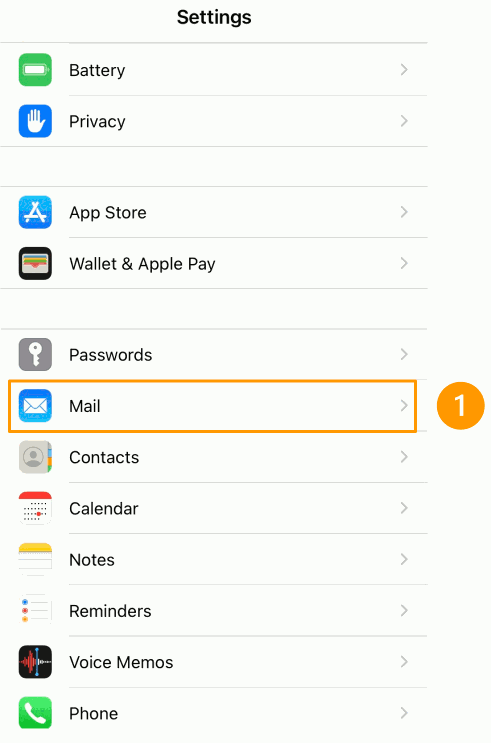

> [!primary]
> Esta tradução foi automaticamente gerada pelo nosso parceiro SYSTRAN. Em certos casos, poderão ocorrer formulações imprecisas, como por exemplo nomes de botões ou detalhes técnicos. Recomendamos que consulte a versão inglesa ou francesa do manual, caso tenha alguma dúvida. Se nos quiser ajudar a melhorar esta tradução, clique em "Contribuir" nesta página.
>

**Última atualização: 21/05/2020**

## Objetivo

As contas Exchange podem ser usadas com vários softwares de e-mail (desde que sejam compatíveis). Isto permite-lhe usar o seu endereço de e-mail no dispositivo que preferir.

**Saiba como configurar a sua conta Exchange num iPhone ou num iPad através da aplicação Mail.**

> [!warning]
>
> A responsabilidade sobre a configuração e a gestão dos serviços que a OVHcloud disponibiliza recai sobre o utilizador. Assim, deverá certificar-se de que estes funcionam corretamente.
>
> Este guia explica como implementar algumas medidas para otimizar a performance e a segurança do seu sistema. No entanto, se encontrar dificuldades, recomendamos que recorra a um [prestador de serviços especializado](https://partner.ovhcloud.com/pt/directory/) e/ou que contacte o editor do serviço. Não poderemos proporcionar-lhe assistência técnica. Para mais informações, aceda à secção «Quer saber mais?» deste guia.
>

## Requisitos

- Ter uma [conta de e-mail Exchange](https://www.ovhcloud.com/pt/emails/){.external}.
- Ter a aplicação Mail instalada no seu dispositivo iOS.
- Ter acesso às credenciais do endereço de e-mail que pretende configurar.

## Instruções

### Adicionar a conta 

> [!primary]
>
> No nosso exemplo, utilizamos a menção servidor: ex**?**.mail.ovh.net. Deverá substituir o "? " pelo número que designa o servidor do seu serviço E-mail Pro.
>
> Encontre este número na sua [Área de Cliente OVHcloud](https://www.ovh.com/auth/?action=gotomanager&from=https://www.ovh.pt/&ovhSubsidiary=pt){.external}, na rubrica `Web Cloud`{.action} e depois `Microsoft`{.action}.
> Clique em `Exchange`{.action} e, a seguir, na plataforma Exchange pretendida. O servidor é visível na secção **Ligação** do separador `Informações gerais`{.action}.
>

No ecrã principal do seu dispositivo, aceda a `Regulações`{.action} (ícone de roda dentada). A adição de uma conta efetua-se de diferentes formas consoante a sua versão do iOS:

- **Para iOS 7, 8, 9 e 10**: aceda a `Mail, Contacts, Calendário`{.action} e depois a `Adicionar uma conta`{.action}. A seguir selecione `Outra`{.action}, depois `Adicionar uma conta de e-mail`{.action}. Passe em seguida à etapa 5 da tabela seguinte.

- **Para iOS 11**: carregue em `Contas e palavras-passe`{.action} e depois em `Adicionar uma conta`{.action}. A seguir selecione `Outra`{.action}, depois `Adicionar uma conta de e-mail`{.action}. Passe em seguida à etapa 5 da tabela seguinte.

- **Para as versões atuais**: siga as instruções da tabela abaixo.

| | |
|---|---|
|{.thumbnail}|1. Em `Regulações`, aceda ao `Mail`.    2. Carregue em `Contas`.   3. Carregue em `Adicionar uma conta`.   4. Escolha a `Microsoft Exchange`.|
|5. Introduza o seu **endereço de e-mail** e uma **descrição** da sua conta de e-mail, aceda a `Seguinte`.  6. Selecione `Configuração manual`.  |{.thumbnail}|
|{.thumbnail}|7. Introduza:  - o servidor **ex?.mail.ovh.net** ( substitua o **?** por [o número do seu servidor Exchange](#addaccount))  - o seu **endereço de e-mail completo** no nome de utilizador  - a palavra-passe do seu endereço de e-mail|
|8. Certifique-se de que tem um `Mail`{.action} selecionado para que a aplicação possa utilizar esta conta. As outras aplicações (como *Calendar* e *Notes*) podem usar algumas das funções colaborativas inerentes ao Exchange.  9. Carregue em `Guardar` para finalizar a adição da sua conta exchange.|{.thumbnail}|

Se quiser, pode efetuar um teste de envio para verificar se a conta está corretamente configurada.

### Utilizar o endereço de e-mail

Após a configuração, a conta de e-mail está pronta a usar e pode começar a enviar e receber mensagens no seu dispositivo.

A OVHcloud também disponibiliza uma aplicação web com [funcionalidades de colaboração Exchange](https://www.ovhcloud.com/pt/emails/){.external} acessível no endereço <https://www.ovh.pt/mail/>. Para aceder, só precisa dos dados de acesso relativos ao seu endereço de e-mail.

> [!primary]
>
> Em caso de dificuldade de receção ou de envio de e-mails, consulte a nossa [FAQ sobre os serviços de e-mail da OVHcloud](https://docs.ovh.com/pt/emails/faq-emails/).
>

## Quer saber mais?

[Configurar o seu endereço de e-mail no serviço MX Plan ou num serviço de hosting web num iPhone ou num iPad](https://docs.ovh.com/pt/emails/mail_partilhado_guia_configuracao_iphone_ios_91/)

[Configurar a sua conta E-mail Pro num iPhone ou num iPad](https://docs.ovh.com/gb/en/emails-pro/iphone-configuration/)

[FAQ: e-mails](https://docs.ovh.com/pt/emails/faq-emails/)

Fale com a nossa comunidade de utilizadores: <https://community.ovh.com/en/>.