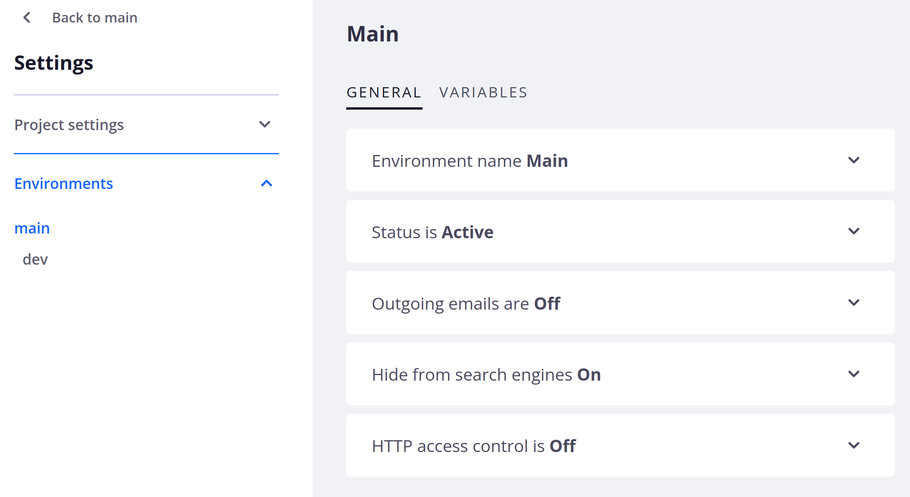
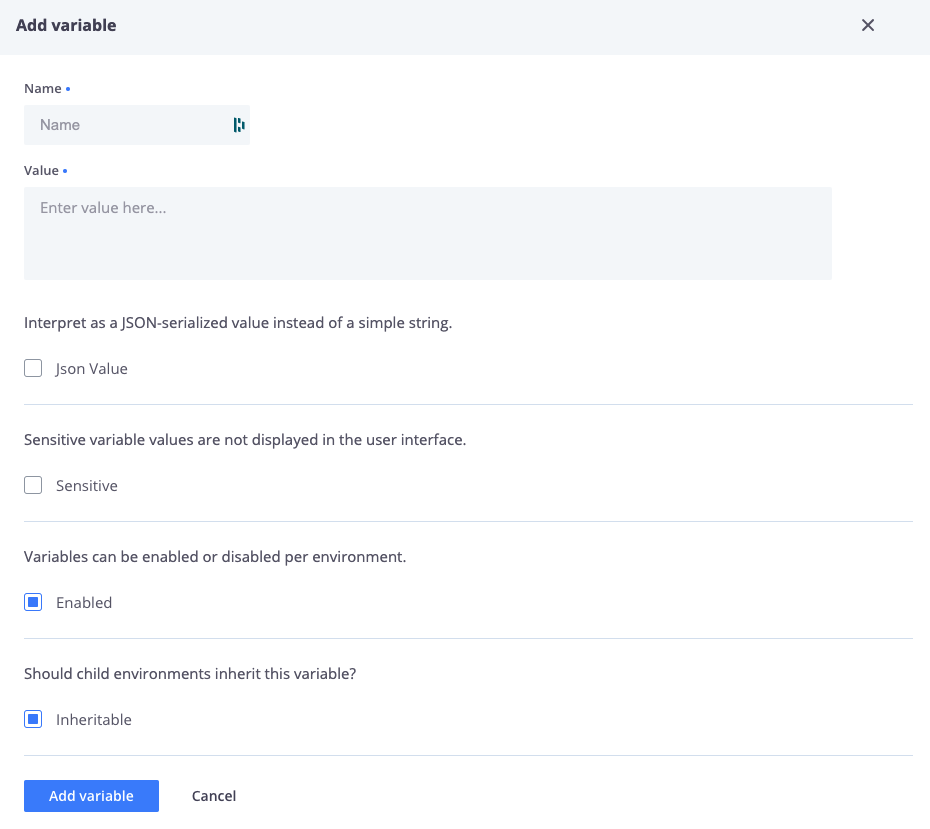

**Last updated 13th January 2022**


## Objective  

You can access an environment's settings by selecting that environment from the **Select Environments** pull-down menu at the top of the page or by clicking that environment within the Environments graphic on the right side. Click the `Settings` tab at the top of the screen.

## General

The `General` screen allows you to extend the behavior of a specific environment.



### Environment name

The first setting allows you to modify the name of the environment and view its parent environment.

### Status

From the `Status` tab, you can activate or deactivate an environment.


The `Deactivate & Delete Data` action:

* Deactivates the environment.
  Unless it's re-activated, it is no longer deployed
  and isn't accessible from the web or via SSH.
* Destroys all services running on this environment.
* Deletes all data specific to the environment.
  If the environment is reactivated, it syncs data from its parent environment.

Once the environment is deactivated,
the Git branch remains on Web PaaS in the inactive environment.
To delete the branch as well, you need to execute the following:

```bash
git push origin :BRANCH-NAME
```

> [!primary]  
> 
> Your default environment is protected.
> It can't be deleted through the management console or the CLI
> and shouldn't be deleted through the API unless you are planning on configuring another branch to become the `default_branch` to replace it.
> To do so, see [renaming the default branch](../../guides-general/default-branch).
> 
> 

### Outgoing emails

From this tab, you can allow your application to send emails via a SendGrid SMTP proxy.


Changing this setting temporarily lists the environment's status as "Building",
as the project re-builds with the new setting.
Once it has redeployed, it once again appears as "Active" in your settings.


### Search engine visibility

From this tab, you can tell search engines to ignore the site entirely, even if it's publicly visible.


### X-Robots-Tag

By default, Web PaaS includes an additional `X-Robots-Tag` header on all non-production environments:

```bash
X-Robots-Tag: noindex, nofollow
```

That tells search engines to not index sites on non-production environments entirely and not traverse links from those sites,
even if the sites are publicly visible.
This keeps non-production sites out of search engine indexes,
which otherwise would dilute the SEO of the production site.
It can't be disabled on non-production environments.

In live production environments (those that have domains assigned),
the block of search engines is turned off automatically and your app can serve a `robots.txt` file as normal.
However, you must ensure that the file is in your project's web root
(the directory where the `/` location maps to) and your application is configured to serve it.
See [the location section in `.platform.app.yaml`](../../configuration-app/app-reference#locations).

To block search engines with the `X-Robots-Tag` header on a production environment,
run the following [Web PaaS CLI](../../development-cli) command:

```bash
webpaas environment:info restrict_robots true
```

### HTTP access control

You shouldn't expose your development environments to the whole wide world.
Web PaaS allows you to implement access control either by login/password (the equivalent to .htaccess)
or filtering IP addresses or a network using the [CIDR format](https://en.wikipedia.org/wiki/Classless_Inter-Domain_Routing).
So both`4.5.6.7` and `4.5.6.0/8` are legal formats.

> [!primary]  
> 
> Changing access control triggers a new deploy of the current environment.
> However, the changes don't propagate to child environments until those are manually redeployed.
> 
> 

These settings get inherited by branches below the one you are on.
That means if you create a `staging` environment and you create branches from it,
they all inherit the same authentication information that you only have to set up once.

You can also set up authentication with the CLI by running `webpaas environment:http-access`,
which also allows you to read the current setup.
This eases the integration of CI jobs with Web PaaS as you don't need to hard code the values in the CI.

You can allow or deny access to specific IPs or IP ranges.
First, switch the access control section to ON.
Then add one or more IPs or CIDR IP masks followed by `allow` or `deny`.
See the example below.
Note that `allow` entries should come before `deny` entries in case they both match.


For example, the following configuration allows only the IP `198.51.100.0` to access your website.

```bash
198.51.100.0 allow
0.0.0.0/0 deny
```

If you want set access instructions for bots such as search crawlers,
look into how [adjusting a `robots.txt` file could help](https://community.platform.sh/t/diagnosing-and-resolving-issues-with-excessive-bot-access/792)
and when you'd need to restrict IP addresses directly.

## Variables

The `Variables` screen allows you to define the variables that are available on a specific environment.



## Routes

The `Routes` screen describes the configuration features that define the routes of your application.
Routes can't be edited here,
but it provides a routes configuration example for your project's `.platform/routes.yaml` file.


Consult the documentation for more information about properly configuring [Routes](../../configuration-routes) for your project.
