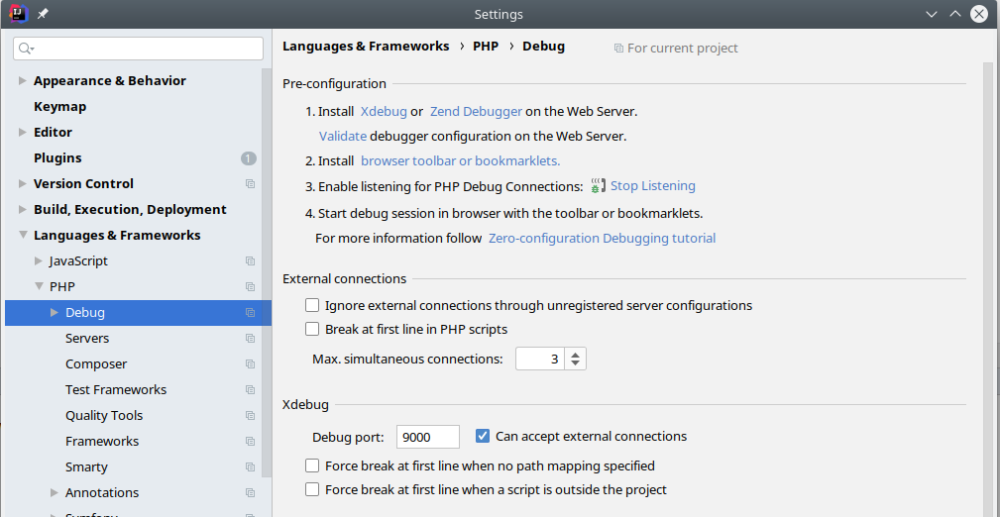
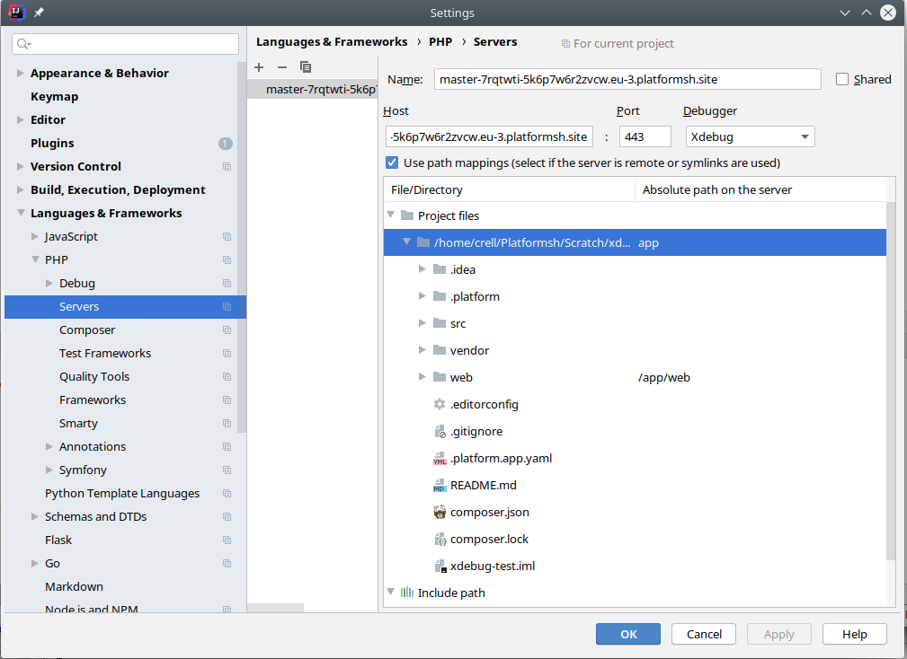

**Last updated 10th May 2021**


## Objective  

**Last updated 10th May 2021**


## Objective  

[Xdebug](https://xdebug.org/) is a real-time debugger extension for PHP.  While usually used for local development, it can also be helpful for debugging aberrant behavior on the server.  It is available on Web PaaS Grid instances running PHP 7.2 and higher.

As configured on Web PaaS, it avoids any runtime overhead for non-debug requests, even in production, and only allows SSH-tunneled connections to avoid any security issues.

## Setting up Xdebug

Xdebug is not enabled the same way as other extensions, as it should not be active on most requests.  Xdebug has a substantial impact on performance and should not be run in a production process.  Instead, Web PaaS runs a second PHP-FPM process with Xdebug that is used only for debug requests, leaving the normal process unaffected.

Enable Xdebug by adding the following configuration to the application's `.platform.app.yaml` file:

```yaml
runtime:
    xdebug:
        idekey: PHPSTORM
```

The `idekey` value can be any arbitrary alphanumeric string, as long as it matches your IDE's configuration.

When that key is defined, Web PaaS will start a second PHP-FPM process on the container that is identically configured but also has Xdebug enabled.  Only incoming requests that have an Xdebug cookie or query parameter set will be forwarded to the debug PHP-FPM process.  All other requests will be directed to the normal PHP-FPM process and thus have no performance impact.

Xdebug has numerous other configuration options available.  They are all set as `php.ini` values, and can be configured the same way as any other [`php.ini` setting](../ini).  Consult the [Xdebug documentation](https://xdebug.org/docs/) for a full list of available options, although in most cases the default configuration is sufficient.

If you have the [router cache](../../configuration-routes/cache) enabled, you will also need to explicitly add the Xdebug cookie (`XDEBUG_SESSION`) to the cookie whitelist.  Depending on the cookies you already have listed there the result should look similar to this:

```yaml
"https://{default}/":
    # ...
    cache:
      enabled: true
      cookies: ['/^SS?ESS/', 'XDEBUG_SESSION']
```

## Using Xdebug

### Open a tunnel

From your local checkout of your application, run `webpaas environment:xdebug` (or just `webpaas xdebug`) to open an SSH tunnel to the server.  That SSH tunnel will allow your IDE and the server to communicate debug information securely.

By default, Xdebug operates on port 9000.  Generally, it is best to configure your IDE to use that port.  If you wish to use an alternate port use the `--port` flag.

To close the tunnel and terminate the debug connection, press `Ctrl-C`.

### Install an Xdebug helper

While Xdebug can be triggered from the browser by adding a special query parameter, the preferred way is to use a browser plugin helper.  One is available for [Firefox](https://addons.mozilla.org/en-US/firefox/addon/xdebug-helper-for-firefox/) and for [Chrome](https://chrome.google.com/webstore/detail/xdebug-helper/eadndfjplgieldjbigjakmdgkmoaaaoc).  Their respective plugin pages document how to trigger them when needed.

## Using PHPStorm

The configuration for Xdebug will be slightly different for each IDE.  Web PaaS has no preference as to the IDE or editor you use, but we have provided configuration instructions for PHPStorm/IntelliJ due to its popularity in the PHP ecosystem.

### 1. Configure Xdebug

In your PHPStorm Settings window, go to `Languages & Frameworks` > `PHP` > `Debug`.

Ensure that the "Debug port" is set to the expected value (9000, or whatever you want to use in the `--port` flag) and that "Can accept external connections" is checked.  Other settings are at your discretion.



### 2. Set DBGp Proxy

In your PHPStorm Settings window, go to `Languages & Frameworks` > `PHP` > `Debug` > `DBGp Proxy`.

Ensure that the "IDE key" field is set to the same value as the `idekey` in `.platform.app.yaml`.  The exact value doesn't matter as long as it matches.


### 3. Configure a server

In your PHPStorm Settings window, go to `Languages & Frameworks` > `PHP` > `Servers`.

Add a new server for your Web PaaS environment.  The "Host" should be the hostname of the environment on Web PaaS you will be debugging.  The "Port" should always be 443 and the "Debugger" set to Xdebug.  Ensure that "Use path mappings" is checked, which will make available a tree of your project with a column to configure the remote path that it should map to.

This page lets you define what remote paths on the server correspond to what path on your local machine.  In the majority of cases you can just define the root of your application (either the repository root, or the root of your PHP code base specifically in a multi-app setup) to map to `app`, as in the example below.



> [!primary]  
> It may be easier to allow the debug process to connect once, allow it to fail, and then select the "Configure server mappings" error message.  That will pre-populate most of the fields in this page and only require you to set the `app` root mapping.
> 

### 4. Listen for connections

Toggle on PHPStorm's Xdebug listener.  Either select `Run` > `Start listening for PHP debug connections` from the menu or click the  icon in the toolbar.

To disable PHPStorm's listener, either select `Run` > `Stop listening for PHP debug connections` from the menu or toggle the  icon in the toolbar.

### 5. Start debugging

While in listen mode, start the `webpaas xdebug` tunnel.  Use the Xdebug helper plugin for your browser to enable debugging.  Set a breakpoint in your application, then load a page in your browser.  The request should pause at the breakpoint and allow you to examine the running application.
